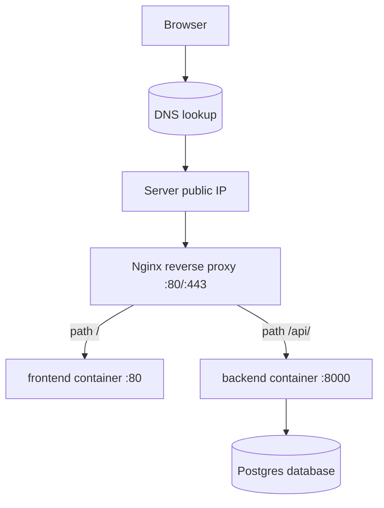
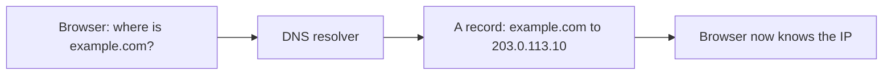
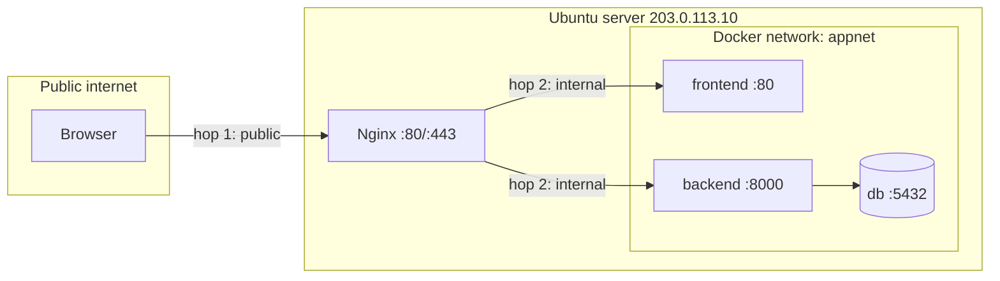
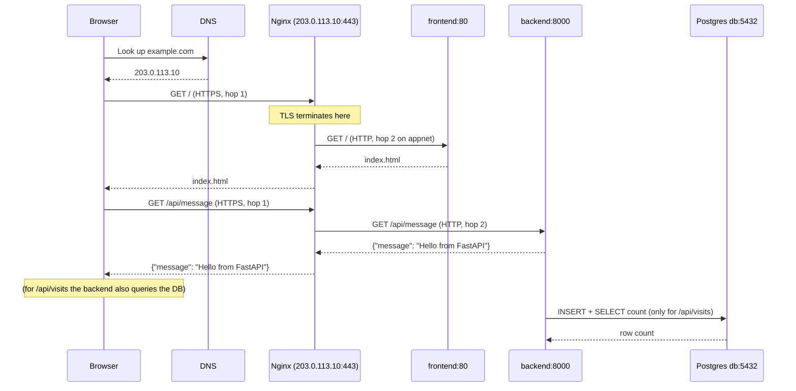
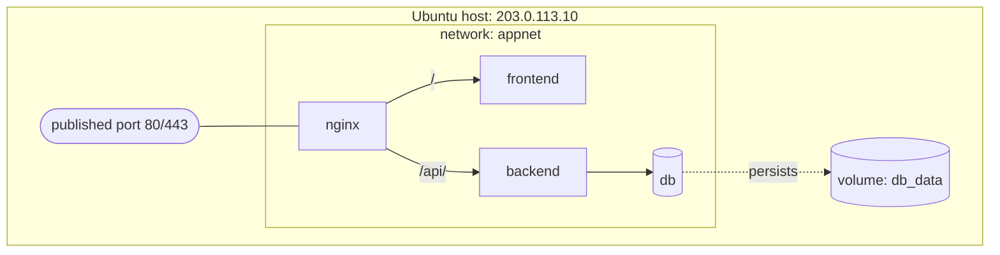

# Architecture — the complete request path

In [the README](README.md) we met all the tools and saw two diagrams: how code gets *deployed*, and a preview of how a request *flows* at runtime. This chapter is dedicated entirely to that second story. We are going to follow **one single request** — a user typing `example.com` into their browser — and trace it through *every* component it touches, explaining what each one is, why it exists, and where it's covered in depth later.

By the end you'll have a complete mental model of the live system: what talks to what, over which network, on which port, and where the data lives. This model is the backbone of the whole module — once you can picture the request path, every later chapter snaps into place.

---

## The system in one picture

Here is the **canonical runtime diagram** (the same one introduced in the README, which we'll reuse in [reverse-proxies](reverse-proxies.md), [dns](dns.md), and [https](https.md)). Keep it in view as we walk through it.



> 💡 **Intuition:** Picture a restaurant. A customer looks up the restaurant's address in a directory (**DNS**), drives to the building (the **server IP**), and walks in. A **receptionist** (Nginx) greets them and sends them to the right room — the dining room (**frontend**) or the kitchen counter (**backend**). The kitchen keeps its ingredients in a **pantry** (the **database**). Nobody from the street walks straight into the kitchen; they always go through the receptionist first.

We'll now take that walk one component at a time.

---

## Component 1: the Browser

**Intuition.** The browser is the customer standing on the street holding a name — `example.com` — but no address yet.

**Technical explanation.** When a user types `https://example.com` and presses Enter, the browser needs to turn that human-friendly **domain name** into a numeric **IP (Internet Protocol) address** it can actually connect to, because the internet routes packets by IP, not by name. The browser cannot do this alone; it asks the Domain Name System.

This is the very first hop, and it's why the diagram's first arrow points at a DNS lookup rather than at our server.

---

## Component 2: DNS — turning a name into a number

> 💡 **Intuition:** **DNS (Domain Name System)** is the **internet phone book**: you know the name (`example.com`) and DNS gives you the number (`203.0.113.10`).

**Technical explanation.** DNS is a global, distributed lookup service. When you bought `example.com` you created DNS **records** that map names to addresses. The two that matter for us:

- An **A record** mapping `example.com` → `203.0.113.10` (the "A" stands for *Address*; it points a name at an IPv4 address).
- A second A record (or a `www` record) mapping `www.example.com` → `203.0.113.10` as well, so both spellings work.

The browser's request travels through a chain of DNS resolvers, but the answer it ultimately gets is the same: *the IP for `example.com` is `203.0.113.10`*. Results are **cached** (remembered for a while) so this lookup usually happens once and is reused.

The full mechanics — record types, TTL (Time To Live), propagation delays, and how to configure records at your domain registrar — are the subject of **[the DNS chapter](dns.md)**.



Now the browser has `203.0.113.10`. Time for the first network hop.

---

## Component 3: the server's public IP — the building's address

> 💡 **Intuition:** The **Ubuntu server** is the **always-on restaurant kitchen**, and `203.0.113.10` is its street address. Unlike your laptop, it never sleeps and it's reachable from anywhere on the internet.

**Technical explanation.** Our application runs on a rented **Ubuntu 24.04 LTS** server — a Linux computer in a data center, online 24/7, with a stable **public IP address** of `203.0.113.10`. The browser opens a connection to that IP. By convention web traffic arrives on **port 80** (plain HTTP) or **port 443** (encrypted HTTPS). A **port** is like a numbered door on the building: one IP address, many doors, each for a different kind of service.

On our server, only one program is listening on those public doors: **Nginx**. The application containers (backend, frontend, database) are *not* exposed to the internet directly — and that deliberate choice is the heart of the architecture, explained next.

Provisioning this server (creating it, securing SSH access, installing Docker, opening the firewall for ports 80/443) is covered in **[the deployment chapter](deployment.md)**.

---

## The two network hops — the single most important idea

Before we meet Nginx, internalize this. There are **two completely separate networks** in play, and a request crosses a boundary between them.

> 💡 **Intuition:** Hop 1 is the **public street** — the open internet, where anyone can send a request to `203.0.113.10:443`. Hop 2 is the **private hallway inside the building** — a Docker network that only the containers can see. The receptionist (Nginx) stands exactly on the threshold between the two.

1. **Hop 1 — public internet → Nginx.** The browser, somewhere out on the internet, connects to the server's public IP on port 80/443. Nginx is the *only* thing listening there. This is the boundary you can reach from the outside.

2. **Hop 2 — internal Docker network → containers.** Nginx then forwards the request *inside* the server, over a private virtual network called **`appnet`** that Docker creates for our stack. On this network the containers find each other by **service name** — Nginx talks to `backend:8000` and `frontend:80` as if those were hostnames. The outside world cannot reach `appnet` at all.



This is why **the browser never talks to the backend directly.** The backend's port 8000 and the database's port 5432 are *not published* to the host machine, so they're invisible from the internet. The only published port is Nginx's 80/443. That gives us one controlled front door, a single place to enforce HTTPS, and a smaller attack surface. We'll see exactly how Docker enforces this in [the Docker chapter](docker.md) and [the Docker Compose chapter](docker-compose.md).

> ⚠️ **Common mistake:** "Publishing" every container's port (`ports:` for backend and db in Compose) so they're all reachable from the internet. That re-exposes your database to the world and defeats the reverse-proxy design. Only `nginx` should publish ports; everything else communicates over `appnet` internally.

---

## Component 4: Nginx — the reverse proxy / receptionist

> 💡 **Intuition:** **Nginx** is the **receptionist**. Every visitor arrives at one front desk, and the receptionist decides which room they go to based on what they're asking for.

**Technical explanation.** A **reverse proxy** is a server that sits in front of your application services, accepts every incoming request, and forwards it to the correct internal service according to rules you define. Nginx is a fast, battle-tested web server commonly used in this role.

Our routing rule is simple and lives in [`example-app/nginx/default.conf`](example-app/nginx/default.conf):

- A request whose path starts with **`/api/`** is forwarded to the **`backend`** container on port **8000**.
- **Everything else** is forwarded to the **`frontend`** container on port **80**.

Here is the relevant slice of that config — the version we actually ship:

```nginx
upstream frontend_upstream {
    server frontend:80;
}
upstream backend_upstream {
    server backend:8000;
}

server {
    listen 80;
    server_name _;            # match any hostname for now (see https.md for TLS)

    location /api/ {
        proxy_pass http://backend_upstream;
        proxy_set_header Host              $host;
        proxy_set_header X-Real-IP         $remote_addr;
        proxy_set_header X-Forwarded-For   $proxy_add_x_forwarded_for;
        proxy_set_header X-Forwarded-Proto $scheme;
    }

    location / {
        proxy_pass http://frontend_upstream;
        proxy_set_header Host              $host;
        proxy_set_header X-Real-IP         $remote_addr;
        proxy_set_header X-Forwarded-For   $proxy_add_x_forwarded_for;
        proxy_set_header X-Forwarded-Proto $scheme;
    }
}
```

Line by line, the parts that matter for the architecture:

- `upstream frontend_upstream { server frontend:80; }` — defines a named pool of backends. The name `frontend` is **not** a public hostname; it's the Compose **service name**, which Docker's internal DNS resolves to that container's address on `appnet`. Same for `backend:8000`.
- `listen 80;` — Nginx accepts connections on port 80 (later, port 443 for HTTPS in [the HTTPS chapter](https.md)).
- `server_name _;` — for now, match *any* hostname. Once we add TLS we'll set this to `example.com`.
- `location /api/ { proxy_pass http://backend_upstream; ... }` — the routing rule: anything under `/api/` goes to the backend pool. This is exactly the "path-based routing" arrow in the canonical diagram.
- `location / { proxy_pass http://frontend_upstream; ... }` — the catch-all: every other path goes to the frontend.
- The four `proxy_set_header` lines forward useful context to the upstream: the original `Host`, the client's real IP, the chain of forwarding IPs, and whether the original request was `http` or `https`. Without these, your backend would only ever see Nginx's address and think every request came over plain HTTP.

This is also exactly where **TLS terminates** — see the dedicated section below. The deep dive on Nginx config and routing is **[the reverse-proxies chapter](reverse-proxies.md)**.

---

## Components 5 & 6: the frontend and backend containers

> 💡 **Intuition:** These are the rooms the receptionist sends visitors to. The **frontend** is the dining room (what the customer sees); the **backend** is the kitchen counter (where the real work happens).

**The frontend container.** A tiny Nginx-based container that serves one static file, [`index.html`](example-app/frontend/index.html), on port **80**. That page, once loaded in the browser, makes a `fetch("/api/message")` call. Crucially, it calls `/api/...` on the **same origin** (`example.com`) — *not* some separate backend URL. So the browser sends that follow-up request right back to our front door, and Nginx routes it to the backend. The browser still never knows the backend exists as a separate thing.

**The backend container.** Our [FastAPI service](example-app/backend/app/main.py), listening on port **8000**, exposing exactly three endpoints:

- `GET /api/health` — returns `{"status": "ok"}`; a *liveness probe* used by Docker's healthcheck and by monitoring.
- `GET /api/message` — returns `{"message": "Hello from FastAPI"}`; what the frontend displays.
- `GET /api/visits` — increments and returns a visit counter stored in Postgres, degrading gracefully (`{"visits": null, ...}`) if the database is unreachable.

The backend reads its database connection string from the `DATABASE_URL` environment variable, set in Compose to `postgresql://app:app@db:5432/app`. Notice the host portion: **`db`** — again a Compose service name resolved over `appnet`, never a public address. How these containers are built and run is covered in [the Docker](docker.md) and [Docker Compose](docker-compose.md) chapters.

---

## Component 7: Postgres — where data persists

> 💡 **Intuition:** A **volume** is the **pantry / fridge** — the ingredients that survive after the meal is eaten. Containers are disposable (you can throw the cooked meal away), but the pantry's contents must outlive any single container.

**Technical explanation.** The `db` service runs the official `postgres:16-alpine` image and listens on the standard Postgres port **5432**, reachable *only* on `appnet` (never published to the internet). It holds the `visits` table behind the `/api/visits` endpoint.

Here's the subtle but vital point: **containers are ephemeral**. If you stop and recreate the `db` container, anything stored inside its own filesystem vanishes. To keep data, Compose mounts a named **volume** called **`db_data`** at Postgres's data directory:

```yaml
  db:
    image: postgres:16-alpine
    environment:
      POSTGRES_USER: app
      POSTGRES_PASSWORD: app
      POSTGRES_DB: app
    volumes:
      - db_data:/var/lib/postgresql/data
    # ...
volumes:
  db_data:
```

Line by line:

- `image: postgres:16-alpine` — the official Postgres 16 image, Alpine variant (small).
- `POSTGRES_USER / PASSWORD / DB: app` — creates a database named `app` owned by user `app` with password `app` (fine for a teaching app; use real secrets in production).
- `volumes: - db_data:/var/lib/postgresql/data` — mounts the named volume `db_data` over Postgres's data directory. Now the *data lives in the volume*, on the host's disk, independent of the container's life. Destroy and recreate the container all day; the pantry stays stocked.
- The top-level `volumes: db_data:` block declares that named volume so Docker manages it.

> ⚠️ **Common mistake:** Forgetting the volume, then losing your whole database the first time you run `docker compose down -v` or recreate the container. **Data that must survive belongs in a volume.**

---

## Where TLS terminates

> 💡 **Intuition:** A **TLS (Transport Layer Security) certificate** is a **tamper-proof ID card** issued by a trusted authority. It proves the server really is `example.com` and lets the browser encrypt the connection so no one in between can read or alter it.

**Technical explanation.** **TLS termination** means: the place where the encrypted HTTPS connection is *decrypted* back into plain HTTP. In our architecture that place is **Nginx**. The browser ↔ Nginx leg (hop 1, across the public internet) is encrypted with HTTPS on port **443**. Once inside the server, Nginx forwards plain HTTP to the containers over `appnet` (hop 2) — that's safe because `appnet` is a private network not exposed to anyone.

Putting TLS at the reverse proxy means we configure certificates in exactly **one** place instead of in every service. We obtain free, auto-renewing certificates from **Let's Encrypt**; the full how-to is **[the HTTPS chapter](https.md)**.

---

## The full request, as a sequence

The flowchart shows *structure*; a `sequenceDiagram` shows *timing* — the exact order of messages for one complete visit, including the frontend's follow-up call to the API.



Read it as two round trips: first the browser fetches the page (`/`, routed to the frontend), then the JavaScript on that page fetches data (`/api/message`, routed to the backend). For `/api/visits`, the backend adds one more internal hop to Postgres. Notice that **every** browser-facing arrow passes through Nginx, and TLS is decrypted there once.

---

## Container & network topology

Finally, the *static* picture: which services exist, what network they share, what they publish, and where data lives. This is essentially a visual reading of [`docker-compose.yml`](example-app/docker-compose.yml).



What this encodes:

- **Only `nginx` is connected to the published port** 80/443 — the one bridge between host and internet.
- **All four services share the `appnet` network**, so they can resolve and reach each other by service name (`frontend`, `backend`, `db`).
- **`backend` reaches `db`** for the visit counter; nothing else touches the database.
- **`db` persists to the `db_data` volume**, which survives container recreation.

> ✅ **Best practice:** Keep exactly one entry point. Publish ports only on the reverse proxy, put every service on a single private network, give it a clear name (`appnet`), and store stateful data in named volumes. This one-front-door, private-backplane, persistent-state pattern scales from this toy app to large production systems with very few changes.

---

## Mapping each component to its chapter

Use this as a quick index — every box in the diagrams has a home chapter:

| Component | What it does here | Deep-dive chapter |
|---|---|---|
| Browser → name lookup | Resolves `example.com` → `203.0.113.10` | [DNS](dns.md) |
| Ubuntu server (`203.0.113.10`) | Always-on host running Docker | [Deployment](deployment.md) |
| Containers & images | How each service is packaged | [Docker](docker.md) |
| The four-service stack & `appnet` & `db_data` | How they run together | [Docker Compose](docker-compose.md) |
| Nginx routing (`/` vs `/api/`) | The receptionist / reverse proxy | [Reverse proxies](reverse-proxies.md) |
| TLS termination on 443 | Encrypting the public hop | [HTTPS](https.md) |
| Image storage | Where built images live | [Registries](registries.md) |
| The pipeline that builds & deploys all this | test → build → deploy | [GitHub Actions](github-actions.md) |
| Health checks & logs | Knowing it's alive | [Monitoring](monitoring.md) |

---

## Exercises

Work through these to confirm the model has landed. Hints and answers are hidden.

1. **Trace it yourself.** A user requests `https://example.com/api/visits`. List, in order, every component the request passes through and what each one does.

2. **Why two networks?** Explain in two or three sentences why the database port 5432 is *not* published to the host, and what would change if it were.

3. **Find the service names.** Open [`docker-compose.yml`](example-app/docker-compose.yml) and [`nginx/default.conf`](example-app/nginx/default.conf). Identify every place a *service name* (rather than a real hostname or IP) is used to connect one container to another.

4. **Where does TLS live?** If you wanted to add HTTPS, which single container would you change, and why is one place enough?

<details>
<summary>Show answers</summary>

1. Browser → **DNS** (resolves `example.com` to `203.0.113.10`) → connect to **server IP** on port 443 → **Nginx** (terminates TLS, sees path starts with `/api/`) → routes over `appnet` to **backend:8000** → backend runs `INSERT` + `SELECT count` against **Postgres `db:5432`** (over `appnet`, using the `db_data` volume) → response travels back up through Nginx to the browser.

2. Postgres holds your data and has no business being reachable from the internet; leaving 5432 internal-only (on `appnet`) means attackers on the public internet simply cannot connect to it. If you published it, anyone who found the IP could attempt to connect to your database directly — a serious exposure. The backend still reaches it fine because backend and db share `appnet`.

3. Service names used as hostnames: in [`docker-compose.yml`](example-app/docker-compose.yml), `DATABASE_URL: postgresql://app:app@db:5432/app` uses **`db`**. In [`nginx/default.conf`](example-app/nginx/default.conf), `server frontend:80;` and `server backend:8000;` use **`frontend`** and **`backend`**. Docker's internal DNS resolves all three to container addresses on `appnet`.

4. Only the **`nginx`** container. Because it is the single public entry point (TLS terminates there), configuring the certificate once on Nginx secures every route; the internal containers keep speaking plain HTTP over the private `appnet`. See [HTTPS](https.md).

</details>

---

## Next / Related

- **Next:** [Docker](docker.md) — start building the images that become these containers.
- [Reverse proxies](reverse-proxies.md) — the full Nginx config and routing rules previewed here.
- [DNS](dns.md) — how the very first hop (name → IP) actually works.
- [Deployment](deployment.md) — provision the `203.0.113.10` server and bring this whole architecture online.
- Back to [the README](README.md) for the module overview and table of contents.
