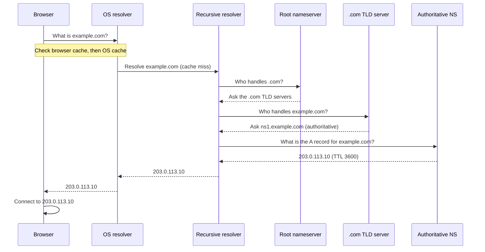
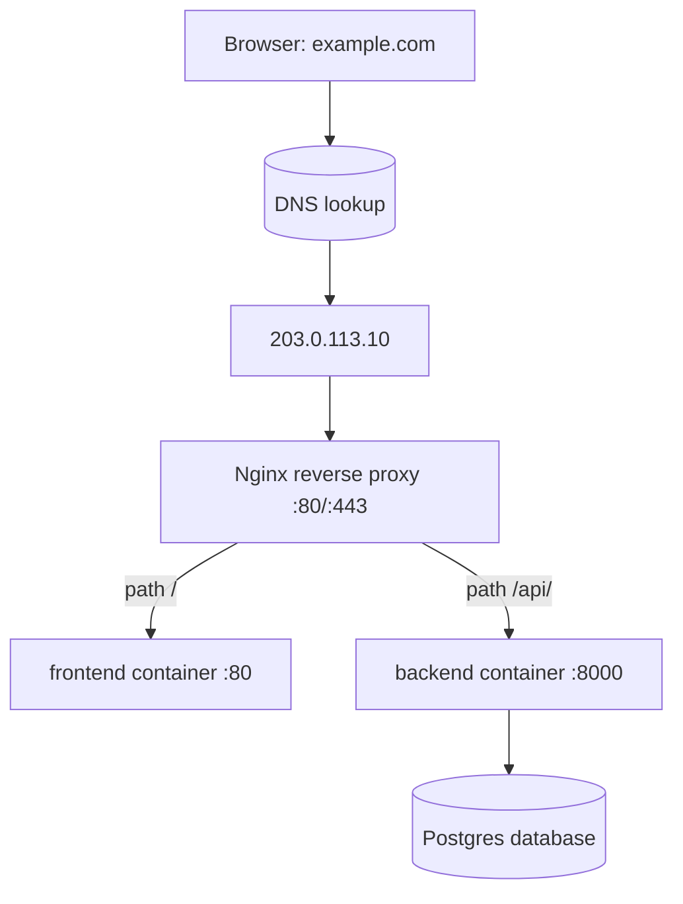

# DNS — The Internet Phone Book

When you type `example.com` into a browser, a small miracle happens in the
background: within a few dozen milliseconds, your computer turns that friendly
name into a number like `203.0.113.10` and connects to the right machine
somewhere on the planet. That translation step is **DNS (Domain Name System)**,
and this chapter teaches it from first principles. By the end you will be able
to read DNS records, query them with command-line tools, and configure the
records that point `example.com` at our Ubuntu server.

---

## 1. The problem DNS solves

> 💡 **Intuition:** DNS is the **internet phone book** — it maps names you can
> remember (`example.com`) to numbers machines actually use (`203.0.113.10`).

Computers on the internet do not talk to each other using names. They talk using
**IP addresses (Internet Protocol addresses)** — numeric labels that identify a
machine on a network. There are two kinds in use today:

- **IPv4**, written as four numbers separated by dots, e.g. `203.0.113.10`.
- **IPv6**, written as groups of hexadecimal digits separated by colons, e.g.
  `2001:db8::10`. IPv6 exists because the world ran out of IPv4 addresses.

Humans are terrible at remembering numbers like `203.0.113.10`, and worse at
`2001:db8::10`. We are good at remembering names like `example.com`. There is a
second, deeper problem too: the IP address of a service can **change**. If a
website's address were baked into every link and bookmark, moving the site to a
new server would break the entire internet. DNS adds a layer of indirection: you
publish the *name* everywhere, and quietly update the *number* it points to
whenever you move servers.

So DNS gives us two gifts:

1. **Memorable names** instead of raw numbers.
2. **Indirection** — we can change the underlying IP without changing the name.

This is exactly like a phone book (or the contacts app on your phone): you look
up "Mom" by name, and the phone book knows the current number. If Mom changes
her number, you update one entry, not every place you ever wrote it down.

---

## 2. The resolution chain — who answers the question

When your browser needs the IP for `example.com`, it does not ask one all-knowing
server. The answer is assembled by walking a **hierarchy** of caches and servers,
each of which knows a little more than the last. Let's define the players first,
then watch them work together.

- **Browser cache** — your browser remembers names it looked up recently.
- **OS (Operating System) cache / resolver** — your operating system also keeps a
  cache and knows which resolver to ask.
- **Recursive resolver** — usually run by your internet provider (or a public one
  like `8.8.8.8` or `1.1.1.1`). It does the legwork of asking everyone else on
  your behalf and caches the result. "Recursive" means it keeps asking until it
  has a final answer.
- **Root nameservers** — the top of the tree. They don't know `example.com`'s IP,
  but they know who is responsible for `.com`.
- **TLD (Top-Level Domain) nameservers** — responsible for a suffix like `.com`,
  `.org`, or `.io`. They don't know `example.com`'s IP either, but they know which
  **authoritative nameserver** holds the records for `example.com`.
- **Authoritative nameserver** — the final source of truth. This is the server
  that actually holds the records you configured for your domain and answers
  "`example.com` is `203.0.113.10`."

Here is the full conversation as a sequence:



> 💡 **Intuition:** Think of looking up a specialist. You ask the operator
> (recursive resolver). The operator asks the national directory (root) which
> regional directory covers your area (TLD), then asks that regional directory
> which exact office holds the record (authoritative), and finally reads you the
> number. You only ever spoke to the operator; they did all the chasing.

Crucially, **caching** happens at every level. The first lookup of the day for
`example.com` may walk the whole chain; the next million lookups are answered
instantly from a cache until the record's **TTL** (see §4) expires.

---

## 3. DNS records — the entries in the phone book

A domain's authoritative nameserver holds a set of **records**. Each record has a
**name**, a **type**, a **value**, and a **TTL**. Below are the record types you
will actually use, all shown for our example domain `example.com` pointing at our
server `203.0.113.10`.

### A record — name → IPv4

The workhorse. An **A record** maps a name to an IPv4 address.

```dns
example.com.        3600    IN    A    203.0.113.10
```

Read left to right: the name `example.com.` (the trailing dot means "fully
qualified"), TTL `3600` seconds, class `IN` (Internet — effectively always this),
type `A`, value `203.0.113.10`. This single line is what makes `http://example.com`
reach our Ubuntu box.

### AAAA record — name → IPv6

An **AAAA record** (pronounced "quad-A") is the IPv6 equivalent of an A record. If
your server has an IPv6 address, you publish it here so IPv6-only clients can reach
you.

```dns
example.com.        3600    IN    AAAA    2001:db8::10
```

### CNAME record — name → another name (an alias)

A **CNAME (Canonical Name) record** says "this name is an alias for that name."
The classic use is making `www.example.com` follow whatever `example.com` points
to, so you only maintain one IP in one place (the **apex** A record).

```dns
www.example.com.    3600    IN    CNAME    example.com.
```

Now `www.example.com` resolves by first looking up `www` → `example.com`, then
`example.com` → `203.0.113.10`. Change the apex A record and `www` follows
automatically.

> ⚠️ **Common mistake:** You generally **cannot** put a CNAME at the **apex**
> (the bare `example.com`, also called the "zone apex" or "root"). The DNS
> standard forbids a CNAME coexisting with other required records that live at
> the apex (like NS and SOA). So `example.com` must be an **A/AAAA** record;
> only subdomains like `www` should be CNAMEs. Some providers offer "CNAME
> flattening" / "ALIAS" records to work around this — but the plain rule is:
> **apex = A/AAAA, subdomain = CNAME (or A).**

### MX record — where email goes

An **MX (Mail Exchanger) record** tells other mail servers which host accepts
email for your domain. The number is a **priority** (lower = preferred).

```dns
example.com.        3600    IN    MX    10 mail.example.com.
```

MX records have nothing to do with your website — `example.com` the website and
`example.com` the email destination are configured independently. Hosting your
site somewhere does not move your email.

### TXT record — arbitrary text (used for verification & email security)

A **TXT (Text) record** holds free-form text. In practice it's used to **prove you
own a domain** (a provider asks you to add a specific string) and for email
authentication standards like **SPF** and **DKIM**.

```dns
example.com.        3600    IN    TXT    "v=spf1 include:_spf.example.net -all"
```

### NS record — who is authoritative

An **NS (Name Server) record** lists the authoritative nameservers for the domain.
This is how the `.com` TLD knows where to send the recursive resolver.

```dns
example.com.        86400   IN    NS    ns1.example-dns.com.
example.com.        86400   IN    NS    ns2.example-dns.com.
```

You usually set these at your **domain registrar** (where you bought the domain)
to point at whichever DNS host manages your zone.

---

## 4. TTL and propagation — why DNS changes feel slow

**TTL (Time To Live)** is a number of seconds attached to every record. It tells
caches: "you may remember this answer for this long before asking again." A TTL of
`3600` means resolvers around the world may cache the record for one hour.

This is why DNS changes are **not instant**. If a resolver fetched your old record
five minutes ago with a one-hour TTL, it will keep serving the old value for
another 55 minutes. The informal term for waiting out all these caches worldwide is
**propagation** — though nothing is really "propagating"; old answers are simply
**expiring** from caches at different times.

> ⚠️ **Common mistake:** Leaving a **high TTL** (e.g. 86400 = 24 hours) right
> before a server migration. Some visitors will hit the old IP for a full day
> after you switch. **Fix:** lower the TTL to 300 seconds (5 minutes) a day or
> two *before* the migration, switch the record, confirm it works, then raise the
> TTL back up for efficiency.

---

## 5. How a browser finds a website — end to end

Let's tie everything together. You type `https://example.com` and press Enter:

1. **Browser cache.** The browser checks its own short-lived DNS cache. Hit →
   done. Miss → continue.
2. **OS resolver.** The browser asks the operating system, which checks its cache
   (and files like `/etc/hosts`). Miss → continue.
3. **Recursive resolver.** The OS asks the configured recursive resolver (your ISP
   or `1.1.1.1`). If it has a cached, unexpired answer, it returns it. Otherwise it
   does the recursion below.
4. **Root → TLD → authoritative.** The resolver asks a root server ("who handles
   `.com`?"), then the `.com` TLD server ("who handles `example.com`?"), then the
   authoritative nameserver ("what is the A record?"). The authoritative server
   replies `203.0.113.10`.
5. **Caching.** Every layer caches `203.0.113.10` for the record's TTL.
6. **Connect.** The browser now has an IP. It opens a TCP connection to
   `203.0.113.10` on port 443 (HTTPS), performs the TLS handshake (see
   [https.md](https.md)), and sends the HTTP request. On our server, that
   connection lands on the **Nginx reverse proxy**, which routes it to the right
   container (see [reverse-proxies.md](reverse-proxies.md)).



DNS is only the **first hop** — it gets the browser to the server's front door
(`203.0.113.10`). Everything after that is the job of the reverse proxy and the
application stack.

---

## 6. Practical tooling — querying DNS yourself

You don't have to take DNS on faith. Two command-line tools let you ask resolvers
directly.

### `dig` — the detailed view

`dig` (Domain Information Groper) is the standard tool on Linux and macOS.

```bash
dig example.com A
```

This asks for the **A record** of `example.com`. The output has several sections;
the important one is `ANSWER SECTION`:

```text
;; ANSWER SECTION:
example.com.        3600    IN    A    203.0.113.10
```

That is exactly the record format from §3: name, TTL, class, type, value.

For a clean, scriptable answer with no decoration, add `+short`:

```bash
dig +short example.com A
```

```text
203.0.113.10
```

You can query any record type the same way:

```bash
dig +short example.com AAAA     # IPv6 address
dig +short www.example.com      # follows the CNAME to the apex A record
dig +short example.com MX       # mail servers
dig example.com NS              # authoritative nameservers
```

You can also ask a **specific resolver** to see what *it* currently has cached —
useful for checking propagation from different vantage points:

```bash
dig @1.1.1.1 +short example.com A     # ask Cloudflare's resolver
dig @8.8.8.8 +short example.com A     # ask Google's resolver
```

### `nslookup` — the everywhere tool

`nslookup` is older and a bit less detailed, but it ships on Windows, macOS, and
Linux, so it's handy when `dig` isn't installed.

```bash
nslookup example.com
```

```text
Server:     1.1.1.1
Address:    1.1.1.1#53
Non-authoritative answer:
Name:   example.com
Address: 203.0.113.10
```

"Non-authoritative answer" simply means the answer came from a **cache** (a
recursive resolver), not directly from the authoritative server. That's normal and
expected.

---

## 7. The records you'd set to point the domain at our server

Here is the concrete configuration to make both `example.com` and
`www.example.com` reach our Ubuntu box at `203.0.113.10`. You enter these in your
DNS host's control panel (the table form most panels show maps directly onto these
lines):

```dns
; Apex must be an A record (and AAAA if you have IPv6)
example.com.        3600    IN    A       203.0.113.10
; example.com.      3600    IN    AAAA    2001:db8::10     ; add if you have IPv6

; www is an alias that follows the apex
www.example.com.    3600    IN    CNAME   example.com.
```

After saving, verify from a couple of resolvers:

```bash
dig +short example.com A          # expect 203.0.113.10
dig +short www.example.com        # expect 203.0.113.10 (resolved via the CNAME)
```

Once both return `203.0.113.10`, the name half of the journey is done. The next
step is making sure the server answers correctly for that hostname (reverse proxy)
and securely (HTTPS).

> ⚠️ **Common mistake:** Forgetting the **AAAA** record. If your provider gives
> you an IPv6 address and you only set the A record, IPv6-preferring clients may
> try IPv6, find nothing, and feel "slow" or intermittently broken. Either
> publish a correct AAAA record **or** publish none at all — never publish a wrong
> one.

> ⚠️ **Common mistake:** **Duplicate or stale records.** Leaving an old A record
> pointing at a decommissioned server (or two A records with different IPs) means
> roughly half your traffic goes to the wrong place. Audit your zone and remove
> anything that no longer applies before going live.

> ✅ **Production best practices:**
> - **Apex = A/AAAA, subdomains = CNAME.** Never put a CNAME at the apex.
> - **Lower TTLs before a migration** (300s), restore higher TTLs (3600s+) after.
> - **Verify from multiple resolvers** (`dig @1.1.1.1`, `dig @8.8.8.8`) before
>   announcing a change — don't trust a single cache.
> - **Get DNS pointing correctly *before* requesting TLS certificates** — Let's
>   Encrypt validates by reaching your domain (see [https.md](https.md)).
> - **Keep `www` and apex consistent** so visitors land on the same site either
>   way; decide on a canonical host and redirect the other at the proxy layer.

---

## 8. Exercises

Try these before peeking at the answers.

**Exercise 1 — Trace a lookup.**
In your own words, list every cache and server consulted, in order, the *first*
time a browser resolves `example.com` on a fresh machine. Then explain what
changes on the *second* lookup five seconds later.

<details>
<summary>Answer</summary>

First lookup: **browser cache** (miss) → **OS resolver/cache** (miss) →
**recursive resolver** (miss) → **root nameserver** (returns the `.com` TLD
servers) → **`.com` TLD server** (returns the authoritative nameserver for
`example.com`) → **authoritative nameserver** (returns `203.0.113.10` with its
TTL). The result is then cached at the recursive resolver, the OS, and the
browser.

Second lookup five seconds later: the browser (or at least the recursive
resolver) still has the answer cached and unexpired, so it returns `203.0.113.10`
**immediately** without contacting root, TLD, or authoritative servers.
</details>

**Exercise 2 — Pick the right record type.**
For each goal, name the record type to create:
(a) point `example.com` at `203.0.113.10`;
(b) make `www.example.com` follow the apex;
(c) point `example.com` at an IPv6 address;
(d) prove to a certificate provider that you own the domain.

<details>
<summary>Answer</summary>

(a) **A** record. (b) **CNAME** record (`www` → `example.com`). (c) **AAAA**
record. (d) **TXT** record (the provider gives you a string to publish, then
checks it's there).
</details>

**Exercise 3 — Debug a slow migration.**
You changed `example.com`'s A record to a new server two hours ago, but some
users still hit the old one. You run `dig @1.1.1.1 +short example.com` and get the
**new** IP, but `dig @8.8.8.8 +short example.com` still returns the **old** IP.
What's happening, and what should you have done differently?

<details>
<summary>Answer</summary>

Different recursive resolvers cached the **old** record at different times, and
they hold it until its **TTL** expires — so `8.8.8.8` is still inside its cache
window while `1.1.1.1` has already refreshed. Nothing is broken; you're watching
propagation. To avoid the long wait, you should have **lowered the TTL** (e.g. to
300 seconds) a day or two *before* the migration, so caches everywhere would
refresh within minutes of the switch. After confirming the new IP everywhere, you
can raise the TTL back up.
</details>

---

## Next / Related

- **[reverse-proxies.md](reverse-proxies.md)** — once DNS gets the browser to
  `203.0.113.10`, the Nginx reverse proxy decides which container handles the
  request.
- **[https.md](https.md)** — correct DNS is a prerequisite for issuing TLS
  certificates; Let's Encrypt validates by reaching your domain.
- **[deployment.md](deployment.md)** — where we actually stand up the Ubuntu
  server at `203.0.113.10` that these records point to.
- **[architecture.md](architecture.md)** — the big-picture view of how DNS, the
  reverse proxy, and the containers fit together.
