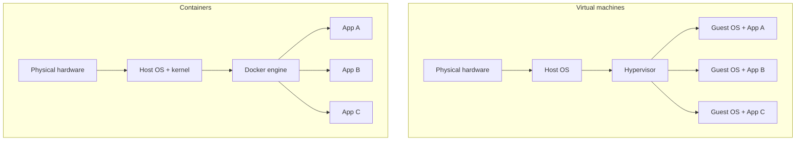
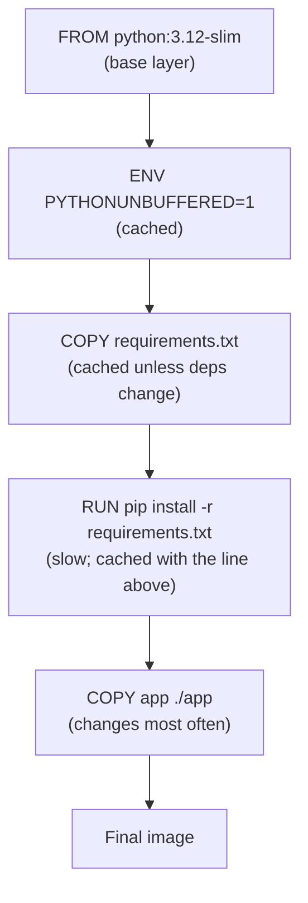
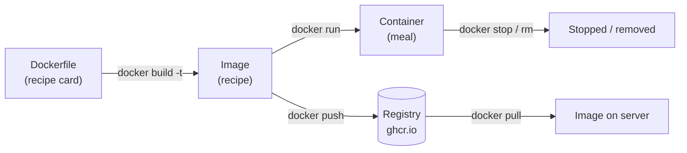

# Docker

You know how to write Python. You can build a FastAPI service, train a model,
wrangle a DataFrame. But sooner or later you hit a wall that has nothing to do
with your code being *wrong* and everything to do with *where it runs*. This
chapter is about that wall — and about Docker, the tool that knocks it down.

We will start from first principles, define every term the first time it
appears, and build up to the exact `Dockerfile` we ship for the backend of
[the example app](example-app/docker-compose.yml). By the end you will be able
to read, write, build, and run containers with confidence.

---

## 1. The problem Docker solves: "but it works on my machine"

> 💡 **Intuition:** Imagine you cook a dish perfectly in your own kitchen, then
> bring the *recipe* to a friend's house — but their oven runs hotter, they have
> a different brand of flour, and the dish comes out wrong. Nothing was wrong
> with your recipe. The *environment* was different. Docker lets you ship the
> whole kitchen, not just the recipe.

Here is the everyday version of the pain. You finish a FastAPI service on your
laptop. It runs. You hand it to a colleague, and it explodes:

- You have Python 3.12; they have 3.10, and one of your dependencies needs 3.12.
- You installed `libpq` (the Postgres client library) once, months ago, and
  forgot. Their machine doesn't have it, so `psycopg` fails to import.
- An environment variable you set in your shell profile is missing for them.
- It works on macOS but the production server is Ubuntu, and a path separator
  or a system package differs.

Every one of these bugs has the same root cause: **software does not run in a
vacuum.** It depends on a specific operating system, specific system libraries,
specific language runtimes, specific versions, and specific configuration. Your
laptop happens to have all of those. Another machine does not — until you make
it so.

The traditional fix was a long README: "install Python 3.12, then `apt-get
install libpq-dev`, then set `DATABASE_URL`, then…". READMEs rot, steps get
skipped, and "works on my machine" becomes a running joke.

**Docker** is a tool that packages your application *together with* everything
it needs to run — the OS libraries, the Python runtime, your dependencies, your
code, and the start command — into a single, portable, immutable unit called a
**container image**. Anyone with Docker can run that image and get *byte-for-byte
the same environment* you built, whether they're on macOS, Windows, or an Ubuntu
server in a data center.

> Docker is the company and the tooling; a **container** is the running thing it
> produces. We'll define container precisely in a moment.

---

## 2. Containers vs virtual machines

Before containers, the standard way to get a reproducible environment was a
**virtual machine (VM)** — a complete, simulated computer (its own kernel, its
own full operating system) running *on top of* your real computer. VMs work, but
they are heavy: each one boots a whole OS, takes gigabytes of disk, and seconds
to minutes to start.

Containers are lighter. A container does **not** boot its own operating system
kernel. Instead, all containers on a machine **share the host's Linux kernel**,
but each gets its own isolated *user space*: its own filesystem, its own process
list, its own network interface. The isolation is provided by Linux kernel
features (namespaces and cgroups) rather than by simulating hardware.

> 💡 **Intuition:** A VM is a separate *house* with its own foundation,
> plumbing, and electrical system. A container is a separate *apartment* in a
> shared building — your own lockable front door and rooms, but you share the
> building's foundation (the kernel) with the neighbors. Apartments are far
> cheaper and faster to move into than building a house each time.

Here is the difference in stacks:



Notice the asymmetry: in the VM column, every app drags along an entire **Guest
OS**. In the container column, the apps share one kernel and the Docker engine
keeps them isolated. That is why a container image for a Python service might be
~150 MB while an equivalent VM image is several gigabytes, and why a container
starts in well under a second.

Practical consequence for you: on macOS or Windows there is *no* Linux kernel to
share, so Docker Desktop quietly runs a tiny Linux VM in the background and your
containers live inside it. You won't usually notice, but it explains why the
first `docker` command after a reboot is a little slow.

| | Virtual machine | Container |
|---|---|---|
| Isolates by | Simulating hardware | Linux namespaces/cgroups |
| Boots its own kernel? | Yes | No (shares host kernel) |
| Typical size | GBs | tens–hundreds of MB |
| Start time | seconds–minutes | milliseconds–seconds |
| Density per host | low | high |

---

## 3. Images: the recipe

> 💡 **Intuition:** A Docker **image** is a **recipe** — a frozen, immutable set
> of instructions and ingredients. It describes exactly how to assemble an
> environment, but it isn't running anything yet, the same way a recipe card
> isn't dinner.

Technically, an **image** is a read-only, layered filesystem snapshot plus some
metadata (the default command to run, environment variables, the port it
expects, the working directory). It is **immutable**: once built, an image never
changes. If you need a change, you build a *new* image.

You don't write images directly. You write a **Dockerfile** — the **written
recipe card** — and Docker *builds* it into an image. A Dockerfile is a plain
text file of instructions, one per line, like `FROM python:3.12-slim` or `COPY
app ./app`. We'll dissect a real one in §10.

Images are identified by a **name** and a **tag**, written `name:tag`, for
example `python:3.12-slim` or `ghcr.io/chrisw09/example-app-backend:latest`. The
tag (the part after the colon) is a label for a particular version. If you omit
the tag, Docker assumes `:latest` — which, despite the name, just means "the tag
literally called latest," not "the newest." (More on why that bites people in
the best-practices section.)

---

## 4. Containers: the cooked meal

> 💡 **Intuition:** If the image is the recipe, the **container** is the
> **cooked meal** — a concrete, running instance produced from the recipe. From
> one recipe you can cook many meals; from one image you can run many containers.

Technically, a **container** is a running (or stopped) instance of an image. When
you start one, Docker takes the immutable image and adds a thin, **writable
layer** on top. Your app can write files, but those writes go into that
container-specific layer — they do **not** modify the image. Delete the
container and that writable layer (and everything in it) is gone, unless you
stored it in a volume (§8).

This is the key mental model:

```
one Dockerfile  --build-->  one image  --run-->  many containers
   (recipe card)             (recipe)              (meals)
```

You can run three containers from the same image, each isolated from the others,
each with its own writable layer, its own process, its own network identity.

---

## 5. Layers and the build cache

This is the single most important Docker concept for working efficiently, so we
will go slowly.

> 💡 **Intuition:** Each instruction in your recipe card is a **step**, and
> Docker **caches the result of each step**. If you re-cook and steps 1–4 are
> unchanged, Docker reuses the cached results and only redoes the steps that
> actually changed. Reorder your steps badly and you throw that saving away.

An image is built as a **stack of layers**. Each instruction in the Dockerfile
(`FROM`, `COPY`, `RUN`, …) produces one layer — a diff of "what changed in the
filesystem at this step." Layers stack on top of each other; the final image is
all of them combined.

When you run `docker build`, Docker walks the Dockerfile top to bottom. For each
instruction it asks: *"have I already built this exact layer, given the exact
same parent layer and the exact same inputs?"* If yes, it reuses the cached
layer instantly. The moment one instruction's inputs change, that layer **and
every layer after it** must be rebuilt — the cache is invalidated from that point
down.



This is why the ordering rule exists: **put the things that change rarely near
the top, and the things that change often near the bottom.** Your dependencies
(`requirements.txt`) change far less often than your source code, so you copy
and install dependencies *before* copying your code. Then editing a line in
`main.py` only invalidates the cheap `COPY app ./app` layer — the expensive
`pip install` layer is reused. Get this backwards (copy all code first, then
install) and *every* code edit forces a full reinstall. We'll see exactly this
ordering in the real Dockerfile.

> ⚠️ **Common mistake:** Copying your whole project (`COPY . .`) *before*
> installing dependencies. Now any source edit busts the dependency cache and
> every build reinstalls everything — turning 3-second rebuilds into 3-minute
> ones.

---

## 6. Registries: the warehouse for recipes

> 💡 **Intuition:** A **registry** is a **warehouse / app store** for images.
> You `push` images up to it; other machines (your colleague's laptop, the
> production server) `pull` them down. It's how a recipe travels from your
> machine to the world.

A **registry** is a server that stores and distributes images. The default
public one is **Docker Hub** (`docker.io`); that's where official images like
`python:3.12-slim` and `postgres:16-alpine` live, and why `docker pull python`
just works. This module uses **GitHub Container Registry (GHCR)** at `ghcr.io`,
because our code already lives on GitHub and CI can push there for free.

An image's full name encodes where it lives:

```
ghcr.io / chrisw09 / example-app-backend : latest
   |          |              |               |
registry    owner       repository         tag
```

For our example app the three images are
`ghcr.io/chrisw09/example-app-backend`,
`ghcr.io/chrisw09/example-app-frontend`, and
`ghcr.io/chrisw09/example-app-nginx`. (GHCR requires the owner to be lowercase,
so the GitHub owner `ChrisW09` becomes `chrisw09`. In generic examples you'll
see `ghcr.io/<owner>/example-app-backend` — substitute your own owner.)

The full lifecycle, which the whole module builds toward, is: you build an image
locally or in CI, push it to GHCR, and the server pulls it and runs it. Pushing
and pulling get a chapter of their own — see [Registries](registries.md).

---

## 7. Networking: how containers talk

Each container gets its own isolated network stack — its own private IP address.
By default Docker puts containers on a **bridge network**, a virtual switch that
connects containers on the same host so they can talk to each other while staying
isolated from the outside world unless you explicitly publish a port.

The magic feature you'll rely on constantly: **container DNS by service name.**
When you create a user-defined network (which Docker Compose does automatically —
ours is called `appnet`), Docker runs an internal DNS server. Inside that
network, a container can reach another *by its name*. The backend connects to
Postgres using the hostname `db`, not an IP address:

```
postgresql://app:app@db:5432/app
                      ^^
            this "db" is a hostname Docker resolves
```

> 💡 **Intuition:** DNS is the **internet phone book** — it turns a name into a
> number. Docker runs a tiny private phone book for your network, so `db` always
> resolves to whatever IP the database container currently has, even after a
> restart changes that IP.

Two related ideas you must keep separate:

- **Container-to-container** traffic stays *inside* the bridge network and uses
  service names. The backend listens on `8000` and the db on `5432`; other
  containers reach those ports directly over `appnet`. No `-p` needed.
- **Host-to-container** (or internet-to-container) traffic needs a **published
  port** — you map a port on the host to a port in the container with `-p`. We
  publish only Nginx's port 80 to the outside world; the backend and db are
  reachable *only* from inside `appnet`. That's a security feature: the database
  is never exposed to the internet.

> ⚠️ **Common mistake:** Trying to reach another container at `localhost`.
> Inside a container, `localhost` means *that same container*, not the host and
> not its neighbors. Use the service name (`db`, `backend`) instead.

Networking gets a full treatment, including the Nginx receptionist, in
[Reverse proxies](reverse-proxies.md).

---

## 8. Volumes and bind mounts: data that survives

Recall from §4 that a container's writable layer dies with the container. That's
fine for a stateless web app, but a *database* must keep its data when you
restart, upgrade, or replace the container. The answer is to store that data
*outside* the container's lifecycle.

> 💡 **Intuition:** A **volume** is the **pantry/fridge** — the place where food
> (data) is kept so it survives long after a particular meal (container) is
> cleared away. The meal is disposable; the pantry is not.

There are two ways to mount external storage into a container:

1. **Named volume** — storage managed by Docker, living in Docker's own area on
   disk, referred to by a name. This is what we use for Postgres: a volume named
   `db_data` mounted at `/var/lib/postgresql/data` (where Postgres keeps its
   files). Delete and recreate the `db` container all day; as long as `db_data`
   survives, the data survives. You'd create one ad hoc with
   `-v db_data:/var/lib/postgresql/data`.

2. **Bind mount** — you map a *specific directory on the host* into the
   container, written as `-v /abs/host/path:/path/in/container`. Great for
   development (mount your source code so edits appear live inside the
   container), less ideal for production data because it ties you to a host path.

The distinction: a **named volume** is "Docker, keep this data somewhere safe
and remember it by name"; a **bind mount** is "use *this exact folder* on my
machine." Use named volumes for databases, bind mounts for live-editing code in
dev.

> ⚠️ **Common mistake:** Storing database files in the container's writable
> layer (no volume at all). The first time you `docker rm` the container — or CI
> redeploys a new image — every row is gone. Always put stateful data on a
> volume.

---

## 9. The hands-on command tour

Time to actually drive Docker. We'll explain every command and its common flags.
Throughout, "the image" means our backend image and "the container" means a
running instance of it.

### `docker build` — turn a Dockerfile into an image

```bash
docker build -t example-app-backend:dev .
```

- `docker build` — read a Dockerfile and produce an image.
- `-t example-app-backend:dev` — **tag** (name) the resulting image. `-t` is
  short for `--tag`. Without it your image gets no name and is awkward to refer
  to. You can pass `-t` multiple times to apply several tags at once.
- `.` — the **build context**: the directory Docker sends to the builder and
  whose files `COPY` can see. The `.` means "the current directory." By default
  Docker looks for a file literally named `Dockerfile` in that directory; use
  `-f path/to/Dockerfile` to point elsewhere.

> 🔧 **Troubleshooting:** If `COPY requirements.txt .` fails with "file not
> found," you almost certainly ran `docker build` from the wrong directory — the
> file must be *inside the build context* (`.`). Paths in `COPY` are relative to
> the context, not to where the Dockerfile lives.

### `docker run` — create and start a container from an image

This is the workhorse. Here it is with the flags you'll use most:

```bash
docker run -d --name backend -p 8000:8000 \
  -e DATABASE_URL=postgresql://app:app@db:5432/app \
  -v db_data:/var/lib/postgresql/data --rm \
  example-app-backend:dev
```

- `docker run` — create a *new* container from an image and start it.
- `-d` — **detached**: run in the background and return your terminal. Without
  it, the container runs in the **foreground** and ties up your shell (handy
  when you want to watch logs live, painful when you want to keep working).
- `--name backend` — give the container a stable, human-friendly name. Without
  it Docker invents a random one like `eloquent_turing`. The name is also a DNS
  name on the network, so naming it `backend` is what lets neighbors reach it as
  `backend`.
- `-p 8000:8000` — **publish a port**: map `HOST:CONTAINER`. The left number is
  the port on your machine; the right is the port inside the container. After
  this, `http://localhost:8000` on your host reaches the app. `-p 9000:8000`
  would expose it on host port 9000 instead. (Remember: this is only for
  host↔container; containers reach each other without `-p`.)
- `-e DATABASE_URL=...` — set an **environment variable** inside the container.
  This is how you inject configuration (database URLs, API keys, feature flags)
  without baking it into the image. Repeat `-e` for each variable, or use
  `--env-file file.env` for many.
- `-v db_data:/var/lib/postgresql/data` — mount a **volume** (here a named
  volume) at a path inside the container, so data persists (§8).
- `--rm` — automatically **remove** the container when it stops. Without `--rm`,
  stopped containers linger (visible via `docker ps -a`) and pile up. Great for
  throwaway/test runs; *don't* use it for long-running services you want to
  inspect after a crash.
- `example-app-backend:dev` — the image to run. Anything *after* the image name
  would override the image's default command.

### `docker ps` — list running containers

```bash
docker ps        # only running containers
docker ps -a     # all containers, including stopped ones
```

- `docker ps` shows what's currently running: container ID, image, command,
  status, ports, name.
- `-a` (`--all`) also shows **stopped** containers. Essential for debugging "my
  container isn't there" — it probably exited; `-a` reveals it and its exit
  status.

### `docker logs` — read a container's output

```bash
docker logs backend       # print everything so far
docker logs -f backend    # stream and follow new output
```

- `docker logs backend` prints whatever the container has written to stdout/
  stderr (for us, uvicorn's startup banner and request logs).
- `-f` (`--follow`) keeps the stream open and prints new lines as they arrive —
  the container equivalent of `tail -f`. Press Ctrl-C to stop following (the
  container keeps running).

### `docker exec` — run a command inside a running container

```bash
docker exec -it backend bash
```

- `docker exec` runs an *additional* command inside an already-running
  container — your way "in" to look around.
- `-it` is two flags: `-i` (`--interactive`, keep stdin open) and `-t`
  (`--tty`, allocate a terminal). Together they give you a usable interactive
  shell. Drop them for one-shot commands like `docker exec backend ls /app`.
- `bash` is the command to run. Slim images may only have `sh`, so try
  `docker exec -it backend sh` if `bash` isn't found.

### `docker stop` — gracefully stop a running container

```bash
docker stop backend
```

Sends the main process a polite SIGTERM, waits (10 seconds by default), then
SIGKILL if it hasn't exited. This lets the app shut down cleanly. (`docker kill`
skips the grace period — avoid unless something's wedged.)

### `docker rm` — delete a container

```bash
docker rm backend        # must be stopped first
docker rm -f backend     # force: stop then remove in one step
```

- Removes a *stopped* container and its writable layer. (Volumes survive — that's
  the point of §8.)
- `-f` (`--force`) stops a running container and removes it in one go.

### `docker images` — list local images

```bash
docker images
```

Lists images you have locally: repository, tag, image ID, age, size. Use it to
confirm a build produced what you expected and to spot bloat. (`docker rmi
<image>` removes an image.)

### `docker pull` / `docker push` — move images to and from a registry

```bash
docker pull postgres:16-alpine
docker push ghcr.io/chrisw09/example-app-backend:latest
```

- `docker pull` downloads an image from a registry to your machine. `docker run`
  pulls automatically if the image isn't already local, so you rarely pull by
  hand except to pre-fetch.
- `docker push` uploads a *locally built, properly named* image to its registry.
  The image name must include the registry (`ghcr.io/...`), and you must be
  logged in (`docker login ghcr.io`). Details in [Registries](registries.md).



---

## 10. The worked example: our backend Dockerfile

Let's build up to the file we actually ship. First, a **simplified** version
that works but is naive — read it to get the shape, then we'll see why the real
one is better.

```dockerfile
# SIMPLIFIED — works, but not production-grade. Do not ship this.
FROM python:3.12-slim
WORKDIR /app
COPY . .
RUN pip install -r requirements.txt
CMD ["uvicorn", "app.main:app", "--host", "0.0.0.0", "--port", "8000"]
```

It runs, but it has three problems we now know to spot:

1. `COPY . .` *before* `pip install` means every code edit busts the dependency
   cache (§5) — slow rebuilds.
2. It runs as **root** inside the container — a security risk (§ best practices).
3. It has no healthcheck and no Python container defaults.

Now here is **the production version we ship**, quoted verbatim from
[`example-app/backend/Dockerfile`](example-app/backend/Dockerfile):

```dockerfile
# syntax=docker/dockerfile:1

# ---- Base image: small, official Python ----
FROM python:3.12-slim

# Sensible Python defaults inside containers
ENV PYTHONUNBUFFERED=1 \
    PYTHONDONTWRITEBYTECODE=1

# All later paths are relative to /app
WORKDIR /app

# Copy ONLY requirements first so the pip layer is cached until deps change
COPY requirements.txt .
RUN pip install --no-cache-dir -r requirements.txt

# Now copy the application code
COPY app ./app

# Run as a non-root user (never run containers as root in production)
RUN useradd --create-home appuser && chown -R appuser /app
USER appuser

# Document the port the app listens on
EXPOSE 8000

# Container-level liveness check
HEALTHCHECK --interval=30s --timeout=3s --start-period=10s --retries=3 \
  CMD python -c "import urllib.request,sys; sys.exit(0 if urllib.request.urlopen('http://localhost:8000/api/health').status==200 else 1)"

# Start the ASGI server, bound to all interfaces so Docker can reach it
CMD ["uvicorn", "app.main:app", "--host", "0.0.0.0", "--port", "8000"]
```

Line by line:

- `# syntax=docker/dockerfile:1` — a special first-line directive telling Docker
  to use the version-1 Dockerfile frontend, which unlocks modern build features.
  Harmless and recommended; keep it as the very first line.
- `FROM python:3.12-slim` — the **base image**, the foundation every other layer
  stacks on. `python:3.12-slim` is the official Python 3.12 image on a trimmed-
  down Debian — small, but with everything Python needs. (`-slim` drops build
  tools and docs you don't need at runtime; the full `python:3.12` is much
  larger.)
- `ENV PYTHONUNBUFFERED=1 PYTHONDONTWRITEBYTECODE=1` — sets two environment
  variables in one layer (the `\` continues the line). `PYTHONUNBUFFERED=1` makes
  Python flush stdout immediately so your logs appear in real time in `docker
  logs` instead of being held in a buffer. `PYTHONDONTWRITEBYTECODE=1` stops
  Python from writing `.pyc` cache files you don't need in a container.
- `WORKDIR /app` — sets the working directory inside the image to `/app`,
  creating it if needed. Every later `COPY`, `RUN`, and `CMD` is relative to it.
- `COPY requirements.txt .` — copy *only* the dependency list into `/app`. Doing
  this **before** copying source is the layer-caching trick from §5.
- `RUN pip install --no-cache-dir -r requirements.txt` — install the
  dependencies. `--no-cache-dir` tells pip not to keep its download cache inside
  the image, shrinking the final size. This is the slow layer, and because it
  sits above the source copy, it's reused on every build where
  `requirements.txt` is unchanged.
- `COPY app ./app` — *now* copy the application source (the `app/` package) into
  `/app/app`. This is the layer that changes most often, so it sits low.
- `RUN useradd --create-home appuser && chown -R appuser /app` — create an
  unprivileged user `appuser` and give it ownership of `/app`. By default
  containers run as **root**; if an attacker breaks out of a root process the
  blast radius is much larger.
- `USER appuser` — switch to that non-root user for everything that follows,
  including the running app. This is a core production hardening step.
- `EXPOSE 8000` — **documentation** that the app listens on port 8000. It does
  *not* publish the port (that's `-p` at run time); it's a signpost for humans
  and tooling.
- `HEALTHCHECK --interval=30s --timeout=3s --start-period=10s --retries=3 CMD …`
  — tells Docker how to check the container is *healthy*, not just running. Every
  30s it runs the `CMD`; the check has 3s to respond; Docker ignores failures for
  the first 10s (`--start-period`, giving the app time to boot); after 3
  consecutive failures the container is marked `unhealthy`. The check itself is a
  one-liner Python script that hits `/api/health` and exits 0 on HTTP 200, 1
  otherwise. This matters because Compose can *wait* for a container to be
  healthy before starting dependents (see `condition: service_healthy` in
  [Docker Compose](docker-compose.md)).
- `CMD ["uvicorn", "app.main:app", "--host", "0.0.0.0", "--port", "8000"]` — the
  default command run when a container starts. It launches uvicorn (the ASGI
  server) serving the FastAPI `app` object from `app/main.py`. The crucial flag
  is `--host 0.0.0.0`: it binds to **all** network interfaces. If you bound to
  `127.0.0.1` instead, the app would only listen on the container's loopback and
  Docker couldn't route traffic to it — a classic beginner trap.

> 🔧 **Troubleshooting:** Container starts then immediately exits with code 0 or
> 137 and `docker ps` shows nothing? Run `docker ps -a` to see the exit code,
> then `docker logs <name>`. Code 0 often means your `CMD` finished (e.g. it was
> a script, not a long-running server). Code 137 means it was killed (often out
> of memory, or you `docker stop`ped it).

There is also a [`.dockerignore`](example-app/backend/.dockerignore) sitting
next to the Dockerfile. Just as `.gitignore` keeps files out of Git, this keeps
files out of the build context — `__pycache__/`, `.pyc` files, `.pytest_cache/`,
`tests/`, and `.venv/`. Smaller context means faster builds and prevents stale
junk from leaking into the image.

---

## 11. Best practices and common mistakes (recap)

> ✅ **Production best practices:**
> - **Use small, official base images** (`python:3.12-slim`, `nginx:1.27-alpine`).
>   Smaller images pull faster, start faster, and have a smaller attack surface.
> - **Order layers for caching:** rarely-changing things (deps) above
>   often-changing things (source). See §5.
> - **Run as a non-root user.** Create and `USER` an unprivileged account.
> - **Add a `.dockerignore`** so build context stays lean and secrets/junk never
>   enter the image.
> - **One process per container.** A container should do one job (run the API,
>   *or* serve files, *or* be the database) — not all three. This keeps images
>   small, restarts cheap, and scaling independent.
> - **Pin real tags in production, not `:latest`.** `:latest` is a moving target;
>   two servers can pull "latest" hours apart and run different code. Pin an
>   immutable tag (our CI also tags every image with the Git commit SHA, e.g.
>   `…-backend:<sha>`) so a deploy is reproducible and rollbacks are exact.

> ⚠️ **Common mistakes (consolidated):**
> - Copying all source before installing deps (cache busting).
> - Binding the server to `127.0.0.1` instead of `0.0.0.0` inside the container.
> - Reaching neighbors via `localhost` instead of their service name.
> - Putting database data in the writable layer instead of a volume.
> - Relying on `:latest` in production and being surprised when "the same deploy"
>   ships different code.

---

## 12. Exercises

Try each before opening the answer.

**Exercise 1.** You edit one line in `app/main.py` and rebuild. Which layers of
our production Dockerfile get rebuilt, and which are reused from cache? Why?

<details>
<summary>Answer</summary>

Everything up to and including `RUN pip install …` is **reused** from cache,
because none of its inputs changed (`requirements.txt` is identical). The
`COPY app ./app` layer is **rebuilt** because the source changed, and every layer
*after* it (`useradd`, `USER`, `EXPOSE`, `HEALTHCHECK`, `CMD`) is also re-created
since the cache is invalidated from the first changed layer downward. The slow
`pip install` is *not* repeated — that's exactly why we copy requirements first.
</details>

**Exercise 2.** Write a single `docker run` command that runs
`example-app-backend:dev` in the background, names it `api`, exposes it on host
port 8080, sets `DATABASE_URL` to an empty string, and removes itself when it
stops.

<details>
<summary>Answer</summary>

```bash
docker run -d --name api -p 8080:8000 -e DATABASE_URL="" --rm example-app-backend:dev
```

`-d` background, `--name api` names it, `-p 8080:8000` maps host 8080 to the
container's 8000, `-e DATABASE_URL=""` injects the (empty) variable, `--rm`
auto-cleans on exit. Note the host:container port order — 8080 is on your
machine, 8000 is inside.
</details>

**Exercise 3.** Your container runs but `http://localhost:8000` returns nothing,
even though `docker logs` shows uvicorn started. Name two likely causes.

<details>
<summary>Answer</summary>

1. You forgot `-p 8000:8000`, so the port was never published to the host — the
   app is only reachable from inside Docker.
2. uvicorn is bound to `127.0.0.1` inside the container instead of `0.0.0.0`, so
   Docker can't route host traffic to it. Our `CMD` uses `--host 0.0.0.0`
   precisely to avoid this.
</details>

**Exercise 4.** Why does the database use a named volume `db_data` while the
backend and frontend containers need no volume at all?

<details>
<summary>Answer</summary>

Postgres is **stateful** — it must keep its data files between restarts and
across image upgrades, so its data directory (`/var/lib/postgresql/data`) is
mounted on the named volume `db_data`, which outlives any individual container.
The backend and frontend are **stateless** — they hold no data that must survive;
everything they need is baked into the image or fetched from the database at
runtime. Delete and recreate them freely and nothing is lost.
</details>

---

## Next / Related

- **[Docker Compose](docker-compose.md)** — run all four containers of the
  example app together with one command, instead of juggling `docker run`.
- **[Registries](registries.md)** — `push`/`pull` images to and from GHCR, the
  warehouse our CI publishes to.
- **[Deployment](deployment.md)** — how the built images land on the Ubuntu
  server and go live.
