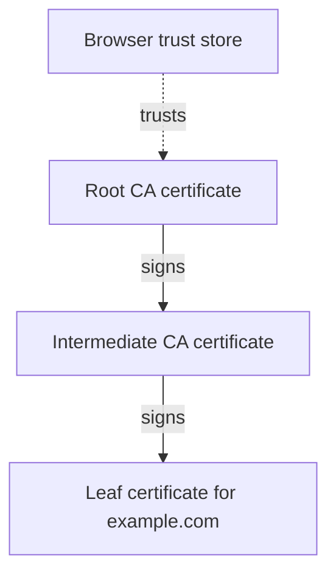
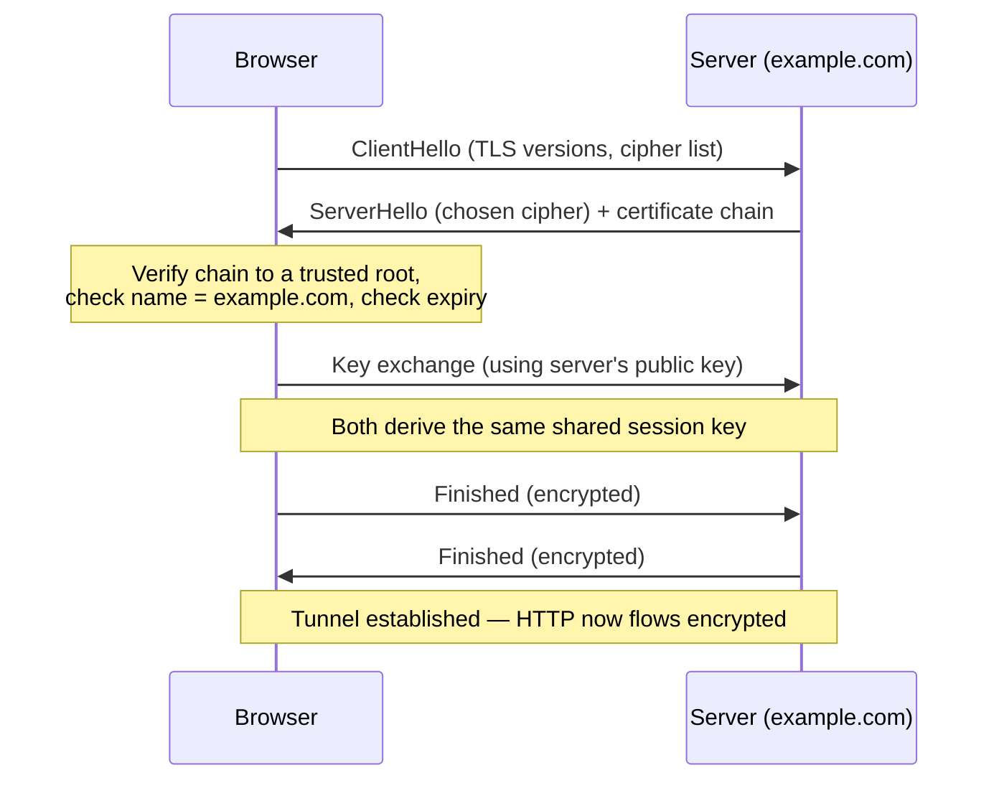
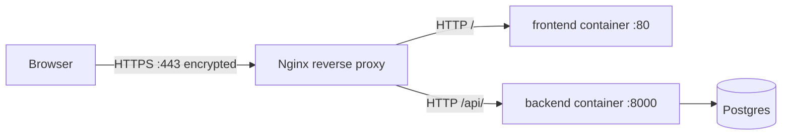

# HTTPS — Locking the Front Door

Our [DNS](dns.md) points `example.com` at `203.0.113.10`, and our
[Nginx reverse proxy](reverse-proxies.md) routes requests to the right container.
But so far everything travels as **plaintext HTTP**. Anyone between the visitor
and our server — a café Wi-Fi router, an internet provider, an attacker on the
same network — can **read and even modify** every request and response. This
chapter fixes that with **HTTPS**, taught from first principles, and then shows
two concrete ways to enable it on our stack.

---

## 1. HTTP vs HTTPS — what's exposed

**HTTP (HyperText Transfer Protocol)** is how browsers and servers exchange web
pages. By itself it is **unencrypted**: requests and responses travel as readable
text. Over plain HTTP, anyone on the network path can see:

- the full **URL path and query string** (e.g. `/api/visits?user=42`),
- all **headers**, including cookies and authentication tokens,
- the entire **request and response body** — form fields, passwords, JSON,
- and they can **tamper** with any of it in transit (injecting ads, malware, or
  altering data) without either side noticing.

**HTTPS (HTTP Secure)** is the *same* HTTP, but wrapped in an encrypted tunnel
provided by **TLS** (below). With HTTPS, an eavesdropper sees only the destination
**domain** and **IP**, plus a stream of encrypted bytes. The path, headers,
cookies, and bodies are confidential and protected against tampering.

> 💡 **Intuition:** HTTP is a postcard — anyone handling it can read it. HTTPS is
> a sealed, tamper-evident envelope that only the intended recipient can open.

---

## 2. SSL vs TLS — a quick history

You'll hear "SSL" and "TLS" used interchangeably. Here's the truth:

- **SSL (Secure Sockets Layer)** was the original encryption protocol from the
  1990s. All its versions (SSL 2.0, 3.0) are now **broken and deprecated** — do
  not use them.
- **TLS (Transport Layer Security)** is SSL's successor and the protocol actually
  in use today (TLS 1.2 and TLS 1.3 are current).

Colloquially, people still say **"SSL"** when they mean **TLS** — "SSL
certificate," "SSL termination." Tools keep the old name too (the Nginx directive
is `ssl_certificate`, the library is OpenSSL). Just know that under the hood it's
**TLS**, and aim for **TLS 1.2+**.

---

## 3. Certificates and the chain of trust

For HTTPS to work, the server must prove it really *is* `example.com` — otherwise
an attacker could encrypt traffic to *themselves* and impersonate the site. That
proof is a **TLS certificate**.

> 💡 **Intuition:** A **TLS certificate** is a **tamper-proof ID card** issued by
> a trusted authority. Just as you trust a passport because a government you
> recognize issued it, your browser trusts a certificate because a **Certificate
> Authority** it recognizes signed it.

### Public and private keys

TLS is built on **asymmetric (public-key) cryptography**, which uses a matched
**key pair**:

- A **private key** the server keeps absolutely secret.
- A **public key** the server can share freely (it's embedded in the certificate).

Their magic property: data encrypted with one key can only be decrypted with the
other. So a browser can encrypt a secret with the server's **public** key, and
**only** the holder of the matching **private** key (the real server) can decrypt
it. This is how both sides establish a shared secret without ever transmitting it
in the clear.

### The chain of trust

A certificate is trusted because of a **chain** of signatures:



- **Root CA (Certificate Authority)** — a small set of highly trusted
  organizations. Their **root certificates** ship pre-installed in your operating
  system and browser ("trust store"). Roots are kept offline and precious.
- **Intermediate CA** — roots delegate day-to-day signing to intermediates, so the
  root key stays safely offline. The intermediate is signed *by* the root.
- **Leaf certificate** — your actual certificate for `example.com`, signed by an
  intermediate.

When a browser connects, the server presents the **leaf + intermediate(s)**. The
browser walks the chain up to a **root it already trusts**. If every signature
checks out and the leaf's name matches `example.com`, it's trusted. Break the
chain anywhere and the browser shows a security warning.

### The TLS handshake

Before any HTTP is sent, the browser and server perform a **TLS handshake** to
verify identity and agree on encryption keys:



In words: the browser proposes versions and ciphers (**ClientHello**); the server
picks one and sends its **certificate chain** (**ServerHello**); the browser
**verifies** the chain, name, and expiry; the two perform a key exchange to derive
a shared **session key**; from then on all HTTP travels **encrypted** with that
symmetric key (fast) while the asymmetric keys (slow) were only used to bootstrap
trust.

---

## 4. Certificate Authorities and Let's Encrypt

Historically, certificates cost money and involved manual paperwork. **Let's
Encrypt** changed that: it's a **free, automated, non-profit Certificate
Authority**. Its key properties:

- **Free** — no cost per certificate.
- **Automated** via **ACME (Automatic Certificate Management Environment)**, a
  protocol where a program proves domain control and fetches a certificate without
  human intervention. The common proof is the **HTTP-01 challenge**: the CA gives
  your client a token, the client serves it at a special URL on your domain, and
  the CA fetches it to confirm you control `example.com`. (This is why
  [DNS](dns.md) must be correct **first** — the CA reaches your domain to verify.)
- **Short-lived, 90-day certificates.** Short lifetimes limit the damage if a key
  leaks and *force* automation.
- **Auto-renew.** Because they expire every 90 days, you set up automatic renewal
  (typically renewing around day 60) so it never lapses.

> 💡 **Intuition:** Let's Encrypt is a trusted ID office that issues your ID card
> for free, in seconds, by a robot — on the condition that the card expires
> quickly and a robot keeps renewing it.

---

## 5. Why HTTPS matters

- **Confidentiality** — nobody on the path can read the traffic.
- **Integrity** — traffic can't be silently modified in transit.
- **Authenticity** — the certificate proves you're talking to the real
  `example.com`, not an impostor.
- **SEO** — search engines rank HTTPS sites higher.
- **Browser warnings** — modern browsers mark plain HTTP pages "**Not secure**"
  and block sensitive features. HTTPS is effectively mandatory.

---

## 6. Where TLS terminates in our stack

A key design decision: **TLS terminates at the Nginx reverse proxy.** The proxy
holds the certificate and private key, decrypts incoming HTTPS, and then forwards
**plain HTTP** to the backend and frontend containers over the internal `appnet`
network.



This is standard and safe: the internal traffic never leaves the host or crosses
the public internet — it stays on Docker's private `appnet`. We manage **one**
certificate, at one place, instead of one per service. The backend still learns
the request was originally HTTPS thanks to the **`X-Forwarded-Proto`** header set
by the proxy (see [reverse-proxies.md](reverse-proxies.md)).

---

## 7. Path (a) — Certbot with Nginx

**Certbot** is the official Let's Encrypt client. Run on the Ubuntu host where
Nginx lives, it can obtain a certificate **and** edit the Nginx config for you.

### Install and run

```bash
# Install certbot and its Nginx plugin (Ubuntu 24.04)
sudo apt update
sudo apt install -y certbot python3-certbot-nginx

# Obtain a cert for both names and let certbot edit Nginx automatically
sudo certbot --nginx -d example.com -d www.example.com
```

Line by line:

- **`apt install certbot python3-certbot-nginx`** installs Certbot plus the plugin
  that understands and rewrites Nginx config.
- **`certbot --nginx`** runs Certbot in Nginx mode.
- **`-d example.com -d www.example.com`** requests a single certificate valid for
  **both** names. (Both must already resolve to `203.0.113.10` per [dns.md](dns.md),
  and port **80** must be reachable so the HTTP-01 challenge succeeds.)

### What Certbot changes

When it succeeds, Certbot:

1. Saves the certificate and key under
   `/etc/letsencrypt/live/example.com/` (`fullchain.pem` = leaf + intermediates,
   `privkey.pem` = your private key).
2. **Adds a `listen 443 ssl;` server block** referencing those files.
3. **Adds an HTTP→HTTPS redirect** so requests on port 80 are sent to 443.

### The resulting Nginx TLS config

This is the §5.10 [`default.conf`](example-app/nginx/default.conf) extended for
TLS. The `upstream` blocks are unchanged; the single `server` block becomes two —
one redirecting HTTP, one serving HTTPS:

```nginx
upstream frontend_upstream {
    server frontend:80;
}
upstream backend_upstream {
    server backend:8000;
}

# Port 80: redirect every HTTP request to HTTPS.
server {
    listen 80;
    server_name example.com www.example.com;
    return 301 https://$host$request_uri;
}

# Port 443: the real, encrypted site.
server {
    listen 443 ssl;
    server_name example.com www.example.com;

    # The certificate chain and private key Certbot installed.
    ssl_certificate     /etc/letsencrypt/live/example.com/fullchain.pem;
    ssl_certificate_key /etc/letsencrypt/live/example.com/privkey.pem;

    # Modern, safe TLS settings.
    ssl_protocols       TLSv1.2 TLSv1.3;

    # Tell browsers to always use HTTPS for the next 6 months (HSTS).
    add_header Strict-Transport-Security "max-age=15768000" always;

    # API traffic -> FastAPI backend (prefix preserved, no trailing slash).
    location /api/ {
        proxy_pass http://backend_upstream;
        proxy_set_header Host              $host;
        proxy_set_header X-Real-IP         $remote_addr;
        proxy_set_header X-Forwarded-For   $proxy_add_x_forwarded_for;
        proxy_set_header X-Forwarded-Proto $scheme;
    }

    # Everything else -> static frontend.
    location / {
        proxy_pass http://frontend_upstream;
        proxy_set_header Host              $host;
        proxy_set_header X-Real-IP         $remote_addr;
        proxy_set_header X-Forwarded-For   $proxy_add_x_forwarded_for;
        proxy_set_header X-Forwarded-Proto $scheme;
    }
}
```

Explaining the new lines (the `location`/`proxy_*` lines are identical to
[reverse-proxies.md](reverse-proxies.md)):

- **`return 301 https://$host$request_uri;`** — in the port-80 block, every request
  gets a permanent redirect to the same path on `https://`. Visitors typing
  `http://example.com` are bounced to the secure version.
- **`listen 443 ssl;`** — accept HTTPS connections on port 443 and enable TLS.
- **`ssl_certificate .../fullchain.pem;`** — the **leaf + intermediate** chain the
  server presents during the handshake (§3).
- **`ssl_certificate_key .../privkey.pem;`** — the matching **private key**. Keep
  this file readable only by root; never commit it anywhere.
- **`ssl_protocols TLSv1.2 TLSv1.3;`** — allow only modern TLS versions; refuse the
  broken old ones.
- **`add_header Strict-Transport-Security ... always;`** — **HSTS (HTTP Strict
  Transport Security)** tells browsers to use HTTPS for this domain for the given
  duration, even if a user types `http://` — closing a downgrade-attack window.
- **`server_name example.com www.example.com;`** — now pinned to our real names
  (we replaced the catch-all `_`), so the right certificate is selected.

### Auto-renewal

Let's Encrypt certs last **90 days**, so renewal must be automatic. The Certbot
package installs a **systemd timer** (or cron job) that runs twice daily and
renews anything close to expiry. You can test it manually:

```bash
sudo certbot renew --dry-run   # simulate renewal without changing anything
systemctl list-timers | grep certbot   # confirm the timer is active
```

`certbot renew` only acts on certs within ~30 days of expiry and reloads Nginx
when it renews one, so there's nothing to do day to day once the timer exists.

---

## 8. Path (b) — Traefik automatic certificates

If you use **Traefik** instead of Nginx (see [reverse-proxies.md](reverse-proxies.md)),
TLS is even simpler: Traefik speaks **ACME** natively and obtains/renews Let's
Encrypt certificates by itself. You configure an ACME **resolver** once, then opt
each route into it with a label.

```yaml
services:
  traefik:
    image: traefik:v3.1
    command:
      - "--providers.docker=true"
      - "--entrypoints.web.address=:80"
      - "--entrypoints.websecure.address=:443"
      # Define a Let's Encrypt resolver named "le" using the HTTP-01 challenge
      - "--certificatesresolvers.le.acme.httpchallenge=true"
      - "--certificatesresolvers.le.acme.httpchallenge.entrypoint=web"
      - "--certificatesresolvers.le.acme.email=admin@example.com"
      - "--certificatesresolvers.le.acme.storage=/letsencrypt/acme.json"
    ports:
      - "80:80"
      - "443:443"
    volumes:
      - /var/run/docker.sock:/var/run/docker.sock:ro
      - letsencrypt:/letsencrypt   # persist issued certs across restarts
    networks: [appnet]

  backend:
    image: ghcr.io/chrisw09/example-app-backend:latest
    labels:
      - "traefik.enable=true"
      - "traefik.http.routers.backend.rule=Host(`example.com`) && PathPrefix(`/api`)"
      - "traefik.http.routers.backend.entrypoints=websecure"
      - "traefik.http.routers.backend.tls.certresolver=le"   # <- automatic HTTPS
      - "traefik.http.services.backend.loadbalancer.server.port=8000"
    networks: [appnet]

volumes:
  letsencrypt:

networks:
  appnet:
```

- The **`certificatesresolvers.le.acme...`** command flags define a resolver named
  `le` that uses the **HTTP-01 challenge** on the `web` (`:80`) entrypoint and
  stores certs in `acme.json`.
- The **`--...acme.email`** is where Let's Encrypt sends expiry notices.
- Persisting **`/letsencrypt`** in a volume means certs survive restarts (and you
  don't re-request them and hit rate limits).
- On the backend, **`tls.certresolver=le`** is the whole opt-in: Traefik sees the
  route's `Host(`example.com`)`, requests a certificate for it, serves the route
  over `:443`, and renews it automatically before expiry.

Just like the Nginx setup, **TLS terminates at Traefik** and traffic to the
containers stays plain HTTP on `appnet`.

> ⚠️ **Common mistakes:**
> - **Port 443 not open.** A firewall or cloud security group blocking 443 means
>   HTTPS connections never arrive. Open **both** 80 (for the ACME challenge and
>   the redirect) and 443.
> - **Hitting Let's Encrypt rate limits.** Repeatedly re-issuing the same cert
>   during testing trips weekly limits. Use **`--dry-run`** (Certbot) or
>   Let's Encrypt's **staging** environment while experimenting, and persist
>   `acme.json` so Traefik doesn't keep re-requesting.
> - **Mixed content.** An HTTPS page that loads scripts/images over `http://` is
>   blocked by browsers. Always reference resources with `https://` or
>   protocol-relative/same-origin paths.
> - **Forgetting renewal.** Without an active timer (Certbot) or persisted
>   `acme.json` (Traefik), the cert silently expires after 90 days and every
>   visitor sees a scary warning. Verify renewal works.
> - **Wrong DNS before issuance.** If `example.com` doesn't yet resolve to
>   `203.0.113.10`, the HTTP-01 challenge can't reach your server and issuance
>   fails. Fix DNS first (see [dns.md](dns.md)).

> ✅ **Production best practices:**
> - **Automate renewal** and verify it (`certbot renew --dry-run`, or confirm the
>   Traefik timer/storage).
> - **Redirect HTTP → HTTPS** so no one is served over plaintext.
> - **Enable HSTS** once you're confident HTTPS is permanent.
> - **Use strong protocols/ciphers** — TLS 1.2 and 1.3 only; disable SSL and old
>   TLS versions.
> - **Protect the private key** (`privkey.pem`): root-only permissions, never in
>   git, never in an image.
> - **Cover both names** on the cert (`example.com` **and** `www.example.com`).

---

## 9. Exercises

**Exercise 1 — Read the chain.**
A browser connects to `https://example.com`. List, in order, what the server sends
and what the browser checks before any HTTP is exchanged. Which key never leaves
the server?

<details>
<summary>Answer</summary>

The server sends a **ServerHello** with the chosen cipher plus its **certificate
chain** (leaf + intermediate(s)). The browser **verifies the chain up to a trusted
root**, checks the leaf's **name matches `example.com`**, and checks it's **not
expired/revoked**. They then do a key exchange to derive a shared **session key**.
The server's **private key** never leaves the server — it's only used to prove
ownership during the handshake.
</details>

**Exercise 2 — Why X-Forwarded-Proto?**
TLS terminates at Nginx, so the backend is reached over plain HTTP. Why must the
proxy still send `X-Forwarded-Proto: https`, and what breaks if it doesn't?

<details>
<summary>Answer</summary>

The backend only sees the **internal HTTP** hop, so without a hint it assumes the
user is on HTTP. **`X-Forwarded-Proto: https`** tells it the *original* request was
HTTPS, so it builds **`https://` redirects/links** and sets **`Secure` cookies**.
Without it you get `http://` redirects (causing redirect loops once HSTS/redirects
are in play) and insecure cookies — even though the public connection was secure.
</details>

**Exercise 3 — Renewal gone wrong.**
A site worked for three months, then suddenly every visitor sees "your connection
is not private." What almost certainly happened, how would you confirm it, and how
do you prevent it?

<details>
<summary>Answer</summary>

The **90-day Let's Encrypt certificate expired** because **auto-renewal wasn't
working**. Confirm by checking the cert's expiry (browser cert viewer, or
`echo | openssl s_client -connect example.com:443 | openssl x509 -noout -dates`).
Fix by renewing now (`sudo certbot renew`) and **ensuring the renewal timer is
active** (`systemctl list-timers | grep certbot`) — or, with Traefik, that
`acme.json` is persisted in a volume. Prevent recurrence by testing
`certbot renew --dry-run`.
</details>

---

## Next / Related

- **[dns.md](dns.md)** — DNS must point `example.com`/`www.example.com` at
  `203.0.113.10` *before* a certificate can be issued (the CA validates by
  reaching your domain).
- **[reverse-proxies.md](reverse-proxies.md)** — where TLS terminates; the
  `listen 443` block and `X-Forwarded-Proto` header live here.
- **[deployment.md](deployment.md)** — opening ports 80/443 on the Ubuntu server
  and running Certbot or Traefik in production.
- **[architecture.md](architecture.md)** — the end-to-end secure request path
  through DNS, the proxy, and the containers.
