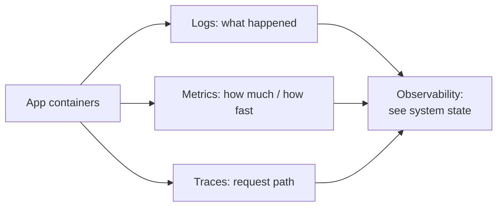
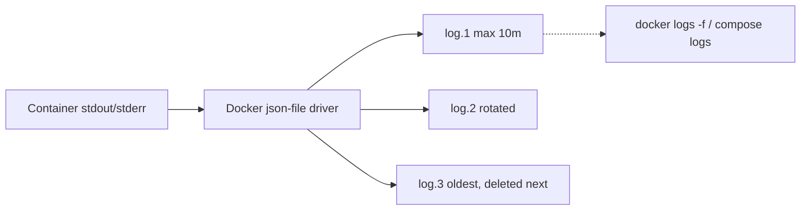
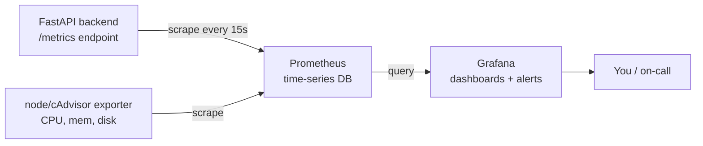

# Monitoring & Observability

You have shipped the [example app](example-app/docker-compose.yml) to a real
server (see [deployment.md](deployment.md)). It is live. Now comes the question
every operator eventually asks at 2 a.m.: *"Is it actually working — and if not,
why?"* This chapter is about answering that question **before** your users have
to tell you something is broken.

The reader is assumed to know Python and FastAPI but to have little DevOps
experience, so we build everything from first principles.

---

## 1. Why monitoring matters

> 💡 **Intuition:** Running a server without monitoring is like running a
> **restaurant kitchen** with no thermometers, no smoke detector, and no one
> watching the dining room. The food might be fine — but you would have no idea
> until a customer complains, the kitchen is on fire, or the freezer has been
> off for a day. Monitoring is the set of instruments that lets you *see* the
> state of the kitchen at a glance.

A running container does not announce its problems. It can be slowly leaking
memory, returning 500 errors to one in twenty users, or filling the disk with
logs — and nothing on the surface looks wrong until it suddenly all falls over.
**Observability** is the practice of instrumenting your system so its internal
state is visible from the outside.

---

## 2. The three pillars of observability

Observability is traditionally built on three kinds of data, called the **three
pillars**:

| Pillar | What it is | Question it answers |
|---|---|---|
| **Logs** | Timestamped text records of discrete events | *"What happened, and when?"* |
| **Metrics** | Numeric measurements sampled over time | *"How much / how fast / how many?"* |
| **Traces** | The path of a single request across services | *"Where did this one request spend its time?"* |

This chapter focuses on **logs** and **metrics**, which give you the most value
for the least effort and are the right starting point for a small app. Tracing
becomes valuable once you have many services calling each other; for our
four-container app, logs and metrics are plenty.



---

## 3. Logs: the diary of your containers

### 3.1 Intuition and how Docker captures logs

> 💡 **Intuition:** Logs are the kitchen's **diary** — "8:01 order received,
> 8:03 sent to grill, 8:04 grill reported error." When something goes wrong, the
> diary is the first thing you read.

By default, every line your program writes to **stdout** (standard output) and
**stderr** (standard error) is captured by Docker. This is exactly why our
backend's startup code does `print(f"[startup] DB init skipped: {exc}")` and why
Uvicorn prints request logs — Docker scoops up those lines and stores them.

### 3.2 Reading logs

To follow a single container's logs in real time:

```bash
docker logs -f example-app-backend-1
```

- `docker logs` — print a container's captured stdout/stderr.
- `-f` — **f**ollow: keep the stream open and print new lines as they arrive
  (like `tail -f`). Press `Ctrl-C` to stop following (the container keeps
  running).

With Compose, you usually refer to services by name rather than container ID:

```bash
docker compose logs -f backend          # follow one service
docker compose logs -f                   # follow ALL services, interleaved
docker compose logs --tail=100 nginx     # last 100 lines of nginx
```

- `docker compose logs -f backend` — follow just the `backend` service.
- `docker compose logs -f` — follow everything; lines are prefixed with the
  service name so you can tell `backend`, `frontend`, `db`, and `nginx` apart.
- `--tail=100` — show only the most recent 100 lines, useful when a log is huge.

> 💡 **Intuition:** `docker compose logs -f` with no service name is your
> "watch the whole kitchen" view — every station's diary, merged into one stream.

### 3.3 Log drivers

A **log driver** decides *where* Docker sends those captured lines. The default
driver is `json-file`, which writes them to a JSON file on the host disk. Other
drivers can ship logs to syslog, journald, or a remote aggregation service. For
a single-server app, `json-file` is fine — but it has a dangerous default we must
fix.

### 3.4 Log rotation — or your disk will fill up

By default, `json-file` logs grow **without limit**. A chatty app can write
gigabytes of logs over weeks until the disk is full — at which point Docker,
Postgres, and everything else start failing in confusing ways.

> ⚠️ **Common mistake:** Leaving logs unbounded. The number-one cause of a
> "the server randomly died" incident on small deployments is a disk filled by
> unrotated container logs. **Always** cap log size.

The fix is **log rotation**: keep at most N files of at most M size each, and
discard the oldest. Add this to each service in your production compose file:

```yaml
  backend:
    image: ghcr.io/chrisw09/example-app-backend:latest
    logging:
      driver: json-file
      options:
        max-size: "10m"     # rotate after each file reaches 10 megabytes
        max-file: "3"       # keep at most 3 rotated files (30m total)
    # …rest of the service unchanged…
```

- `driver: json-file` — the default driver, stated explicitly.
- `max-size: "10m"` — start a new log file once the current one hits 10 MB.
- `max-file: "3"` — keep three files at most; the oldest is deleted on rotation.

With this, a single service can use at most ~30 MB of log disk, full stop. Apply
the same `logging:` block to `frontend`, `db`, and `nginx`.

> ✅ **Best practice:** Set `max-size`/`max-file` on every service from day one.
> You can also set it globally in `/etc/docker/daemon.json` so all containers
> inherit it, then restart Docker.



---

## 4. Health checks: the simplest monitoring you already have

Before reaching for fancy tools, note that the app already monitors itself with
**health checks** — a command Docker runs periodically to ask a container "are
you alive?"

Recall the backend's `HEALTHCHECK` from the [Dockerfile](docker.md) (§5.6):

```dockerfile
HEALTHCHECK --interval=30s --timeout=3s --start-period=10s --retries=3 \
  CMD python -c "import urllib.request,sys; sys.exit(0 if urllib.request.urlopen('http://localhost:8000/api/health').status==200 else 1)"
```

- Every **30s** (`--interval`), Docker runs the command.
- It calls our own `/api/health` endpoint, expecting HTTP 200.
- `--start-period=10s` gives the app time to boot before failures count.
- After **3** consecutive failures (`--retries`), the container is marked
  `unhealthy`.

And the database's healthcheck from the [compose file](example-app/docker-compose.yml)
(§5.12):

```yaml
    healthcheck:
      test: ["CMD-SHELL", "pg_isready -U app"]
      interval: 10s
      timeout: 5s
      retries: 5
```

`pg_isready -U app` asks Postgres if it is accepting connections. This is what
`backend`'s `depends_on: db: condition: service_healthy` waits for, so the
backend never starts before the database is ready.

Check health status at a glance:

```bash
docker compose ps
docker inspect --format='{{.State.Health.Status}}' example-app-backend-1
```

`docker compose ps` shows a `STATUS` column reading `healthy`, `unhealthy`, or
`starting`. This is your free, built-in liveness monitoring — no extra tools
required.

> ✅ **Best practice:** Every long-running service should have a health check
> tied to a real endpoint (like `/api/health`), not just "the process is up." A
> process can be running yet wedged; hitting a real endpoint catches that.

---

## 5. Metrics: numbers over time

Logs tell you *what happened*; **metrics** tell you *how much* and *how fast*,
sampled continuously. "Requests per second," "error rate," "p95 latency,"
"memory used" — these are metrics. You cannot eyeball logs to know your error
rate; you need numbers plotted over time.

> 💡 **Intuition:** If logs are the kitchen diary, metrics are the **dashboard
> of gauges** — temperature, orders-per-minute, oven load — updating live so you
> see a trend forming before it becomes a fire.

We will use the two industry-standard open-source tools for this:

- **Prometheus** — a **pull-based metrics scraper and time-series database**. On
  a fixed interval it *pulls* (scrapes) numbers from an HTTP endpoint each target
  exposes (conventionally `/metrics`), and stores them as time series (a value
  tagged with labels, at a timestamp).
- **Grafana** — a **dashboard and alerting** tool. It queries Prometheus and
  draws graphs, and can fire alerts when a metric crosses a threshold.



Note the direction of the arrows: Prometheus **pulls** from the app, not the
other way around. The app just exposes numbers; Prometheus comes and collects
them on its schedule.

### 5.1 Exposing metrics from FastAPI

For Prometheus to scrape the backend, the backend must expose a `/metrics`
endpoint in Prometheus's text format. The simplest way in a FastAPI app is an
instrumentator library. Conceptually:

```python
# In the backend (illustrative — adds a /metrics endpoint)
from prometheus_fastapi_instrumentator import Instrumentator

# after `app = FastAPI(...)`:
Instrumentator().instrument(app).expose(app)   # serves GET /metrics
```

This automatically tracks request counts, error counts, and latency per endpoint
and serves them at `/metrics`. (You would add `prometheus-fastapi-instrumentator`
to `requirements.txt`.) Alternatively, run a separate **exporter** sidecar
container; for CPU/memory/disk of the host and containers, the standard choices
are **node_exporter** (host metrics) and **cAdvisor** (per-container metrics).

> ⚠️ **Common mistake:** Exposing `/metrics` publicly through Nginx. Metrics can
> leak internal details and add load. Keep `/metrics` on the internal `appnet`
> network so only Prometheus (also on `appnet`) can reach it — do **not** add a
> `location /metrics` to the public Nginx config.

### 5.2 Adding Prometheus and Grafana to Compose

Here is a Compose snippet that adds `prometheus` and `grafana` services to the
stack. They join the same `appnet` network so Prometheus can scrape the
`backend` service by its name.

```yaml
  prometheus:
    image: prom/prometheus:latest
    volumes:
      - ./prometheus.yml:/etc/prometheus/prometheus.yml:ro
      - prom_data:/prometheus
    restart: unless-stopped
    networks: [appnet]

  grafana:
    image: grafana/grafana:latest
    ports:
      - "3000:3000"            # Grafana UI; restrict via firewall in prod
    environment:
      GF_SECURITY_ADMIN_PASSWORD: ${GRAFANA_PASSWORD}
    volumes:
      - grafana_data:/var/lib/grafana
    depends_on:
      - prometheus
    restart: unless-stopped
    networks: [appnet]

volumes:
  db_data:
  prom_data:                   # Prometheus's time-series storage survives restarts
  grafana_data:                # Grafana dashboards/settings survive restarts
```

Line notes:

- `prom/prometheus:latest` / `grafana/grafana:latest` — the official images.
- The `prometheus.yml` file is mounted **read-only** (`:ro`) into the place
  Prometheus expects its config.
- `prom_data` and `grafana_data` are named **volumes** — the *pantry/fridge* —
  so your stored metrics and dashboards survive container restarts.
- Grafana publishes port `3000`. In production, restrict who can reach it (do
  **not** open 3000 in `ufw`; use an SSH tunnel or put it behind authenticated
  Nginx).
- `GF_SECURITY_ADMIN_PASSWORD` sets the admin password from a secret rather than
  the insecure default `admin`.

### 5.3 A minimal `prometheus.yml`

Prometheus's config lists *what to scrape* and *how often*. Create
`prometheus.yml` next to the compose file:

```yaml
global:
  scrape_interval: 15s          # how often to pull metrics from every target

scrape_configs:
  - job_name: "backend"
    metrics_path: /metrics      # the endpoint the instrumentator exposes
    static_configs:
      - targets: ["backend:8000"]   # resolved by Docker DNS on appnet

  - job_name: "prometheus"
    static_configs:
      - targets: ["localhost:9090"]  # Prometheus scraping itself
```

Line by line:

- `scrape_interval: 15s` — pull every target's numbers every 15 seconds.
- `job_name: "backend"` — a label grouping all metrics from the backend.
- `metrics_path: /metrics` — where on the target to fetch (the default is
  `/metrics`, shown here for clarity).
- `targets: ["backend:8000"]` — **this is the critical line.** `backend` is the
  Compose service name; Docker's internal DNS on `appnet` resolves it to the
  backend container, and `8000` is the backend's port. Prometheus scrapes
  `http://backend:8000/metrics`.

> ⚠️ **Common mistake:** Scraping the wrong target — e.g. `localhost:8000` (which
> is *Prometheus's own* container, where nothing listens) instead of
> `backend:8000`. Inside the Compose network you address other services by their
> **service name**, never `localhost`. Verify in the Prometheus UI under
> **Status → Targets** that `backend` shows `UP`.

### 5.4 Seeing it in Grafana

Open Grafana at `http://203.0.113.10:3000` (or via an SSH tunnel), log in, add
Prometheus as a **data source** (URL `http://prometheus:9090`, again by service
name), and build a dashboard. You can import community dashboards by ID for
FastAPI, node_exporter, and cAdvisor to get useful graphs in minutes.

---

## 6. What to actually watch

Tools are useless without knowing which numbers matter. For a web service, the
canonical set is the **"RED" metrics** plus **resource saturation**:

- **Request rate** — requests per second. A sudden drop to zero often means the
  app is down or unreachable; a spike may mean a traffic surge or an attack.
- **Errors** — the rate and percentage of 5xx (and unexpected 4xx) responses.
  This is usually your **most important alerting signal**: users feel errors
  directly.
- **Latency** — how long requests take, watched at percentiles (p50, p95, p99),
  not just the average. The average hides the slow tail that frustrates users.
- **CPU and memory** — per container. Steadily climbing memory is a classic leak;
  CPU pinned at 100% means you are saturated and latency will suffer.
- **Disk** — free space on the host. This is the silent killer (remember the
  unrotated-logs problem in §3.4). Alert *before* it hits zero.

> ✅ **Best practice:** Alert on **symptoms users feel** (error rate, high
> latency, app down) rather than on every internal blip. An alert that fires
> constantly gets ignored — "alert fatigue" — and then the one real alert is
> missed too.

> ⚠️ **Common mistake:** Setting up dashboards but **no alerts**. A dashboard
> only helps if someone is looking at it. The whole point of metrics is to be
> told automatically when something crosses a line — configure Grafana alerts (or
> Prometheus Alertmanager) so the system pages *you*, not the other way around.

---

## 7. Putting logs and metrics together

In practice you use both pillars as a team: **metrics tell you *that* something is
wrong and roughly *where*; logs tell you *why*.**

A typical incident flow:

1. A Grafana alert fires: backend 5xx error rate jumped to 8%.
2. You glance at the latency graph — p95 also spiked at the same moment.
3. You drop to logs: `docker compose logs -f backend` shows
   `database unavailable` errors (our `/api/visits` returns that gracefully).
4. You check `docker compose ps` — `db` is `unhealthy`.
5. You read `docker compose logs db` and find Postgres ran out of disk.

Metrics pointed you to the problem in seconds; logs and health status told you
the root cause. That is the payoff of observability.

---

## Exercises

**Exercise 1 — Tame the logs.**
Your server's disk is filling with container logs. Write the `logging:` block you
would add to the `backend` service so it never uses more than ~30 MB of log
space, and explain each option.

<details>
<summary>Answer</summary>

```yaml
    logging:
      driver: json-file
      options:
        max-size: "10m"
        max-file: "3"
```

`driver: json-file` is Docker's default file-based driver. `max-size: "10m"`
rotates to a new file every 10 MB. `max-file: "3"` keeps at most 3 files (deleting
the oldest), so the ceiling is 3 × 10 MB ≈ 30 MB.

</details>

**Exercise 2 — Fix the scrape target.**
A teammate's `prometheus.yml` has `targets: ["localhost:8000"]` and the
**Status → Targets** page shows the backend as `DOWN`. What is wrong and what is
the correct line? Why?

<details>
<summary>Answer</summary>

Inside the Compose `appnet` network, `localhost` refers to the *Prometheus*
container itself, where nothing listens on 8000. You must address other services
by their Docker service name. The correct target is `["backend:8000"]`, which
Docker DNS resolves to the backend container so Prometheus scrapes
`http://backend:8000/metrics`.

</details>

**Exercise 3 — Choose your alerts.**
For our example app, name the four signals you would alert on and why each
matters more than, say, alerting on CPU alone.

<details>
<summary>Answer</summary>

(1) **Error rate** (5xx %) — users feel errors directly; the top signal.
(2) **Latency** (p95/p99) — slow responses frustrate users even when no error is
returned. (3) **App down / request rate at zero** — total outage. (4) **Disk
free** — the silent killer that takes everything down (e.g. unrotated logs or a
full Postgres volume). CPU alone is a *cause*, not a *symptom* — high CPU only
matters if it actually degrades errors or latency, so alert on the symptoms users
experience and use CPU/memory graphs to diagnose.

</details>

---

## Next / Related

- [deployment.md](deployment.md) — get the app live before you monitor it.
- [docker-compose.md](docker-compose.md) — the compose syntax used for the
  `prometheus`/`grafana` services and healthchecks.
- [docker.md](docker.md) — the `HEALTHCHECK` instruction tied back to here.
- [troubleshooting.md](troubleshooting.md) — once an alert fires, this is how you
  fix it.
