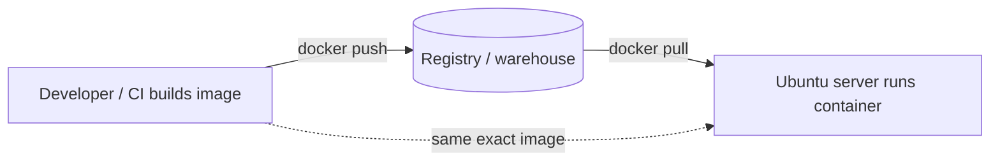
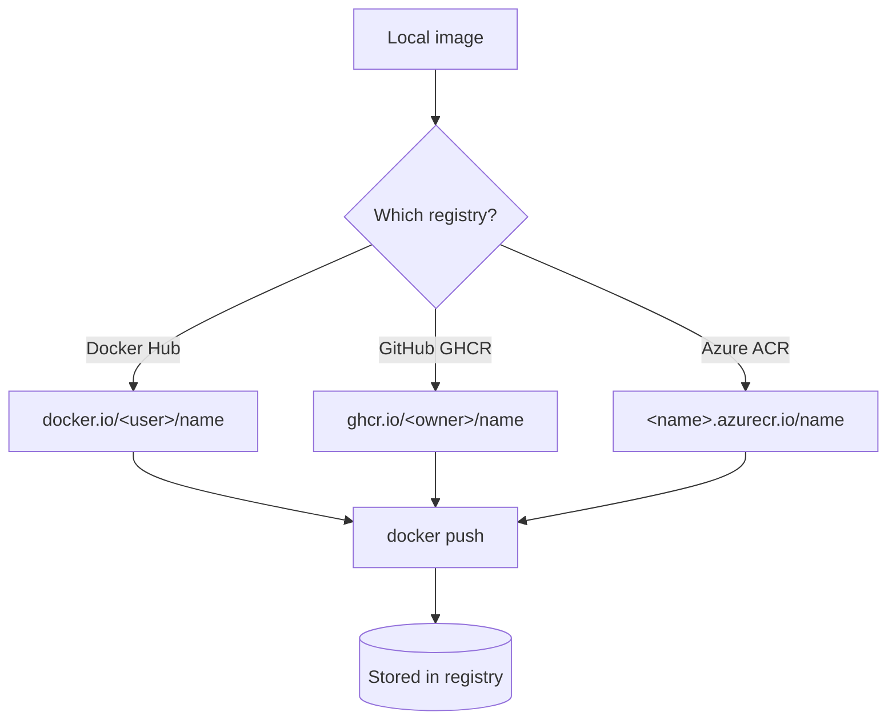

# Container Registries — The Warehouse for Your Images

You've built a Docker image on your laptop. It works. Now how does that exact image get onto your production server, hundreds of miles away? You are not going to email a multi-gigabyte file, and you are certainly not going to rebuild it by hand on the server and hope it comes out identical.

The answer is a **container registry**. This chapter explains what registries are, why they exist, and exactly how to log in, name, push, and pull images — using the three you're most likely to meet: Docker Hub, GitHub Container Registry, and Azure Container Registry.

> 💡 **Intuition:** A registry is a **warehouse — or an app store — for Docker images**. You build a "recipe" (an [image](docker.md)) once, ship it to the warehouse, and anyone with permission can fetch that *exact same recipe* from anywhere. The image you tested on your laptop is byte-for-byte the one the server runs. No surprises.

If [GitHub Actions](github-actions.md) is the **automated factory**, the registry is the warehouse where the factory stores finished goods before the **delivery truck (CD)** carries them to the [Ubuntu server](deployment.md).

---

## 1. Why registries exist

Recall the [image vs container](docker.md) distinction:

- An **image** is a **recipe** — frozen, immutable build instructions plus all the files and dependencies.
- A **container** is the **cooked meal** — a running instance of that recipe.

To run your app on a server, the server needs the *recipe*. Three places are involved, and the registry is the courier between them:



The flow is always **developer → registry → server**:

1. **Build** the image (locally, or in CI on a GitHub-hosted runner).
2. **Push** it to the registry — uploading the recipe to the warehouse.
3. On the server, **pull** it — downloading that identical recipe.
4. Run it with `docker compose up -d`.

The registry decouples *where you build* from *where you run*. Build in CI, run on the server, develop on your laptop — everyone fetches the same artifact from one shared source of truth. This is exactly what the `build-and-push` and `deploy` jobs in [our workflow](example-app/.github/workflows/ci-cd.yml) do.

---

## 2. Anatomy of an image name

Before logging into anything, you must understand how images are *named*, because the name encodes which registry, which owner, and which version. Get a name wrong and `docker push` will cheerfully upload to the wrong place — or fail.

A fully-qualified image reference looks like this:

```
ghcr.io / chrisw09 / example-app-backend : latest
└──┬───┘ └───┬────┘ └────────┬─────────┘ └──┬─┘
 registry   owner          name           tag
```

```
registry/owner/name:tag
```

- **registry** — the warehouse hostname. `ghcr.io` (GitHub), `docker.io` (Docker Hub), `myregistry.azurecr.io` (Azure). If you omit it, Docker defaults to **Docker Hub** (`docker.io`) — which is why `docker pull nginx` works without any hostname.
- **owner** — the namespace: your username, organization, or registry path. For us, `chrisw09`. GHCR requires the owner to be **lowercase**, which is why repo owner `ChrisW09` becomes `chrisw09`.
- **name** — the repository name for this image. We use `example-app-backend`, `example-app-frontend`, `example-app-nginx`.
- **tag** — the version label after the `:`. If omitted, Docker assumes `:latest`.

Our three canonical images, in full:

```
ghcr.io/chrisw09/example-app-backend
ghcr.io/chrisw09/example-app-frontend
ghcr.io/chrisw09/example-app-nginx
```

These names appear verbatim in [docker-compose.yml](example-app/docker-compose.yml) and are produced by the `IMAGE_PREFIX` variable in [the workflow](github-actions.md).

### Tags: the part that bites people

A **tag** names a *version* of an image. The same name can have many tags. There are three styles, and knowing when to use each is the most important takeaway of this chapter.

| Tag style | Example | Meaning | Stable? |
|---|---|---|---|
| **`:latest`** | `…-backend:latest` | "the newest one" — a *moving pointer* | ❌ No — reassigned on every push |
| **Semantic / versioned** | `…-backend:1.4.2` | a deliberate release number | ✅ By convention |
| **Commit SHA** | `…-backend:9f3a1c7…` | the exact commit it was built from | ✅ Effectively immutable |

> ⚠️ **`:latest` is a label, not a guarantee.** It does not mean "stable" or "the latest *release*." It means "whatever was pushed most recently with that tag." Push again and `:latest` silently points at different bits. Two servers pulling `:latest` an hour apart can end up running *different code* with no warning.

### Digests — the only truly immutable reference

Every image has a content **digest**: a SHA-256 hash of its exact contents, written `@sha256:…`. While tags can be reassigned, a digest *cannot* — change one byte of the image and the digest changes. You can pin to a digest for maximum reproducibility:

```
ghcr.io/chrisw09/example-app-backend@sha256:5e1f...c2a9
```

A tag is like saying "the book on the top shelf" (could change). A digest is like an ISBN — it identifies one exact, unchangeable edition.

---

## 3. The tag scheme this module uses

Our [CI/CD workflow](github-actions.md) pushes **two tags for every image on every build**:

```yaml
tags: |
  ${{ env.IMAGE_PREFIX }}-backend:latest
  ${{ env.IMAGE_PREFIX }}-backend:${{ github.sha }}
```

That resolves to, for example:

```
ghcr.io/chrisw09/example-app-backend:latest
ghcr.io/chrisw09/example-app-backend:e83c5f2a9d1b4c6f0a7e8b3c2d1f0a9e8b7c6d5e
```

Why both?

- **`:latest`** is the convenient, human-friendly pointer. The server's [docker-compose.yml](example-app/docker-compose.yml) references `:latest`, so `docker compose pull` always grabs the newest build — no editing the compose file for each deploy.
- **`:${{ github.sha }}`** (the full Git commit hash) is the **immutable audit trail**. Every image is permanently tagged with the exact commit it came from. If `:latest` breaks production, you can pull the SHA-tagged image from the *previous* good commit and roll back instantly — and you can prove, months later, precisely which source produced a given running container.

> 💡 **Intuition:** `:latest` is the "now serving" number at the deli counter — it always points at whoever's current. The SHA tag is the *dated receipt* for each specific order — it never changes, so you can always look one up.

---

## 4. The three registries

All registries speak the same Docker protocol, so the *commands* (`docker login`, `tag`, `push`, `pull`) are identical everywhere. Only the **hostname**, the **naming convention**, and the **login credentials** differ.



### 4.1 Docker Hub — the default public warehouse

Docker Hub is the original, default registry. When you `docker pull python:3.12-slim` (as our [backend Dockerfile](example-app/backend/Dockerfile) does), you're pulling from Docker Hub without naming it.

```bash
# 1. Log in (prompts for your Docker Hub password or an access token)
docker login -u myusername

# 2. Tag a local image with your Docker Hub namespace
docker tag example-app-backend:latest myusername/example-app-backend:latest

# 3. Push it to the warehouse
docker push myusername/example-app-backend:latest

# 4. Anyone (if public) can pull it
docker pull myusername/example-app-backend:latest
```

- `docker login -u myusername` — authenticate. With no registry hostname, Docker assumes `docker.io`. Best practice is an **access token**, not your account password.
- `docker tag <source> <target>` — give an existing local image a second name. Tagging doesn't copy or rebuild; it just adds a label pointing at the same image. The target must include your namespace (`myusername/…`) so the push knows where it belongs.
- `docker push` — upload to Docker Hub.
- `docker pull` — download. Public images need no login; private ones do.

### 4.2 GitHub Container Registry (GHCR) — the one we use

GHCR lives at `ghcr.io` and is tightly integrated with GitHub: images ("packages") attach to your GitHub account or organization and reuse GitHub's permissions. **This is the registry this entire module uses.**

```bash
# 1. Log in to GHCR with a Personal Access Token (PAT)
echo "$GHCR_TOKEN" | docker login ghcr.io -u ChrisW09 --password-stdin

# 2. Build (or already have) the image, tagged for GHCR
docker tag example-app-backend:latest ghcr.io/chrisw09/example-app-backend:latest

# 3. Push to GHCR
docker push ghcr.io/chrisw09/example-app-backend:latest

# 4. On the server, pull it back
docker pull ghcr.io/chrisw09/example-app-backend:latest
```

Line by line:

- `echo "$GHCR_TOKEN" | docker login ghcr.io -u ChrisW09 --password-stdin` — log into `ghcr.io`. We pipe the token via `--password-stdin` so the secret **never appears in your shell history or process list** — a small but important security habit. The token here is a **Personal Access Token (PAT)** with the `write:packages` scope (created at GitHub → Settings → Developer settings → Personal access tokens).
- `docker tag … ghcr.io/chrisw09/example-app-backend:latest` — note the lowercase owner `chrisw09`. GHCR rejects uppercase owners, so even though the GitHub account is `ChrisW09`, the image path must be lowercase.
- `docker push …` — upload to GHCR.
- `docker pull …` — what the server runs (indirectly, via `docker compose pull`) to fetch the image.

**The crucial point about CI:** inside [GitHub Actions](github-actions.md) you do **not** create or store a PAT. GitHub automatically provides `secrets.GITHUB_TOKEN`, and granting the job `permissions: packages: write` lets it push to GHCR. You only need a manual PAT when pushing/pulling from your own laptop or the server outside of Actions.

### 4.3 Azure Container Registry (ACR) — a private cloud registry

If your infrastructure lives in Microsoft Azure, **Azure Container Registry** gives you a private registry inside your Azure subscription, at `<registryname>.azurecr.io`. We don't use it in this module, but it's common in enterprise settings, so here's the shape.

```bash
# 1. Log in (the Azure CLI handles credentials for you)
az acr login --name myregistry

# 2. Tag the image for your ACR hostname
docker tag example-app-backend:latest myregistry.azurecr.io/example-app-backend:latest

# 3. Push
docker push myregistry.azurecr.io/example-app-backend:latest

# 4. Pull
docker pull myregistry.azurecr.io/example-app-backend:latest
```

- `az acr login --name myregistry` — the Azure CLI authenticates you against `myregistry.azurecr.io` using your Azure identity, then hands Docker a short-lived token. (You can also `docker login myregistry.azurecr.io` with a service-principal username/password for automation.)
- The hostname pattern is `<registryname>.azurecr.io` — the registry name *is* the subdomain. ACR registries are **private by default**, so both push and pull require authentication.

> 💡 The mental model is identical for all three: *log in → tag with the right hostname/namespace → push → pull*. Switching registries is just switching the hostname in the image name.

---

## 5. Private vs public, and auth tokens

Registries gate access at the image level:

- **Public images** can be pulled by anyone, no login. (`docker pull nginx` works for everybody.) Pushing still requires you to be the authenticated owner.
- **Private images** require authentication to *both* push and pull. On GHCR, a package's visibility (public/private) is controlled in its package settings on GitHub; a private GHCR image needs a token even to `docker pull`.

**Tokens, not passwords.** Every registry prefers a scoped token over your account password:

- **Docker Hub** — Account Settings → Security → Access Tokens, with read/write/delete scopes.
- **GHCR** — a Personal Access Token (classic) with `read:packages` / `write:packages`, *or* a fine-grained token. In CI, the automatic `GITHUB_TOKEN` replaces all of this.
- **ACR** — your Azure identity via `az acr login`, or a service principal for machines.

> ✅ Give each token the **narrowest scope** that works. A token that can only *read* packages is all your server needs to pull; reserve *write* for the CI job that pushes.

---

## 6. ⚠️ Common mistakes

> ⚠️ **Common mistake — Relying on `:latest` in production.** Two servers pulling `:latest` at different moments may run different code. Worse, `docker compose pull` will only fetch a new `:latest` if it changed — and Docker may keep a stale cached one. Pin to immutable tags (SHA or version) when you need certainty, and keep the SHA tag around for rollbacks.

> ⚠️ **Common mistake — Uppercase owner on GHCR.** `ghcr.io/ChrisW09/…` is rejected. GHCR demands a **lowercase** owner: `ghcr.io/chrisw09/…`. The workflow's `${{ github.repository_owner }}` already lowercases this for you; doing it by hand is where people slip.

> ⚠️ **Common mistake — Pushing to the wrong registry.** Forget the hostname and `docker push myimage:latest` targets **Docker Hub by default** — possibly publishing something you meant to keep private on GHCR. Always include the full `registry/owner/name:tag`.

> ⚠️ **Common mistake — Leaking tokens.** Typing a token as a `docker login -p <token>` argument records it in your shell history and the process list. Always pipe it via `--password-stdin`, or use a secret store / the CI's built-in token.

---

## 7. ✅ Production best practices

> ✅ **Best practice — Use immutable tags.** Tag every build with the commit SHA (as our workflow does) or a real version number. `:latest` is fine as a *convenience pointer*, but your audit trail and rollbacks should rest on tags that never move.

> ✅ **Best practice — Scan images for vulnerabilities.** Registries (GHCR, Docker Hub, ACR) and tools like Trivy or `docker scout` can scan pushed images for known CVEs. Wire a scan into CI so a vulnerable base image fails the build before it ships.

> ✅ **Best practice — Set retention / cleanup policies.** Pushing a SHA tag on every commit means images pile up fast and consume storage. Configure retention rules (GHCR package retention, ACR purge tasks) to delete old untagged or stale images automatically. Our deploy step also runs `docker image prune -f` on the server to reclaim local disk.

> ✅ **Best practice — Least-privilege tokens.** The CI push job gets `packages: write` and nothing else; the server only needs read access to pull. Never reuse one all-powerful token everywhere. Rotate tokens periodically and immediately if one is exposed.

---

## 8. Exercises

**Exercise 1 — Decode an image name.**
What does each part of `ghcr.io/chrisw09/example-app-frontend:9f3a1c7` mean? Which part is immutable, and which could change tomorrow?

<details>
<summary>Answer</summary>

- `ghcr.io` — registry (GitHub Container Registry).
- `chrisw09` — owner (lowercased GitHub owner).
- `example-app-frontend` — image name.
- `9f3a1c7` — tag, here a Git commit SHA.

The **SHA tag** is effectively immutable: it was set once to the image built from that commit and won't be reassigned. Any tag *can* technically be re-pushed, but by convention a SHA tag is never moved — unlike `:latest`, which is reassigned on every build.
</details>

**Exercise 2 — Push to GHCR by hand.**
You built `example-app-backend:latest` locally. Write the commands to tag and push it to GHCR under owner `chrisw09`, also adding a version tag `v1.0.0`.

<details>
<summary>Answer</summary>

```bash
echo "$GHCR_TOKEN" | docker login ghcr.io -u ChrisW09 --password-stdin
docker tag example-app-backend:latest ghcr.io/chrisw09/example-app-backend:latest
docker tag example-app-backend:latest ghcr.io/chrisw09/example-app-backend:v1.0.0
docker push ghcr.io/chrisw09/example-app-backend:latest
docker push ghcr.io/chrisw09/example-app-backend:v1.0.0
```
`GHCR_TOKEN` is a PAT with `write:packages`. Tagging adds names to the same image; you push each tag.
</details>

**Exercise 3 — Why two tags in CI?**
Our workflow pushes both `:latest` and `:${{ github.sha }}`. A teammate says "the SHA tag is redundant, `:latest` is enough." Argue against them.

<details>
<summary>Answer</summary>

`:latest` is a moving pointer — it always means "most recent build," so it can't identify a *specific* version after the next push overwrites it. The SHA tag gives every build a permanent, unique identity tied to its source commit. That enables: (1) **rollback** — redeploy the previous commit's image even after `:latest` moved on; (2) **auditing** — prove exactly which source produced a running container; (3) **reproducibility** — pin an environment to one exact image. `:latest` provides none of these.
</details>

**Exercise 4 — Public vs private pull.**
Your GHCR package `example-app-backend` is **private**. The Ubuntu server runs `docker compose pull` and gets a `denied` error. What's missing, and how do you fix it with least privilege?

<details>
<summary>Answer</summary>

The server isn't authenticated to GHCR, and a private package can't be pulled anonymously. On the server, run `docker login ghcr.io` with a token that has **only** `read:packages` scope (a read-only PAT or deploy token) — never a write-capable one. After login, `docker compose pull` succeeds. Alternatively, make the package public if it contains nothing sensitive.
</details>

---

## Next / Related

- **[GitHub Actions](github-actions.md)** — the `build-and-push` job that produces and pushes these images, and the `GITHUB_TOKEN` / `permissions` that authorize it.
- **[Docker](docker.md)** — what an image *is* (the recipe) before it ever reaches a registry.
- **[Docker Compose](docker-compose.md)** — where the `image:` tags are referenced and pulled with `docker compose pull`.
- **[Deployment](deployment.md)** — how the server logs into GHCR and pulls these images to go live.
