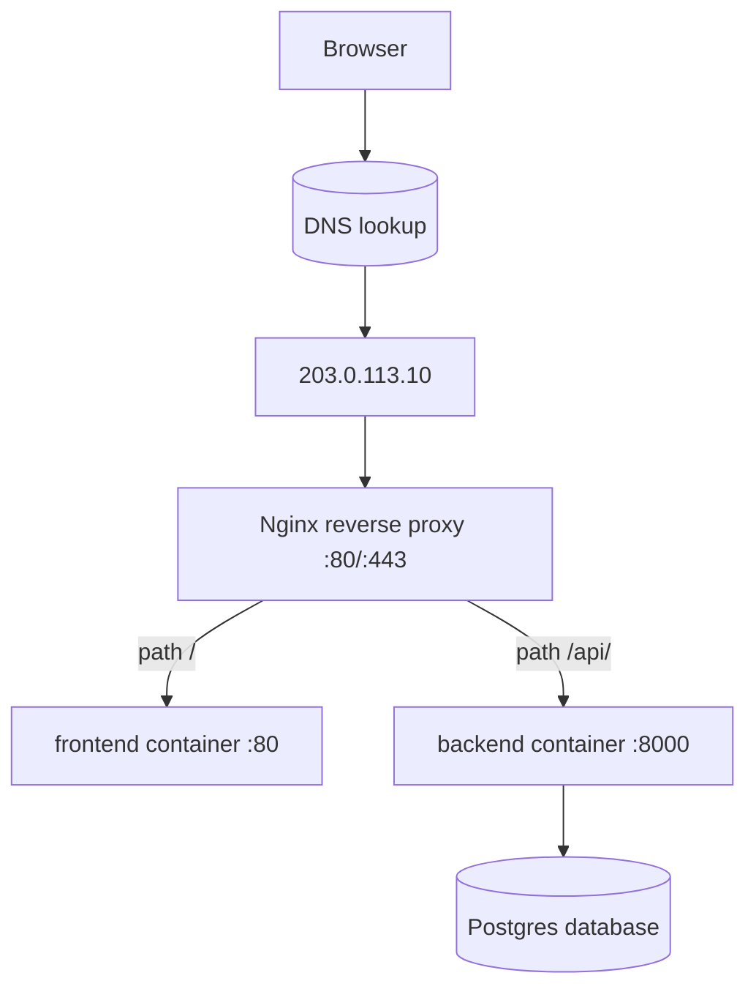
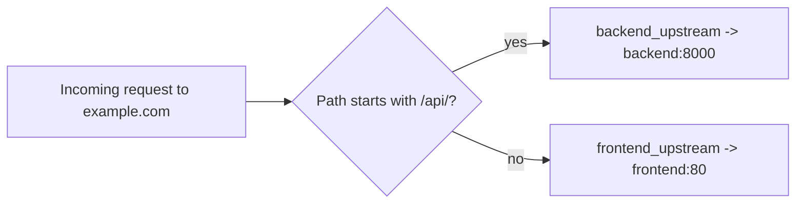

# Reverse Proxies — The Receptionist

Once [DNS](dns.md) has guided a browser to our server's public IP
`203.0.113.10`, something has to *answer* on that machine and decide what to do
with each request. We don't want the outside world talking directly to our
FastAPI backend or our database — we want a single, controlled front door. That
front door is a **reverse proxy**, and in this module it's **Nginx**.

This chapter teaches what a reverse proxy is, how it differs from related ideas
(forward proxy, load balancer), why we want one, and then walks our actual Nginx
config line by line. Finally we meet **Traefik**, a more dynamic alternative, and
compare the two.

---

## 1. What is a reverse proxy?

> 💡 **Intuition:** A reverse proxy is the **receptionist** at the front desk.
> Visitors don't wander the building looking for the right office — they tell the
> receptionist what they want, and the receptionist routes them to the correct
> room, then carries the reply back. The visitor never learns the building's
> internal layout.

Technically, a **reverse proxy** is a server that sits **in front of** one or more
backend services. It accepts incoming requests from clients, forwards each one to
the appropriate backend, receives the backend's response, and returns it to the
client. From the client's point of view, the reverse proxy *is* the website —
clients never see the backends behind it.

The word "reverse" is best understood by contrast with its mirror image.

### Reverse proxy vs forward proxy

A **forward proxy** sits in front of **clients** and represents *them* to the
outside world. A company might route all employee web traffic through a forward
proxy to filter or log it; the websites see the proxy, not the individual
employees.

A **reverse proxy** sits in front of **servers** and represents *them* to the
outside world. Clients see the proxy, not the individual backend services.

In one line: a forward proxy hides **who is asking**; a reverse proxy hides
**who is answering**.

### Reverse proxy vs load balancer

A **load balancer** spreads incoming requests across **multiple identical copies**
of a service so no single instance is overwhelmed. The overlap with reverse
proxies is real: most reverse proxies (Nginx included) *can* load-balance, and
most load balancers *are* a kind of reverse proxy.

The useful distinction is intent:

- A **reverse proxy** focuses on **routing and gatekeeping** — sending `/api/` to
  one service and `/` to another, terminating TLS, hiding internals.
- A **load balancer** focuses on **distributing load** across replicas of the
  *same* service for capacity and resilience.

In our small stack, Nginx acts as a reverse proxy (routing by path). If we later
ran three copies of the backend, the same Nginx could *also* load-balance across
them by listing several servers in an `upstream` block.

---

## 2. Why we need one

Without a reverse proxy you'd have to expose each container on its own port and
ask users to remember them — `:8000` for the API, `:80` for the frontend — and
you'd have no clean place to add TLS. A reverse proxy gives us, in one place:

- **A single entry point** on the standard ports **`:80`** (HTTP) and **`:443`**
  (HTTPS). Users just type `example.com`.
- **Path/host routing.** `example.com/` goes to the frontend; `example.com/api/...`
  goes to the backend. Same domain, same origin, no CORS headaches in the browser.
- **TLS termination.** HTTPS is decrypted **once**, at the proxy. Backends speak
  plain HTTP internally (see [https.md](https.md)). One certificate to manage, not
  one per service.
- **Hiding internal services.** The backend (`:8000`) and database (`:5432`) are
  never published to the internet. Only the proxy is reachable from outside.
- **Compression, caching, buffering, rate limiting.** Cross-cutting concerns live
  in the proxy instead of being reimplemented in every app.

Here is where the reverse proxy sits in our stack:



And here is the routing decision it makes on every request:



Notice that **only `nginx` publishes a port** to the host (`80:80` in our
[docker-compose.yml](example-app/docker-compose.yml)). The `backend`, `frontend`,
and `db` services have **no** published ports — they're reachable only on the
internal `appnet` network, and only the proxy can reach them. That is the "hiding
internal services" benefit made concrete.

---

## 3. Nginx, line by line

Nginx (pronounced "engine-x") is a fast, battle-tested web server and reverse
proxy. Below is the **exact** configuration we ship, quoted verbatim from
[`example-app/nginx/default.conf`](example-app/nginx/default.conf). We'll then
explain **every line**.

```nginx
# Upstreams name the internal containers. Docker's DNS resolves these
# service names ("frontend", "backend") to container IPs on the appnet network.
upstream frontend_upstream {
    server frontend:80;
}
upstream backend_upstream {
    server backend:8000;
}

server {
    listen 80;
    server_name _;            # match any hostname for now (see https.md for TLS)

    # API traffic -> FastAPI backend. The trailing slashes keep the /api/ prefix.
    location /api/ {
        proxy_pass http://backend_upstream;
        proxy_set_header Host              $host;
        proxy_set_header X-Real-IP         $remote_addr;
        proxy_set_header X-Forwarded-For   $proxy_add_x_forwarded_for;
        proxy_set_header X-Forwarded-Proto $scheme;
    }

    # Everything else -> static frontend.
    location / {
        proxy_pass http://frontend_upstream;
        proxy_set_header Host              $host;
        proxy_set_header X-Real-IP         $remote_addr;
        proxy_set_header X-Forwarded-For   $proxy_add_x_forwarded_for;
        proxy_set_header X-Forwarded-Proto $scheme;
    }
}
```

### The `upstream` blocks

```nginx
upstream frontend_upstream {
    server frontend:80;
}
upstream backend_upstream {
    server backend:8000;
}
```

An **`upstream` block** defines a named group of backend servers that Nginx can
forward to. We define two: `frontend_upstream` and `backend_upstream`.

- `server frontend:80;` — the destination is the host **`frontend`** on port
  **`80`**. Where does the name `frontend` come from? It's the **service name** in
  our Docker Compose file. Docker runs an internal **DNS** server on the `appnet`
  network, so `frontend` automatically resolves to that container's current IP.
  This is the same name→IP idea from [dns.md](dns.md), but scoped to the private
  Docker network instead of the public internet.
- `server backend:8000;` — likewise, the **`backend`** service on port **`8000`**,
  which is where our FastAPI app (via Uvicorn) listens.

Naming the upstreams (rather than writing `proxy_pass http://backend:8000`
inline) keeps the `location` blocks clean and makes it trivial to add more servers
later for load balancing — you'd just list additional `server` lines inside the
block.

### The `server` block

```nginx
server {
    listen 80;
    server_name _;
```

A **`server` block** is one virtual host — a complete description of how to handle
requests arriving on a given port/hostname.

- **`listen 80;`** — accept connections on TCP port **80**, the standard HTTP
  port. (In [https.md](https.md) we add a second `listen 443 ssl;` for HTTPS.)
- **`server_name _;`** — which hostnames this block answers for. The underscore
  `_` is a catch-all that matches **any** hostname. That's fine while we're
  learning and serving a single site. Once we add TLS we'll pin this to
  `example.com www.example.com` so the right certificate is selected.

### `location /api/` vs `location /` — routing by path

A **`location` block** matches a URL path prefix and decides what to do with it.
Nginx picks the **most specific** matching location, so a request to
`/api/health` matches `location /api/` (more specific) rather than `location /`
(the catch-all).

```nginx
    location /api/ {
        proxy_pass http://backend_upstream;
        ...
    }

    location / {
        proxy_pass http://frontend_upstream;
        ...
    }
```

- Requests whose path starts with **`/api/`** (e.g. `/api/health`,
  `/api/message`, `/api/visits`) are sent to the **backend**.
- **Everything else** — `/`, `/index.html`, assets — is sent to the
  **frontend**.

This is exactly the routing our [frontend `index.html`](example-app/frontend/index.html)
relies on: the browser calls `/api/message` on the **same origin**, and Nginx
quietly forwards that to `backend:8000`. The browser never talks to the backend
directly, so there's no cross-origin call to worry about.

### `proxy_pass` and the all-important trailing slash

```nginx
        proxy_pass http://backend_upstream;
```

**`proxy_pass`** is the instruction that actually forwards the request to an
upstream. The subtle part is how Nginx rewrites the path, which depends on whether
`proxy_pass` ends with a slash:

- **No trailing slash** (our case): `proxy_pass http://backend_upstream;`. Nginx
  forwards the **original, full path unchanged**. A request for `/api/health`
  arrives at the backend as **`/api/health`**. This is exactly what we want,
  because our FastAPI routes are *defined* with the `/api/` prefix
  (`@app.get("/api/health")`).
- **With a trailing slash**: `proxy_pass http://backend_upstream/;`. Nginx would
  **strip** the matched `location` prefix (`/api/`) and replace it, so
  `/api/health` would arrive at the backend as **`/health`** — which our FastAPI
  app does **not** define, yielding `404 Not Found`.

So the rule for our app is: **`location /api/` + `proxy_pass http://backend_upstream;`
(no trailing slash) preserves the `/api/` prefix.** The comment in the file —
"The trailing slashes keep the /api/ prefix" — refers to the trailing slash on the
`location /api/` matcher; combined with the slash-less `proxy_pass`, the prefix is
carried through to the backend intact.

> ⚠️ **Common mistake:** Adding a trailing slash to `proxy_pass`
> (`http://backend_upstream/`) and then getting 404s because the `/api/` prefix
> was stripped and your FastAPI routes (which include `/api/`) no longer match.
> Decide deliberately whether the backend expects the prefix, and make
> `proxy_pass` agree.

### The four `proxy_set_header` lines — and why backends need them

When Nginx forwards a request, the backend would otherwise see the connection as
coming **from Nginx**, not from the real visitor — Nginx is the receptionist
relaying the message. These headers restore the lost context so the backend knows
who *really* called and how.

```nginx
        proxy_set_header Host              $host;
        proxy_set_header X-Real-IP         $remote_addr;
        proxy_set_header X-Forwarded-For   $proxy_add_x_forwarded_for;
        proxy_set_header X-Forwarded-Proto $scheme;
```

- **`Host $host;`** — forwards the original hostname the visitor requested (e.g.
  `example.com`) instead of the upstream's internal name. Backends use the `Host`
  header to build absolute URLs (redirects, links, cookies). Drop it and redirects
  can point at the wrong place.
- **`X-Real-IP $remote_addr;`** — `$remote_addr` is the IP of whoever connected to
  Nginx, i.e. the **visitor's IP**. Without this, the backend sees only Nginx's
  IP. Apps and logs use `X-Real-IP` to record the true client.
- **`X-Forwarded-For $proxy_add_x_forwarded_for;`** — the standard chain of client
  IPs as a request passes through proxies. `$proxy_add_x_forwarded_for` appends the
  current client to any existing list, preserving the full path through multiple
  proxies.
- **`X-Forwarded-Proto $scheme;`** — tells the backend whether the **original**
  request was `http` or `https`. This matters a lot once TLS terminates at the
  proxy: internally the backend is reached over plain HTTP, but it needs to know
  the user arrived over HTTPS so it builds `https://` links and sets `Secure`
  cookies. See [https.md](https.md).

> ⚠️ **Common mistake:** Missing `X-Forwarded-Proto`. After you add HTTPS, the
> backend (only seeing internal HTTP) thinks the user is on HTTP and issues
> `http://` redirects — which the browser then upgrades or blocks, causing
> redirect loops or "mixed content" warnings. Always forward the original scheme.

> ⚠️ **Common mistake:** A **502 Bad Gateway**. This is Nginx saying "I tried to
> reach the upstream and couldn't." Usually the backend container is down, still
> starting, crashed, or listening on a different port than the `upstream` block
> names. Check `docker compose ps`, the backend logs, and that
> `server backend:8000;` matches the port Uvicorn actually binds.

> ✅ **Production best practices:**
> - Forward **all four** headers on every proxied location so logging, redirects,
>   and HTTPS detection work.
> - Keep backends **unpublished** — only the proxy listens on `:80`/`:443`.
> - Add a **health check** location or rely on the container `HEALTHCHECK` so a
>   sick backend is noticed before users are.
> - Pin Nginx to a specific image tag (we use `nginx:1.27-alpine`) for
>   reproducible builds.

---

## 4. Traefik — the dynamic alternative

Nginx is **static**: you write a config file, and you reload Nginx when it
changes. **Traefik** takes a different approach designed for the container era.

> 💡 **Intuition:** If Nginx is a receptionist working from a printed directory
> you update by hand, **Traefik** is a receptionist who watches the building and
> updates the directory automatically as offices open and close.

**Traefik** is a reverse proxy and load balancer that builds its routing rules
**dynamically** by watching your infrastructure. Its standout features:

- **Label-based dynamic configuration.** Instead of a central config file, each
  service describes how it wants to be routed using **Docker labels** right in the
  Compose file.
- **Automatic service discovery.** Traefik connects to the Docker API and notices
  when containers start or stop, adding and removing routes **with no reload**.
- **Automatic Let's Encrypt.** Traefik can obtain and renew TLS certificates by
  itself via the **ACME** protocol (see [https.md](https.md)) — you just declare
  which domain a service answers for.

Here's a short Traefik setup that routes `example.com/api/` to a backend, with
automatic HTTPS:

```yaml
services:
  traefik:
    image: traefik:v3.1
    command:
      # Watch Docker and only expose containers that opt in via labels
      - "--providers.docker=true"
      - "--providers.docker.exposedbydefault=false"
      # Entry points: HTTP on 80, HTTPS on 443
      - "--entrypoints.web.address=:80"
      - "--entrypoints.websecure.address=:443"
      # ACME / Let's Encrypt: HTTP-01 challenge, store certs in a file
      - "--certificatesresolvers.le.acme.httpchallenge=true"
      - "--certificatesresolvers.le.acme.httpchallenge.entrypoint=web"
      - "--certificatesresolvers.le.acme.email=admin@example.com"
      - "--certificatesresolvers.le.acme.storage=/letsencrypt/acme.json"
    ports:
      - "80:80"
      - "443:443"
    volumes:
      # Traefik needs the Docker socket to discover services
      - /var/run/docker.sock:/var/run/docker.sock:ro
      - letsencrypt:/letsencrypt
    networks: [appnet]

  backend:
    image: ghcr.io/chrisw09/example-app-backend:latest
    labels:
      - "traefik.enable=true"
      # Route example.com/api/* to this service over HTTPS
      - "traefik.http.routers.backend.rule=Host(`example.com`) && PathPrefix(`/api`)"
      - "traefik.http.routers.backend.entrypoints=websecure"
      - "traefik.http.routers.backend.tls.certresolver=le"
      # Tell Traefik which container port to forward to
      - "traefik.http.services.backend.loadbalancer.server.port=8000"
    networks: [appnet]

volumes:
  letsencrypt:

networks:
  appnet:
```

Line notes:

- **`--providers.docker=true`** turns on Docker service discovery;
  **`exposedbydefault=false`** means a container is ignored unless it sets
  `traefik.enable=true` — safe by default.
- The **`entrypoints`** define listening ports: `web` = `:80`, `websecure` =
  `:443`, mirroring Nginx's `listen 80` / `listen 443`.
- The **`certificatesresolvers.le.acme...`** lines configure automatic Let's
  Encrypt via the HTTP-01 challenge, storing issued certs in `acme.json`.
- The **`/var/run/docker.sock`** volume lets Traefik read the Docker API to watch
  containers. (Mount it read-only, `:ro`.)
- The backend's **labels** declare its route: the **`rule`** matches
  `Host(`example.com`) && PathPrefix(`/api`)` — the Traefik equivalent of Nginx's
  `server_name` + `location /api/`. The **`server.port=8000`** label is Traefik's
  version of `server backend:8000;`. The **`tls.certresolver=le`** line is all it
  takes to get HTTPS on this route.

The headline difference: with Nginx you'd edit `default.conf` and reload; with
Traefik you add labels to the service and Traefik reconfigures itself the moment
the container starts.

---

## 5. Nginx vs Traefik

| Dimension | **Nginx** | **Traefik** |
|---|---|---|
| Config style | Static config file (`default.conf`), reload to apply | Dynamic, via Docker **labels** on each service |
| TLS automation | Manual, or via Certbot companion (see [https.md](https.md)) | **Built-in** ACME / Let's Encrypt, auto-renew |
| Dynamic discovery | None — you edit config when services change | **Automatic** — watches the Docker API, no reload |
| Learning curve | Gentle config, but TLS + reloads are manual steps | More moving parts up front, less ongoing toil |
| Maturity / ecosystem | Extremely mature, ubiquitous, vast documentation | Modern, container-native, growing |
| Best when… | Stable topology; you want explicit, auditable config; serving static files | Containers come and go frequently; you want zero-touch routing and automatic certs |

**When to pick which:** Choose **Nginx** when your set of services is stable, you
value an explicit config file you can read and review, or you're already serving
static content with it — which is exactly our situation in this module. Choose
**Traefik** when services scale up and down dynamically and you'd rather not touch
config or manage certificates by hand. Both are excellent; this module uses Nginx
so we can teach every line of the routing explicitly.

---

## 6. Exercises

**Exercise 1 — Trace a request.**
A browser requests `https://example.com/api/health`. Using our shipped
`default.conf`, describe which `location` matches, which upstream and container
receive the request, and the exact path the backend sees.

<details>
<summary>Answer</summary>

The path `/api/health` matches the more specific **`location /api/`** block. That
block has `proxy_pass http://backend_upstream;`, so the request goes to the
**`backend_upstream`** group → **`server backend:8000;`** → the **backend**
container's Uvicorn on port 8000. Because `proxy_pass` has **no trailing slash**,
the original path is preserved, so the backend sees exactly **`/api/health`** —
which matches FastAPI's `@app.get("/api/health")`.
</details>

**Exercise 2 — The trailing-slash trap.**
A teammate changes the API location to `proxy_pass http://backend_upstream/;`
(note the added trailing slash). Suddenly `/api/health` returns 404. Explain why,
and give two ways to fix it.

<details>
<summary>Answer</summary>

With a trailing slash on `proxy_pass`, Nginx **strips the matched `/api/`
prefix**, so the backend receives **`/health`** — a route FastAPI never defined,
hence 404. Fixes: **(1)** remove the trailing slash so the full `/api/health`
path is forwarded unchanged (our shipped behavior); or **(2)** keep the slash but
change the FastAPI routes to *not* include the `/api` prefix (e.g. `/health`),
relying on Nginx to add/strip it. The first is simpler and matches what we ship.
</details>

**Exercise 3 — Diagnose a 502.**
After a deploy, every page returns **502 Bad Gateway**. `docker compose ps` shows
the `backend` container is "restarting." What does the 502 mean, what's the likely
cause, and where do you look?

<details>
<summary>Answer</summary>

**502 Bad Gateway** means Nginx received the request but **could not get a valid
response from the upstream** — here, `backend:8000` is unreachable because the
container keeps crashing/restarting. Look at **`docker compose logs backend`** to
find the crash (bad env var, failed import, port mismatch), confirm Uvicorn is
binding **`0.0.0.0:8000`** to match `server backend:8000;`, and check that the
backend joined the **`appnet`** network. Nginx itself is fine — the fault is the
upstream.
</details>

---

## Next / Related

- **[dns.md](dns.md)** — how the browser reaches `203.0.113.10` before the proxy
  ever sees the request; also where Docker's internal name→IP resolution comes
  from.
- **[https.md](https.md)** — adding the `listen 443 ssl;` block, TLS termination
  at the proxy, and automatic certificates (Certbot for Nginx, ACME for Traefik).
- **[deployment.md](deployment.md)** — running this proxy on the Ubuntu server and
  publishing only `:80`/`:443`.
- **[architecture.md](architecture.md)** — the full request path through DNS,
  proxy, and containers.
