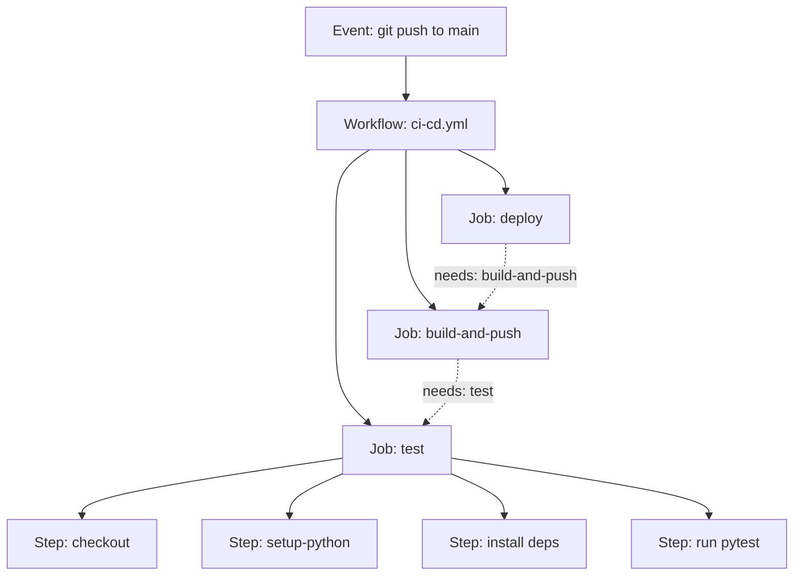
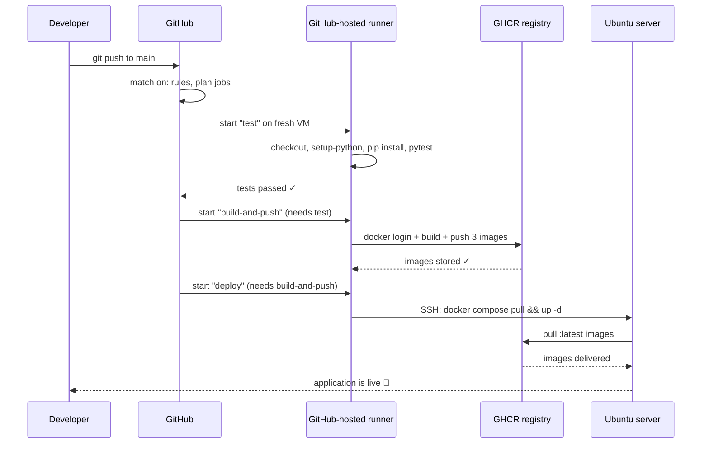

# GitHub Actions — Your Automated Factory

You know how to write Python. You know how to `git push`. But right now, every time you change your code, *you* are the one who runs the tests, builds the Docker images, and copies them to the server. That works for a hobby project. It does not scale, and it does not survive a bad night's sleep — the day you forget to run the tests is the day the bug ships.

**GitHub Actions** is the tool that takes those chores off your hands. This chapter teaches it from first principles, assuming you have never written a line of YAML automation in your life.

> 💡 **Intuition:** Think of GitHub Actions as an **automated factory / assembly line** bolted onto your repository. Every time a part (your code) arrives at the loading dock (a `git push`), the conveyor belt starts. Stations along the belt inspect it, assemble it, package it, and ship it — automatically, the same way, every single time. You designed the assembly line once; the factory runs it forever.

This is the engine of **CI/CD**:

- **CI (Continuous Integration)** — the **quality-control line**. Every change is automatically tested and integrated, so broken code is caught in minutes, not in production.
- **CD (Continuous Delivery/Deployment)** — the **delivery truck**. Once a change passes quality control, it is automatically packaged and shipped to your server.

GitHub Actions can do both. By the end of this chapter you will fully understand the workflow that builds and deploys [our example app](example-app/docker-compose.yml).

---

## 1. The vocabulary, from the outside in

GitHub Actions has a small set of nested concepts. Learn these five words and the rest is detail. We will go from the biggest box to the smallest.

| Term | Factory analogy | What it is |
|---|---|---|
| **Workflow** | the whole assembly line | A YAML file describing an automated process |
| **Event / trigger** | the loading-dock bell that starts the belt | What causes a workflow to run (a push, a PR, a schedule…) |
| **Job** | a workstation (or a whole sub-line) | A group of steps that run together on one machine |
| **Step** | a single task at a station | One command or one reusable action |
| **Action** | a pre-built power tool | A packaged, reusable unit you plug into a step |
| **Runner** | the worker + the workbench | The machine that actually executes a job |

Let's define each properly.

### Workflow

A **workflow** is an automated process described in a single YAML file. It lives in your repository under the special directory `.github/workflows/`. You can have many workflows — one for tests, one for deployment, one for nightly chores. GitHub watches this directory and runs whatever it finds there.

### Event (trigger)

A workflow does nothing until something *triggers* it. An **event** is the thing that rings the bell: someone pushes code, opens a pull request, the clock strikes midnight, or a human clicks a button. The `on:` key in the YAML lists which events the workflow listens for.

### Job

A **job** is a set of steps that execute together on a single fresh machine. A workflow can contain several jobs. **By default, jobs run in parallel** — the factory opens several workstations at once to save time.

If you need order — "don't try to deploy until the tests have passed" — you declare a dependency with the `needs:` keyword. That turns parallel stations into an ordered line.

### Step

A **step** is one unit of work inside a job: run a shell command, or invoke a reusable action. Steps in a job run **sequentially, top to bottom**, on the same machine, so a file created by step 1 is still there for step 2.

### Action

An **action** is a reusable, shareable unit of work — a pre-built power tool someone (often GitHub or Docker) wrote and published so you don't have to. You plug it into a step with `uses:`. Examples: `actions/checkout` (clone your repo onto the runner), `docker/build-push-action` (build and push a Docker image). Actions take inputs via a `with:` block.

### Runner

A **runner** is the actual computer that executes a job. There are two kinds:

- **GitHub-hosted runners** — fresh virtual machines GitHub spins up for you on demand (`ubuntu-latest`, `windows-latest`, `macos-latest`). Each job gets a clean, throwaway VM. You pay nothing for public repos and get free minutes for private ones. This is what we use, and what 95% of projects use.
- **Self-hosted runners** — a machine *you* own and register with GitHub (your own server, a beefy build box with a GPU, a machine inside a private network). You manage and secure it. Use these only when you need special hardware, very long jobs, or access to internal resources GitHub's cloud can't reach.

> 💡 **Intuition:** A GitHub-hosted runner is a **rented workbench that is scrubbed clean and thrown away after every job**. Nothing leaks between runs, which is wonderful for reproducibility — but it also means *nothing persists*. If you need data to survive, you must explicitly save it (caches, artifacts, or a registry).

Here is how the boxes nest:



The dotted `needs` arrows are what turn three parallel jobs into an ordered pipeline: `test` → `build-and-push` → `deploy`.

---

## 2. The anatomy of a workflow file

Every workflow is YAML. Here is the smallest meaningful one — a workflow that does nothing but run the backend tests on every push. We will build up from here.

```yaml
name: Tests                      # 1. Human-friendly label shown in the UI

on: push                         # 2. WHEN to run: on every push to any branch

jobs:                            # 3. WHAT to run
  test:                          # 4. Job id (you choose this name)
    runs-on: ubuntu-latest       # 5. Which runner machine
    steps:                       # 6. The ordered list of tasks
      - uses: actions/checkout@v4        # 7. Pull the repo onto the runner
      - uses: actions/setup-python@v5    # 8. Install Python on the runner
        with:
          python-version: "3.12"         # 9. Input to the action above
      - run: pip install -r requirements.txt   # 10. Run a shell command
      - run: pytest -q                          # 11. Run another shell command
```

Line by line:

1. `name:` — a label for humans. It shows up in the GitHub "Actions" tab. Optional but always include it.
2. `on:` — the **trigger**. Here, the single word `push` means "run on every push to any branch." We'll refine this below.
3. `jobs:` — the container for all jobs. Everything indented under it is a job.
4. `test:` — the **job id**. You invent this name. It is how other jobs refer to this one (via `needs: test`).
5. `runs-on:` — the runner. `ubuntu-latest` asks GitHub for a fresh, current Ubuntu VM.
6. `steps:` — an ordered list. Each `- ` is one step.
7. `uses: actions/checkout@v4` — invoke the `checkout` action. **A fresh runner does not have your code on it** — it is a blank machine. This action git-clones your repository onto it. The `@v4` pins the major version (more on pinning in best practices).
8. `uses: actions/setup-python@v5` — install a specific Python onto the runner.
9. `with:` — inputs for the action immediately above. `python-version: "3.12"` tells `setup-python` which interpreter to install. (We pin **3.12** everywhere — see [the example app](example-app/backend/Dockerfile).)
10. `run:` — execute a shell command directly on the runner. This is the other way (besides `uses:`) to do work in a step.
11. A second `run:` step. Steps execute top to bottom; if `pip install` fails, `pytest` never runs and the job is marked failed.

### `uses:` vs `run:` — the two kinds of step

This distinction is the heart of GitHub Actions, so let's make it crisp.

- **`run:`** executes a shell command, exactly as if you typed it into a terminal on the runner. Use it for project-specific commands: `pytest`, `pip install`, `npm run build`.
- **`uses:`** plugs in a pre-built **action** — a reusable tool published in a repository or the marketplace. Use it for common, fiddly tasks someone has already solved: checking out code, setting up a language, logging into a registry, building a Docker image.

> 💡 **Intuition:** `run:` is *you, using your own two hands* at the workbench. `uses:` is *picking up a power tool* that an expert built. You wouldn't hand-carve a screw; you'd grab a screwdriver. `actions/checkout` is the screwdriver for "get my code."

---

## 3. Triggers — choosing when the belt starts

The `on:` key controls *when* a workflow runs. This is worth understanding deeply, because running the wrong job at the wrong time (e.g. deploying from a pull request) is a classic, dangerous mistake.

### Push and pull_request, with branch filters

```yaml
on:
  push:
    branches: [main]          # run when commits land on main
  pull_request:
    branches: [main]          # run when a PR TARGETS main
```

- `push:` fires when commits are pushed. The `branches: [main]` filter narrows it to the `main` branch only — pushing to a feature branch won't trigger it.
- `pull_request:` fires when a pull request is opened or updated. Here `branches: [main]` means "PRs whose *target* is `main`." This is how you run tests on a proposed change **before** it is merged — the core of the quality-control line.

The combination is the standard CI pattern: test every PR targeting `main`, and test again once code actually lands on `main`.

### Manual and scheduled triggers

```yaml
on:
  workflow_dispatch:          # adds a "Run workflow" button in the UI
  schedule:
    - cron: "0 3 * * *"       # run every day at 03:00 UTC
```

- `workflow_dispatch:` lets a human start the workflow by clicking a button in the Actions tab. Perfect for a deploy you want to trigger on demand, or a one-off maintenance task.
- `schedule:` runs the workflow on a timer using `cron` syntax. The five fields are `minute hour day-of-month month day-of-week`. `0 3 * * *` means "at minute 0 of hour 3, every day." Great for nightly builds, dependency-update checks, or cleanup. Note: scheduled times are always **UTC**.

You can list several triggers at once — a workflow can run on push, on PR, on a button click, *and* on a schedule.

---

## 4. Execution flow: what happens, second by second, on a push to `main`

Let's slow time down and watch the factory react when you run `git push origin main`. This is the single most important mental model in the chapter.

**t = 0s — The push lands.** Your commits arrive at GitHub. GitHub looks in `.github/workflows/` for any workflow whose `on:` rules match a push to `main`. Our `ci-cd.yml` matches.

**t ≈ 1s — GitHub plans the run.** It reads the `jobs:` block and builds a dependency graph from the `needs:` keys. It sees `test` has no `needs`, so it can start immediately. `build-and-push` *needs* `test`. `deploy` *needs* `build-and-push`. So the plan is a strict chain.

**t ≈ 2s — The `test` job is queued.** GitHub requests a fresh `ubuntu-latest` VM. A clean machine boots — no code, no Python packages, nothing.

**t ≈ 10s — `test` runs its steps in order.** Checkout clones the repo. `setup-python` installs Python 3.12. `pip install` pulls the dependencies. `pytest -q` runs the test suite. If any step exits non-zero, the job fails and **the whole chain stops** — `build-and-push` and `deploy` never start. This is the quality-control line doing its job: bad code cannot proceed.

**t ≈ 60s — `test` passes; `build-and-push` begins.** Because `test` succeeded *and* this is the `main` branch (the `if:` condition we'll see below), a new fresh VM is requested. It logs into the registry, builds the three Docker images, and pushes them to GHCR (GitHub Container Registry — see [registries](registries.md)).

**t ≈ 180s — `build-and-push` passes; `deploy` begins.** A third fresh VM connects to the Ubuntu server over SSH and runs `docker compose pull && docker compose up -d`. The server downloads the new images and restarts the containers.

**t ≈ 200s — The new version is live.** Visitors hitting `example.com` now get the new code. You never touched a terminal.



---

## 5. The full canonical workflow — every line explained

Below is the exact workflow we ship for the example app. It is reproduced **verbatim** from the module's source of truth. After it, we explain every field.

> ⚠️ **Path caveat (read this!):** GitHub only runs workflows located at the **repository root** in `.github/workflows/`. This module keeps the file at `example-app/.github/workflows/ci-cd.yml` so it lives *next to* the app it builds, which is great for teaching. **To actually run it, copy or move it to the repo-root `.github/workflows/` directory.** The `APP_DIR` environment variable already points at the module path, so the workflow keeps working once relocated — nothing else needs to change.

```yaml
name: CI/CD

on:
  push:
    branches: [main]
  pull_request:
    branches: [main]

env:
  REGISTRY: ghcr.io
  IMAGE_PREFIX: ghcr.io/${{ github.repository_owner }}/example-app
  APP_DIR: 14_CICD/example-app

jobs:
  test:
    runs-on: ubuntu-latest
    steps:
      - uses: actions/checkout@v4
      - uses: actions/setup-python@v5
        with:
          python-version: "3.12"
      - name: Install dependencies
        working-directory: ${{ env.APP_DIR }}/backend
        run: |
          python -m pip install --upgrade pip
          pip install -r requirements.txt
      - name: Run tests
        working-directory: ${{ env.APP_DIR }}/backend
        run: pytest -q

  build-and-push:
    needs: test
    if: github.ref == 'refs/heads/main'
    runs-on: ubuntu-latest
    permissions:
      contents: read
      packages: write
    steps:
      - uses: actions/checkout@v4
      - uses: docker/setup-buildx-action@v3
      - name: Log in to GHCR
        uses: docker/login-action@v3
        with:
          registry: ghcr.io
          username: ${{ github.actor }}
          password: ${{ secrets.GITHUB_TOKEN }}
      - name: Build & push backend
        uses: docker/build-push-action@v6
        with:
          context: ${{ env.APP_DIR }}/backend
          push: true
          tags: |
            ${{ env.IMAGE_PREFIX }}-backend:latest
            ${{ env.IMAGE_PREFIX }}-backend:${{ github.sha }}
      - name: Build & push frontend
        uses: docker/build-push-action@v6
        with:
          context: ${{ env.APP_DIR }}/frontend
          push: true
          tags: |
            ${{ env.IMAGE_PREFIX }}-frontend:latest
            ${{ env.IMAGE_PREFIX }}-frontend:${{ github.sha }}
      - name: Build & push nginx
        uses: docker/build-push-action@v6
        with:
          context: ${{ env.APP_DIR }}/nginx
          push: true
          tags: |
            ${{ env.IMAGE_PREFIX }}-nginx:latest
            ${{ env.IMAGE_PREFIX }}-nginx:${{ github.sha }}

  deploy:
    needs: build-and-push
    if: github.ref == 'refs/heads/main'
    runs-on: ubuntu-latest
    steps:
      - name: Deploy over SSH
        uses: appleboy/ssh-action@v1
        with:
          host: ${{ secrets.SERVER_HOST }}
          username: ${{ secrets.SERVER_USER }}
          key: ${{ secrets.SERVER_SSH_KEY }}
          script: |
            cd /opt/example-app
            docker compose pull
            docker compose up -d
            docker image prune -f
```

### 5.1 The header: `name`, `on`, `env`

```yaml
name: CI/CD
```
The label shown in the Actions tab. Every run of this file is grouped under "CI/CD."

```yaml
on:
  push:
    branches: [main]
  pull_request:
    branches: [main]
```
Two triggers. **Push to `main`** drives the real pipeline (test → build → deploy). **Pull requests targeting `main`** run only the parts allowed on a PR (we'll see that only `test` runs, thanks to the `if:` guards). This means: open a PR → tests run, giving you a green/red check before you merge; merge to `main` → the full deploy fires.

```yaml
env:
  REGISTRY: ghcr.io
  IMAGE_PREFIX: ghcr.io/${{ github.repository_owner }}/example-app
  APP_DIR: 14_CICD/example-app
```
`env:` at the top level defines **environment variables visible to every job and step**. Defining them once here avoids repeating long strings and keeps the file DRY (Don't Repeat Yourself).

- `REGISTRY` — the registry hostname, `ghcr.io`.
- `IMAGE_PREFIX` — the common stem of every image name. `${{ github.repository_owner }}` is a built-in **context expression**: GitHub substitutes the repo owner at runtime. For owner `ChrisW09` this resolves to `ghcr.io/chrisw09/example-app` (GHCR lowercases owners). The three images then become `…-backend`, `…-frontend`, `…-nginx`, exactly matching the names in [docker-compose.yml](example-app/docker-compose.yml).
- `APP_DIR` — the path from the repo root to the app. This is the variable that lets the workflow live at the repo root while still finding the app inside the module. The `${{ env.APP_DIR }}` syntax reads it back later.

> 💡 **What is `${{ … }}`?** That double-brace syntax is **expression interpolation**. GitHub evaluates whatever is inside before the command runs, substituting values from *contexts* like `github` (info about the event/repo), `env` (your variables), `secrets` (encrypted secrets), and `job`/`steps` (results). It is GitHub Actions' templating language.

### 5.2 Job 1 — `test`

```yaml
  test:
    runs-on: ubuntu-latest
    steps:
      - uses: actions/checkout@v4
      - uses: actions/setup-python@v5
        with:
          python-version: "3.12"
```
A fresh Ubuntu runner. `checkout@v4` clones the repo onto it. `setup-python@v5` installs Python 3.12 (the `with:` block passes the version as an input).

```yaml
      - name: Install dependencies
        working-directory: ${{ env.APP_DIR }}/backend
        run: |
          python -m pip install --upgrade pip
          pip install -r requirements.txt
```
- `name:` gives the step a readable label in the logs.
- `working-directory:` changes into the backend folder *for this step only*, so `requirements.txt` is found without long paths. It expands `APP_DIR` to `14_CICD/example-app/backend`.
- `run: |` — the `|` is YAML for a **multi-line block**: every line below runs as a shell script. We upgrade pip, then install the [backend dependencies](example-app/backend/requirements.txt).

```yaml
      - name: Run tests
        working-directory: ${{ env.APP_DIR }}/backend
        run: pytest -q
```
Runs the [test suite](example-app/backend/tests/test_main.py) quietly (`-q`). If a test fails, `pytest` exits non-zero, the step fails, the job fails, and — because the next jobs `need` this one — the pipeline halts. **Broken code never gets built or deployed.**

### 5.3 Job 2 — `build-and-push`

```yaml
  build-and-push:
    needs: test
    if: github.ref == 'refs/heads/main'
    runs-on: ubuntu-latest
    permissions:
      contents: read
      packages: write
```
Three critical lines:

- **`needs: test`** — this job will not start until `test` finishes successfully. This is what creates the ordered chain. Without it, GitHub would try to build images *in parallel* with the tests — and might push broken images.
- **`if: github.ref == 'refs/heads/main'`** — a **condition**. `github.ref` is the ref that triggered the run; on a push to `main` it equals `refs/heads/main`. On a pull request it is something else (a PR ref). So this job runs **only for pushes to `main`, never for pull requests.** That is exactly what you want: PRs should be *tested*, but they must not *build and push* images. (Anyone could open a PR; you don't want a random PR publishing images under your name.)
- **`permissions:`** — the GitHub-issued token for this job is granted **least privilege**: read-only access to repo `contents`, and `write` access to `packages` (so it can push images to GHCR). By default the token is fairly locked down; `packages: write` is the specific power this job needs and nothing more.

```yaml
    steps:
      - uses: actions/checkout@v4
      - uses: docker/setup-buildx-action@v3
```
Check out the code again (remember: a *new, clean* VM, so we must re-clone). `setup-buildx-action` installs **Buildx**, Docker's modern, faster image builder, which `build-push-action` relies on.

```yaml
      - name: Log in to GHCR
        uses: docker/login-action@v3
        with:
          registry: ghcr.io
          username: ${{ github.actor }}
          password: ${{ secrets.GITHUB_TOKEN }}
```
Authenticate to the registry before pushing.
- `registry: ghcr.io` — log into GitHub Container Registry.
- `username: ${{ github.actor }}` — the user who triggered the run.
- `password: ${{ secrets.GITHUB_TOKEN }}` — `GITHUB_TOKEN` is a **special, automatic secret**. GitHub mints it freshly for each run and destroys it when the run ends; you never create or store it. Combined with `permissions: packages: write` above, it grants exactly enough access to push images and nothing else. You do **not** need to create a Personal Access Token for this. (See [registries](registries.md) for the manual `docker login ghcr.io` you'd run on your laptop.)

```yaml
      - name: Build & push backend
        uses: docker/build-push-action@v6
        with:
          context: ${{ env.APP_DIR }}/backend
          push: true
          tags: |
            ${{ env.IMAGE_PREFIX }}-backend:latest
            ${{ env.IMAGE_PREFIX }}-backend:${{ github.sha }}
```
The workhorse. `docker/build-push-action@v6` builds an image and pushes it in one step.
- `context:` — the build directory (where the [Dockerfile](example-app/backend/Dockerfile) lives), here the backend folder.
- `push: true` — after building, push to the registry. (Set `false` and it would only build, e.g. to test the build on a PR.)
- `tags: |` — a multi-line list of tags to apply. **Two tags per image:**
  - `…-backend:latest` — the moving "newest" pointer.
  - `…-backend:${{ github.sha }}` — `github.sha` is the **full commit hash** of the build. This gives every image an **immutable, traceable tag**: you can always point to *exactly* the image built from *exactly* this commit. This dual-tag scheme (`:latest` plus `:<sha>`) is explained in depth in [registries](registries.md).

The `frontend` and `nginx` steps are identical in shape, just pointing at their own folders and image names. Three services → three build-and-push steps → six tags pushed.

### 5.4 Job 3 — `deploy`

```yaml
  deploy:
    needs: build-and-push
    if: github.ref == 'refs/heads/main'
    runs-on: ubuntu-latest
    steps:
      - name: Deploy over SSH
        uses: appleboy/ssh-action@v1
        with:
          host: ${{ secrets.SERVER_HOST }}
          username: ${{ secrets.SERVER_USER }}
          key: ${{ secrets.SERVER_SSH_KEY }}
          script: |
            cd /opt/example-app
            docker compose pull
            docker compose up -d
            docker image prune -f
```
- `needs: build-and-push` — deploy only after images exist in the registry.
- `if: github.ref == 'refs/heads/main'` — again, **never deploy from a pull request.** Only a real merge to `main` ships to production.
- `appleboy/ssh-action@v1` — a community action that opens an SSH connection to a server and runs a script there.
- `host` / `username` / `key` come from `secrets.SERVER_HOST`, `SERVER_USER`, `SERVER_SSH_KEY`. These are **repository secrets you create** in Settings → Secrets and variables → Actions. They are encrypted and never printed in logs. The key is the private SSH key authorized to log into the [Ubuntu server](deployment.md) at `203.0.113.10`.
- The `script:` runs *on the server*: change into `/opt/example-app`, `docker compose pull` to download the freshly-pushed `:latest` images, `docker compose up -d` to recreate containers with the new images in the background, and `docker image prune -f` to delete the now-unused old image layers and reclaim disk.

That is the full **CI → CD** journey: quality-control line (`test`) → packaging (`build-and-push`) → delivery truck (`deploy`).

---

## 6. ⚠️ Common mistakes

> ⚠️ **Common mistake — Forgetting `permissions:`.** If the build job tries to push to GHCR without `packages: write`, the push fails with a confusing `denied` / `403` error. The default token can't write packages. Grant the *specific* permission the job needs — no more.

> ⚠️ **Common mistake — Leaking secrets in logs.** Never `echo "$MY_SECRET"`, never paste a token into a `run:` for "debugging." GitHub automatically masks values stored as secrets, but it cannot mask a secret you transform (e.g. base64-encode) or one you hardcoded into the YAML. Hardcoded credentials in a workflow are visible to anyone with repo read access.

> ⚠️ **Common mistake — No `needs:` ordering.** Jobs run in **parallel by default**. Omit `needs: test` on the build job and you may build and push images *before the tests finish* — shipping code you haven't validated. Always make `deploy` need `build-and-push`, and `build-and-push` need `test`.

> ⚠️ **Common mistake — Running deploy on pull requests.** Without `if: github.ref == 'refs/heads/main'`, the deploy job fires on *every* PR. Since anyone can open a PR against a public repo, this could let an outsider trigger a production deployment — or just thrash your server. Test on PRs; build and deploy only from `main`.

> ⚠️ **Common mistake — Putting the workflow in the wrong folder.** A workflow under `example-app/.github/workflows/` will **never run**, because GitHub only reads `.github/workflows/` at the **repository root**. See the caveat in §5.

---

## 7. ✅ Production best practices

> ✅ **Best practice — Least-privilege permissions.** Add an explicit `permissions:` block. Start from `contents: read` and add only what each job genuinely needs (`packages: write` for the registry push). The narrower the token, the smaller the blast radius if something goes wrong.

> ✅ **Best practice — Pin action versions.** Use `@v4`, `@v6`, etc. (or, for maximum safety, a full commit SHA like `actions/checkout@<sha>`). Never depend on a floating `@main` of someone else's action — a surprise update could change behavior or, worse, run malicious code with access to your secrets.

> ✅ **Best practice — Cache dependencies.** Re-downloading pip/npm packages on every run is slow. `actions/setup-python` supports a `cache: pip` input; `docker/build-push-action` supports layer caching. Faster runs mean faster feedback.

> ✅ **Best practice — Use a build matrix and branch protection.** A **matrix** runs the same job across several configurations at once (e.g. Python 3.11, 3.12, 3.13) — parallel quality control. Pair this with **branch protection rules** on `main` that *require* the CI checks to pass before a PR can merge: now broken code physically cannot reach `main`.

> ✅ **Best practice — Use Environments and required reviewers.** GitHub **Environments** (e.g. a `production` environment) let you attach **required reviewers** and **secrets scoped to that environment**. Set `environment: production` on the `deploy` job, and a human must click "Approve" before the delivery truck leaves the depot — a safety gate for production.

---

## 8. Exercises

Try these against a fork of the example app. Answers are hidden — think first, then peek.

**Exercise 1 — A lint-only workflow.**
Write a brand-new workflow file `lint.yml` that runs on every pull request to `main`, checks out the code, sets up Python 3.12, installs `ruff`, and runs `ruff check .` on the backend.

<details>
<summary>Answer</summary>

```yaml
name: Lint
on:
  pull_request:
    branches: [main]
jobs:
  lint:
    runs-on: ubuntu-latest
    steps:
      - uses: actions/checkout@v4
      - uses: actions/setup-python@v5
        with:
          python-version: "3.12"
      - run: pip install ruff
      - name: Run ruff
        working-directory: 14_CICD/example-app/backend
        run: ruff check .
```
Place it at the **repo-root** `.github/workflows/lint.yml` so GitHub actually runs it.
</details>

**Exercise 2 — Why does `build-and-push` skip on a PR?**
Trace exactly which jobs run when you open a pull request targeting `main`, and explain why.

<details>
<summary>Answer</summary>

Only `test` runs. The `pull_request` trigger matches, so the workflow starts and `test` (which has no `if:`) executes. But `build-and-push` and `deploy` each carry `if: github.ref == 'refs/heads/main'`. On a pull request, `github.ref` is a PR ref (e.g. `refs/pull/42/merge`), **not** `refs/heads/main`, so both jobs are skipped. Result: PRs get tested but never build or deploy — exactly the safety we want.
</details>

**Exercise 3 — Add a manual deploy button.**
Modify the trigger so a maintainer can also start the pipeline by hand from the Actions tab, without pushing code.

<details>
<summary>Answer</summary>

Add `workflow_dispatch:` to the `on:` block:

```yaml
on:
  push:
    branches: [main]
  pull_request:
    branches: [main]
  workflow_dispatch:
```
A "Run workflow" button now appears in the Actions tab. Note that a manual run on `main` still satisfies `github.ref == 'refs/heads/main'`, so build and deploy will fire.
</details>

**Exercise 4 — Spot the security hole.**
A teammate adds this step "to debug the deploy": `run: echo "Deploying with key ${{ secrets.SERVER_SSH_KEY }}"`. What's wrong, and what should they do instead?

<details>
<summary>Answer</summary>

It tries to print a private SSH key into the build logs. Even though GitHub masks known secret *values*, this is a terrible habit: logs can be exported, the key could appear if transformed, and anyone with read access to the run could see it. Never echo secrets. To debug, log non-sensitive facts instead — e.g. `echo "Deploying to $SERVER_HOST"` only if the host isn't sensitive, or simply rely on the action's own (masked) output. Rotate any key that ever touched a log.
</details>

---

## Next / Related

- **[Container registries](registries.md)** — where the `build-and-push` job stores images, and the `:latest` + `:${{ github.sha }}` tag scheme explained in full.
- **[Docker](docker.md)** — what the images this workflow builds actually *are*.
- **[Docker Compose](docker-compose.md)** — the `docker compose pull && up -d` commands the deploy step runs on the server.
- **[Deployment](deployment.md)** — setting up the Ubuntu server, the `SERVER_*` secrets, and the SSH key the deploy job uses.
