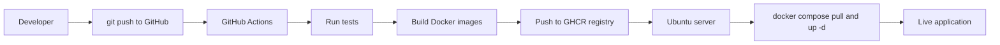
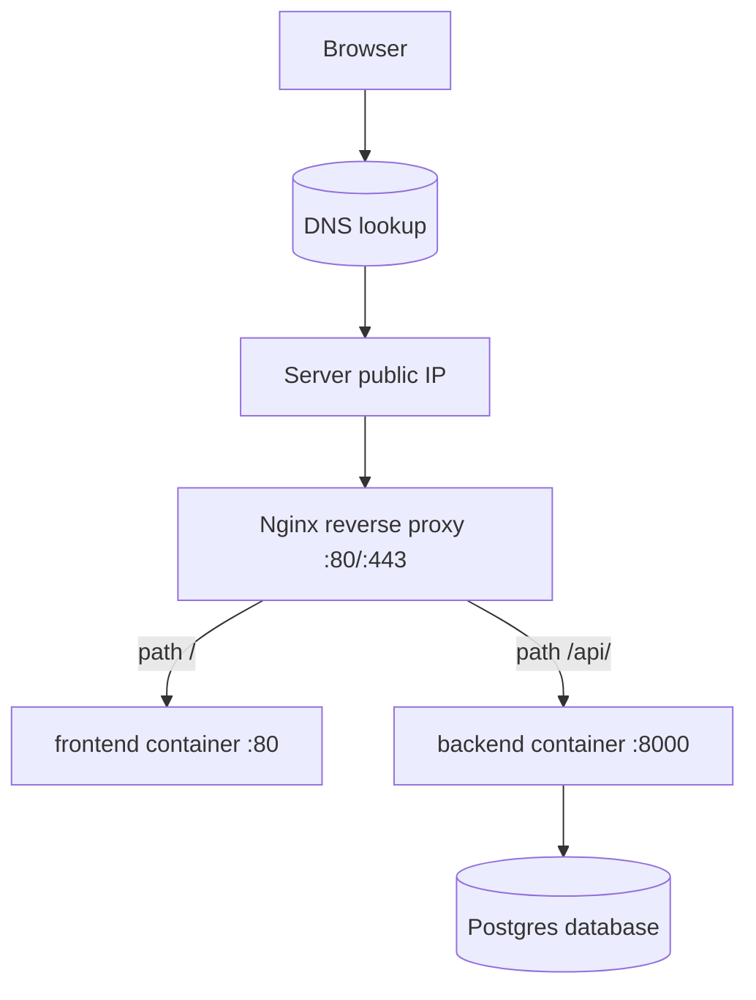

# CI/CD, Docker & Deployment

> 🧭  [◀ Production](../13_production/)  ·  [🏠 Course home](../README.md)  ·  [Capstones ▶](../15_capstones/)

Welcome. This module takes you from *"I can run my FastAPI app on my laptop"* all the way to *"my app is live on the internet at a real domain, ships itself automatically every time I `git push`, and survives a server reboot."*

You already know Python, Git basics, FastAPI, and a bit of machine learning / data science. What you probably **don't** know yet is the world of **DevOps** — the engineering practices and tools that take software from a developer's machine and run it reliably for real users. That's exactly what we'll teach here, slowly and from first principles. No prior DevOps experience is assumed. Every term is defined the first time it appears.

Think of this README as the *front door* of the module. It gives you the mental model and the vocabulary. The other 13 chapters each zoom into one room of the house.

---

## What you'll learn

By the end of this module you will be able to:

- Explain what **CI (Continuous Integration)** and **CD (Continuous Delivery / Deployment)** are, and *why* they exist.
- Package any Python app into a **Docker** image and run it as a **container**.
- Orchestrate several containers (web frontend, API backend, database, reverse proxy) together with **Docker Compose**.
- Store and share container images using a **container registry** (specifically **GitHub Container Registry**, "GHCR").
- Build an automated pipeline with **GitHub Actions** that tests, builds, and deploys your app on every push.
- Rent and configure a real **Ubuntu server**, point a **domain name** at it via **DNS (Domain Name System)**, and serve traffic through a **reverse proxy** (Nginx).
- Secure the whole thing with **HTTPS** using free, auto-renewing **TLS (Transport Layer Security) certificates**.
- Monitor, troubleshoot, and operate the running system like a professional.

---

## Table of contents (read in this order)

This module is meant to be read top to bottom. Each chapter builds on the previous one. Here is the full reading order with one-line summaries:

| # | Chapter | What it covers |
|---|---|---|
| 1 | **README** (this file) | The big picture, vocabulary, and how it all fits together |
| 2 | [Architecture](architecture.md) | The complete request path: Browser → DNS → Server → Reverse proxy → Containers → Database |
| 3 | [Docker](docker.md) | Images, containers, layers, and writing a `Dockerfile` |
| 4 | [Docker Compose](docker-compose.md) | Running multiple containers together as one stack |
| 5 | [Registries](registries.md) | Storing and pulling images from GHCR |
| 6 | [GitHub Actions](github-actions.md) | The automated pipeline that tests, builds, and deploys |
| 7 | [DNS](dns.md) | How a human-friendly domain name becomes a server IP address |
| 8 | [Reverse proxies](reverse-proxies.md) | How Nginx routes incoming requests to the right container |
| 9 | [HTTPS](https.md) | TLS certificates, Let's Encrypt, and encrypting traffic |
| 10 | [Deployment](deployment.md) | Provisioning the Ubuntu server and going live |
| 11 | [Monitoring](monitoring.md) | Health checks, logs, and knowing when something breaks |
| 12 | [Troubleshooting](troubleshooting.md) | A field guide to the errors you *will* hit |
| 13 | [Tutorial](tutorial.md) | A guided, end-to-end walkthrough from zero to live |
| 14 | [Exercises](exercises.md) | Hands-on challenges to cement everything |

The [example app](example-app/docker-compose.yml) — a small FastAPI backend, a static frontend, a Postgres database, and an Nginx reverse proxy — is the single project we deploy throughout. Every chapter refers back to it.

---

## Hands-on lab notebooks

The chapters explain the concepts; three **lab notebooks** let you *practise* them without installing anything — Docker, a CI runner, and a live web stack are all **simulated in pure Python** (100% offline), grounded in the exact files this module ships.

| Notebook | ⏱ Time | Companion chapters | What you do |
|---|---|---|---|
| [`lab01_docker_and_compose.ipynb`](lab01_docker_and_compose.ipynb) | ~60 min | [Docker](docker.md), [Compose](docker-compose.md) | Parse the real `Dockerfile`, hash its instructions into layers, replay the build cache, apply `.dockerignore` to a file tree, and tick through Compose startup order |
| [`lab02_ci_pipeline_github_actions.ipynb`](lab02_ci_pipeline_github_actions.ipynb) | ~60 min | [GitHub Actions](github-actions.md), [Registries](registries.md) | Parse the real workflow, then build an ~80-line Actions-style runner that runs jobs as a DAG, executes real `pytest`, and simulates matrix builds, caching, and a registry |
| [`lab03_deploy_dns_https_monitoring.ipynb`](lab03_deploy_dns_https_monitoring.ipynb) | ~60 min | [DNS](dns.md), [Reverse proxies](reverse-proxies.md), [HTTPS](https.md), [Monitoring](monitoring.md) | Simulate DNS resolution, run a real backend + a reverse proxy you write yourself on `localhost`, simulate the ACME certificate challenge, and build an uptime monitor |

Each lab runs 100% offline and needs no Docker, no server, and no cloud account — so you can watch every moving part in slow motion, then run the real commands (per the [tutorial](tutorial.md)) already knowing what they do. Every lab embeds ✋ checkpoints, 🧪 practice exercises, and a 🎁 mini-project, in the same style as the numbered course lessons.

---

## Prerequisites

You should be comfortable with:

- **Python 3.12** and writing a basic [FastAPI](example-app/backend/app/main.py) app.
- **Git** basics: `clone`, `add`, `commit`, `push`, branches.
- Using a **terminal / command line** (running commands, editing files).
- Basic web concepts: what a URL is, what an HTTP request is.

You will need (we'll walk you through getting each one):

- A free **GitHub** account (for code hosting, Actions, and GHCR).
- **Docker Desktop** installed locally (so you can build and run containers on your machine).
- Eventually, a cheap **cloud server** (around $5–6/month) and a **domain name** (around $10–15/year) for the live-deployment chapters. You can read and follow most chapters without spending a cent.

> 💡 **Intuition:** You don't need to buy anything to *learn* this module. The server and domain are only required for the final "go live for real" chapters. Everything before that runs on your laptop.

---

## The problem: why does CI/CD even exist?

Before we define the tools, let's feel the *pain* they remove. Imagine the old, manual way of shipping software.

You finish a feature on your laptop. To get it to users you must, by hand:

1. Run all the tests (and remember to actually do it).
2. Build the app.
3. Copy the files to a server.
4. Install the right Python version and every dependency on that server.
5. Restart the app.
6. Pray it still works, because the server is configured slightly differently from your laptop ("but it works on my machine!").

Every step is manual, error-prone, and different each time. Two engineers do it two different ways. A forgotten step takes the site down at 2 a.m. This is the world DevOps was invented to fix.

**CI/CD** is the discipline of *automating* that entire path so it happens the same way every time, triggered by a simple `git push`.

### CI — Continuous Integration

> 💡 **Intuition:** CI is the **quality-control line** in a factory. Every part that comes off the assembly line is automatically inspected *before* it's allowed to move on. If it fails inspection, it's pulled aside and a light goes on.

**CI (Continuous Integration)** means: every time anyone pushes code, an automated system *integrates* that change with the main codebase and immediately runs the tests (and other checks like linting). If anything breaks, you find out in minutes — not days later in production. The "continuous" part means it happens on *every* change, automatically, not once a week by hand.

### CD — Continuous Delivery / Deployment

> 💡 **Intuition:** CD is the **delivery truck**. Once a product passes quality control, the truck automatically ships it to customers.

**CD** has two closely related meanings:

- **Continuous Delivery:** every change that passes CI is automatically built and made *ready* to deploy at the push of a button. A human still approves the final release.
- **Continuous Deployment:** goes one step further — every change that passes CI is *automatically* deployed to production, no human button-press required.

In this module our pipeline does full Continuous Deployment: a push to the `main` branch flows all the way to the live server on its own.

---

## The end-to-end pipeline at a glance

Here is the whole journey a code change takes, from your keyboard to a live website. This is the **canonical pipeline diagram** we'll revisit in the [GitHub Actions](github-actions.md), [Deployment](deployment.md), and [Tutorial](tutorial.md) chapters.



Read it as a sentence: *A developer pushes code to GitHub. GitHub Actions (the assembly line) runs the tests; if they pass it builds Docker images, pushes them to the GHCR registry (the warehouse), then tells the Ubuntu server (the kitchen) to pull the new images and restart — and the live application is updated.*

Every box in that diagram is a tool we'll now define.

---

## The tools, defined from first principles

We'll introduce each tool the same way throughout this module: an **intuition** (with an analogy), then the **technical explanation**, then how it connects to the others. The detailed chapters add diagrams, code, and exercises.

### Docker — package once, run anywhere

> 💡 **Intuition:** A Docker **image** is a **recipe** — a frozen, complete set of instructions including the ingredients (your code, the Python version, every library). A Docker **container** is the **cooked meal** — a running instance made from that recipe. The same recipe produces an identical meal on your laptop, on a colleague's machine, and on the server.

The classic problem CI/CD can't solve alone is *"it works on my machine."* Your laptop has Python 3.12, a specific OpenSSL version, certain environment variables. The server has something subtly different, and the app breaks.

**Docker** solves this by packaging your application *together with* its entire environment — the operating-system libraries, the Python runtime, your dependencies, your code — into a single, self-contained, portable unit called an **image**. When you run that image you get a **container**: an isolated process that behaves identically no matter where it runs. The recipe is frozen; the meal always comes out the same.

You describe how to build the image in a plain-text file called a **Dockerfile** — the **written recipe card**. We cover all of this in depth in [the Docker chapter](docker.md), which works through [our backend's actual `Dockerfile`](example-app/backend/Dockerfile).

### Docker Compose — running the whole meal, not one dish

> 💡 **Intuition:** If a single container is one dish, **Docker Compose** is the *set menu* — it describes the whole meal (several dishes that go together) and serves them all at once with one command.

Real apps are rarely a single container. Our example app has **four** services that must run together:

- `backend` — the FastAPI API (listens on port **8000**).
- `frontend` — the static web page (served on port **80**).
- `db` — a Postgres database.
- `nginx` — the reverse proxy that faces the internet (publishes port **80**).

**Docker Compose** lets you declare all of these — plus how they connect, what data persists, and what order they start in — in one file, [`docker-compose.yml`](example-app/docker-compose.yml). Then `docker compose up` starts the entire stack with a single command. We dig into every line in [the Docker Compose chapter](docker-compose.md).

> Note: we always write `docker compose` (two words, the modern v2 command), never the old hyphenated `docker-compose`.

### Container registry — the warehouse for images

> 💡 **Intuition:** A **registry** is a **warehouse / app store** for your recipes (images). You build an image once, store it in the warehouse, and any machine that's allowed can pull a copy and run it.

You build images on GitHub's machines during CI, but they need to *run* on your server. How do they get there? They travel through a **container registry**: a service that stores and serves Docker images. We use **GHCR (GitHub Container Registry)**, which is built into GitHub.

Our images are named like this (note the lowercase owner — GHCR requires it):

```
ghcr.io/chrisw09/example-app-backend
ghcr.io/chrisw09/example-app-frontend
ghcr.io/chrisw09/example-app-nginx
```

The generic form is `ghcr.io/<owner>/example-app-backend`, where `<owner>` is your GitHub username, lowercased. Full details in [the registries chapter](registries.md).

### GitHub Actions — the automated factory

> 💡 **Intuition:** **GitHub Actions** is the **automated factory / assembly line**. You define the stations (test → build → deploy); raw material (`git push`) enters at one end and a deployed app comes out the other.

**GitHub Actions** is GitHub's built-in automation system. You write a **workflow** — a YAML file describing jobs and steps — and GitHub runs it automatically when an event happens (like a push to `main`). Our workflow lives at [`example-app/.github/workflows/ci-cd.yml`](example-app/.github/workflows/ci-cd.yml) and has three jobs that mirror the pipeline diagram: **test**, **build-and-push**, and **deploy**.

> ⚠️ **Common mistake:** GitHub only runs workflows stored at the **repository root** in `.github/workflows/`. We keep ours under `example-app/.github/workflows/` so the lesson and the code stay together, but to make it actually run you must copy or move it to the repo-root `.github/workflows/`. The `APP_DIR` variable inside the file already points at the module path, so it works once relocated. The [GitHub Actions chapter](github-actions.md) explains this thoroughly.

### Ubuntu server — the always-on kitchen

> 💡 **Intuition:** An **Ubuntu server** is the **restaurant kitchen** — unlike your laptop, it's always on, always ready, and its only job is to cook (run) your meals (containers) for customers (users).

A **server** is just a computer that runs continuously and is reachable over the internet. You typically rent one from a cloud provider (DigitalOcean, Hetzner, AWS, etc.) for a few dollars a month. **Ubuntu** is a popular, free Linux operating system; we standardize on **Ubuntu 24.04 LTS** ("LTS" = Long-Term Support, meaning years of security updates). Throughout the module our example server lives at the public IP address **`203.0.113.10`** (a documentation-only IP) and we deploy the app to the directory `/opt/example-app`. Provisioning it is the subject of [the deployment chapter](deployment.md).

### DNS — the internet's phone book

> 💡 **Intuition:** **DNS (Domain Name System)** is the **internet phone book**. You know a person's *name* (`example.com`) but to actually call them you need their *number* (the IP address `203.0.113.10`). DNS does that name → number lookup for you.

Humans remember names; computers route traffic by numbers (IP addresses). **DNS** is the global system that translates a domain name like **`example.com`** into a server's IP address like **`203.0.113.10`**. When you buy a domain, you create DNS **records** that say "this name points to this IP." We cover record types and propagation in [the DNS chapter](dns.md).

### Reverse proxy — the receptionist

> 💡 **Intuition:** A **reverse proxy** is the **receptionist** at the front desk. Every visitor (request) arrives at one front desk, and the receptionist decides which room (which container) to send them to.

Your server has many things running (frontend, backend) but the outside world should only ever talk to **one** front door. A **reverse proxy** is a server that sits in front of your application containers, receives every incoming request, and forwards it to the correct internal service based on rules. We use **Nginx**. In our setup, requests for `/api/` go to the `backend` container; everything else goes to the `frontend` container — see [our Nginx config](example-app/nginx/default.conf). The reverse proxy is also where **HTTPS** is handled. Full treatment in [the reverse-proxies chapter](reverse-proxies.md) and [the HTTPS chapter](https.md).

---

## How the pieces fit together at runtime

The pipeline diagram above showed how code *gets* deployed. This second diagram shows what happens when a *user visits the live site* — the runtime path. We explore it in full in [the architecture chapter](architecture.md); here's the preview.



In words: the browser asks **DNS** for the IP behind `example.com`, gets `203.0.113.10`, and sends its request there. **Nginx** (the receptionist) receives it on port 80/443 and routes by URL path: `/api/...` goes to the **backend** container on port 8000; everything else goes to the **frontend** container on port 80. The backend talks to the **Postgres** database when it needs to store or read data.

---

## How to use the example app

The [example app](example-app/) is deliberately tiny so the *infrastructure* is the star, not the application logic. It is a complete, production-shaped stack:

- A **FastAPI backend** ([`app/main.py`](example-app/backend/app/main.py)) exposing exactly three endpoints:
  - `GET /api/health` — a liveness probe (returns `{"status": "ok"}`), used by Docker and monitoring.
  - `GET /api/message` — returns a hello-world payload the frontend displays.
  - `GET /api/visits` — a visit counter backed by Postgres (it degrades gracefully if the database is down).
- A **static frontend** ([`index.html`](example-app/frontend/index.html)) that fetches `/api/message` and shows it.
- A **Postgres database** for the visit counter.
- An **Nginx reverse proxy** tying it together.

To run the whole stack on your own machine:

```bash
# 1. Clone the repository and enter the example app
cd 14_cicd/example-app

# 2. Build the images and start all four containers
docker compose up --build

# 3. Open the app in your browser
open http://localhost
```

Line by line:

- `cd 14_cicd/example-app` — move into the directory that contains [`docker-compose.yml`](example-app/docker-compose.yml); Compose looks for that file in the current directory.
- `docker compose up --build` — `up` starts every service defined in the Compose file; `--build` first (re)builds the local images from their `Dockerfile`s so you run your latest code.
- `open http://localhost` — Nginx publishes port 80 to your machine, so `http://localhost` reaches the reverse proxy, which serves the frontend. (On Linux use `xdg-open`; on Windows just paste the URL into a browser.)

To stop everything, press `Ctrl+C`, then run `docker compose down` to remove the containers.

> ⚠️ **Common mistake:** Forgetting `--build` after you change code. Without it, Compose may reuse an old image and you'll wonder why your edit "did nothing." When in doubt, rebuild.

> ✅ **Best practice:** Treat the one [`docker-compose.yml`](example-app/docker-compose.yml) as the source of truth for *both* local development and production. Locally you `build` the images; in production you `pull` the exact same images that CI built. Same definition, fewer "works on my machine" surprises.

---

## Estimated time

| Activity | Approx. time |
|---|---|
| Read README + Architecture (the mental model) | 45–60 min |
| Read the core tool chapters (Docker → HTTPS) | 4–6 hours |
| Follow the hands-on [Tutorial](tutorial.md) end to end | 2–4 hours |
| Complete the [Exercises](exercises.md) | 2–3 hours |
| **Total** | **roughly 10–15 hours**, comfortably spread over a week |

You do not have to do it all at once. Read for understanding first; the tutorial and exercises are where it sticks.

---

## A quick self-check

Before moving on, make sure you can answer these in your own words (one sentence each is plenty). Answers are hidden below.

1. What is the difference between a Docker *image* and a Docker *container*?
2. What does CI do, and what does CD do?
3. Why do we need a container *registry* at all?
4. What is the job of a *reverse proxy*?

<details>
<summary>Show answers</summary>

1. An **image** is the frozen recipe (instructions + dependencies + code); a **container** is a running meal cooked from that recipe.
2. **CI** automatically tests every code change as it's integrated; **CD** automatically builds and ships changes that pass to production.
3. CI builds images on GitHub's machines, but they must *run* on your server — the **registry** is the warehouse that stores images so the server can pull and run them.
4. A **reverse proxy** is the single front door that receives every incoming request and routes it to the correct internal container (and terminates HTTPS).

</details>

---

## Next / Related

You now have the vocabulary and the map. Continue in reading order:

- **Next:** [Architecture](architecture.md) — trace one real request through every component, end to end.
- [Docker](docker.md) — start building images and containers, the foundation for everything else.
- [GitHub Actions](github-actions.md) — see the automated pipeline from the diagram above in full detail.
- [Tutorial](tutorial.md) — when you're ready to do it all hands-on from zero to live.

---

📝 **Finished this module?** Test yourself with the [Module 14 quiz](../quizzes/quiz_14_cicd.ipynb) — five questions, ~10 minutes.
