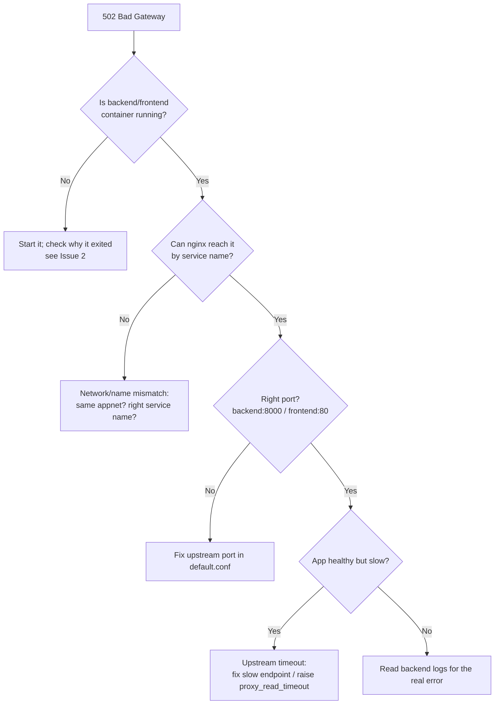

# Troubleshooting Field Guide

Everything in this module eventually breaks in production — that is not a failure
of your skills, it is the normal life of running software. The difference between
a beginner and a seasoned operator is not that the expert avoids problems, but
that the expert has a *method* and a mental library of common failure shapes.

This chapter is that library. It assumes you have deployed the
[example app](example-app/docker-compose.yml) per [deployment.md](deployment.md)
and are watching it per [monitoring.md](monitoring.md). For each issue we follow
the same structure:

> **Symptoms → Cause(s) → Diagnosis (exact commands) → Fix**

Keep this page open in a tab when things go wrong.

---

## A general debugging method (read this first)

> ✅ **The method:** Before touching anything, work *outside-in* and *one layer
> at a time*. Do not guess-and-change randomly — that is how a one-bug incident
> becomes a three-bug incident.

1. **Reproduce & observe.** What exactly is broken, for whom, since when? Get the
   precise error text — never debug a paraphrase.
2. **Locate the layer.** Browser → DNS → firewall → Nginx → frontend/backend
   container → database. Find the *first* layer that is unhealthy; everything
   downstream of it is a symptom, not the cause.
3. **Read the logs at that layer.** `docker compose logs <svc>` is your first
   move 90% of the time.
4. **Form one hypothesis, test it, change one thing.** Re-check. If it did not
   help, revert it before trying the next idea.
5. **Confirm end-to-end.** Fixing the cause is not done until the user-facing
   symptom is gone.

Three commands you will run constantly:

```bash
docker compose ps            # what is up / healthy / restarting?
docker compose logs -f <svc> # why did it misbehave?
docker inspect <container>   # the full truth about a container's config/state
```

---

## Issue 1 — Docker image won't build

**Symptoms.** `docker compose build` (or CI's build step) fails before any
container starts. You see errors like `failed to solve`, `pip install` errors, or
`COPY failed: file not found`.

**Causes.**
- A failing `RUN` step (e.g. a dependency in `requirements.txt` that does not
  install).
- A `COPY` path that does not exist relative to the build **context**.
- `.dockerignore` excluding a file the build needs (or *not* excluding something
  that breaks it).
- A wrong base image tag.

**Diagnosis.**

```bash
# Build just one image with full, unminimized output
docker build -t test-backend ./backend --progress=plain --no-cache
```

- `--progress=plain` prints every command's full output instead of the collapsed
  view — essential for reading the real error.
- `--no-cache` rules out a stale cached layer hiding the problem.

Read the **last** failing step. For `COPY` errors, check the path is relative to
the context directory (`./backend`), and that `.dockerignore` (§5.7) is not
excluding it — note our `.dockerignore` excludes `tests/`, which is correct
because tests are not needed in the runtime image.

**Fix.** Correct the failing line. Common ones:
- A bad dependency version → fix `requirements.txt`.
- `COPY app ./app` failing → ensure you are building from the right context.
- Network flake on `pip install` → re-run; for CI, this is usually transient.

---

## Issue 2 — Container won't start / exits immediately

**Symptoms.** `docker compose ps` shows a service as `Exited (1)` or constantly
`Restarting` (because of `restart: unless-stopped`, a crash-looping container
restarts forever).

**Causes.**
- The app crashes on startup (bad config, missing env var, import error).
- The `CMD` is wrong or the entrypoint can't find the app.
- A dependency (like the database) is not ready and the app exits instead of
  waiting.

**Diagnosis.**

```bash
docker compose ps
docker compose logs --tail=50 backend     # the crash reason is almost always here
docker inspect example-app-backend-1 --format='{{.State.ExitCode}} {{.State.Error}}'
```

The logs almost always contain the Python traceback or the missing-variable
message. The exit code helps too: `0` = clean exit (maybe the command finished
instead of staying up), non-zero = an error.

**Fix.** Address the crash reason from the logs. For our app, a common one is
that `backend` started before `db` — but our compose already guards this with
`depends_on: db: condition: service_healthy`, so confirm that block is present.
If you removed it, the backend may race the database. Restart cleanly after
fixing:

```bash
docker compose up -d --force-recreate backend
```

> ⚠️ **Common mistake:** Adding `restart: unless-stopped` and then concluding
> "it's fine, it restarts." A crash-looping container restarts forever while
> never serving traffic. Always read the logs to see *why* it exits.

---

## Issue 3 — "port is already allocated" / port in use

**Symptoms.** `docker compose up` fails with
`Bind for 0.0.0.0:80 failed: port is already allocated` or
`address already in use`.

**Causes.** Another process already holds port 80 on the host — often a
system-installed Nginx/Apache, a leftover container from a previous run, or two
compose stacks both publishing `80:80`.

**Diagnosis.**

```bash
sudo ss -tulpn | grep ':80'      # which process owns port 80?
docker ps                        # is an old container already publishing 80?
```

- `ss -tulpn` lists listening sockets: `-t` TCP, `-u` UDP, `-l` listening, `-p`
  show the owning process, `-n` numeric ports. The last column names the process
  (e.g. `nginx`, `docker-proxy`).

**Fix.**
- If a stray container holds it: `docker compose down` (or `docker rm -f <id>`).
- If a host service (system Nginx) holds it: stop/disable it —
  `sudo systemctl disable --now nginx` — because in our design the **`nginx`
  container** is the one that should own port 80.
- If two stacks conflict: change one to publish a different host port, e.g.
  `"8080:80"`.

---

## Issue 4 — Nginx returns 502 Bad Gateway

**Symptoms.** The site loads the Nginx error page reading **502 Bad Gateway**.
Nginx is up, but it cannot reach the thing it proxies to.

**Causes.** A 502 means "I, the proxy, could not get a valid response from the
**upstream**." For our [nginx/default.conf](example-app/nginx/default.conf), the
upstreams are `frontend:80` and `backend:8000`. So the backend or frontend
container is down, unhealthy, on the wrong network, or listening on the wrong
port.

**Diagnosis.**

```bash
docker compose ps                          # are backend & frontend healthy?
docker compose logs --tail=50 nginx        # nginx will log the upstream error
docker compose logs --tail=50 backend
# From INSIDE the nginx container, can it reach the backend by service name?
docker compose exec nginx wget -qO- http://backend:8000/api/health
```

Here is the decision flow for diagnosing a 502:



**Fix.**
- If `backend` is down → fix it (Issue 2) and `docker compose up -d`.
- If the upstream name/port is wrong → the config must say `server backend:8000;`
  and `server frontend:80;` exactly (service names on `appnet`), as in §5.10.
- If the `wget` from inside nginx works but the browser still 502s → the running
  nginx config is stale; `docker compose restart nginx`.

> ⚠️ **Common mistake:** Pointing an upstream at `localhost:8000`. Inside the
> nginx container, `localhost` is nginx itself, not the backend. Use the Docker
> **service name** `backend`.

---

## Issue 5 — DNS not resolving

**Symptoms.** `http://203.0.113.10` works, but `http://example.com` does not
load, or your browser says "server not found."

**Causes.** The domain's DNS records do not point at the server, or have not
propagated yet, or point at the wrong IP.

**Diagnosis.**

```bash
dig +short example.com            # what IP does the name resolve to?
dig +short www.example.com
dig example.com A                 # full answer incl. TTL
```

`dig` is the *internet phone book* lookup tool. `+short` prints just the
answer. You want `example.com` to return `203.0.113.10`.

**Fix.**
- In your DNS provider's panel, create an **A record** for `example.com` →
  `203.0.113.10`, and one for `www` (A record to the same IP, or a CNAME to
  `example.com`).
- DNS changes are not instant — they propagate up to the record's **TTL (Time To
  Live)**. If `dig` already shows the right IP but the browser does not, flush
  your local DNS cache or test from another network. See [dns.md](dns.md) for
  the full treatment.

> ⚠️ **Common mistake:** Testing immediately after changing a record and
> panicking. Give it time to propagate, and verify with `dig` (which bypasses the
> browser cache) before assuming the record is wrong.

---

## Issue 6 — HTTPS / Let's Encrypt certificate not working

**Symptoms.** `https://example.com` shows "Not Secure," a certificate warning, or
`SSL_ERROR`/`ERR_CONNECTION_REFUSED` on port 443. Certificate issuance
(`certbot`) fails.

**Causes.**
- Port **443** (or **80**, needed for the HTTP-01 challenge) is blocked by the
  firewall.
- DNS does not yet point at the server, so Let's Encrypt cannot validate domain
  ownership.
- The certificate is expired, or Nginx is serving the wrong/self-signed cert.

**Diagnosis.**

```bash
sudo ufw status                          # are 80 and 443 allowed?
dig +short example.com                   # does the domain point here? (Issue 5)
curl -vI https://example.com 2>&1 | head -n 30   # see the TLS handshake + cert
sudo nginx -t                            # is the nginx config valid?
```

- `curl -v` shows the full TLS handshake, including the certificate's issuer and
  expiry — invaluable for seeing *which* cert is actually served.
- `nginx -t` validates the config syntax before you reload.

**Fix.**
- Open the ports: `sudo ufw allow 80/tcp && sudo ufw allow 443/tcp`. The HTTP-01
  challenge needs port 80 reachable.
- Ensure DNS resolves to `203.0.113.10` *first* (Issue 5) — issuance fails
  otherwise.
- (Re)issue and reload: run your `certbot` flow, then `sudo nginx -t &&
  sudo systemctl reload nginx`. Let's Encrypt certs last 90 days; ensure
  auto-renewal is enabled. Full setup is in [https.md](https.md).

> 💡 **Intuition:** A **TLS certificate** is a *tamper-proof ID card* issued by a
> trusted authority. Let's Encrypt will only issue the card after proving you
> truly control the domain — which is why DNS and port 80 must work *before* the
> cert can.

---

## Issue 7 — GitHub Action fails

GitHub Actions failures fall into four sub-categories. Open the failed run in the
**Actions** tab and read which job (and step) is red.

**7a. The `test` job fails.**
- *Symptom:* `pytest` reports failures.
- *Diagnosis:* Read the test output in the job log; reproduce locally with
  `cd 14_cicd/example-app/backend && pytest -q`.
- *Fix:* Fix the code or the test. This is CI doing its job — a red test blocks
  deployment by design.

**7b. The `build-and-push` build fails.**
- *Symptom:* `docker/build-push-action` errors.
- *Diagnosis:* Same as Issue 1 — read the failing build step. Often a `context`
  path mismatch; confirm `context: ${{ env.APP_DIR }}/backend` resolves
  correctly (`APP_DIR` is `14_cicd/example-app`).
- *Fix:* Correct the Dockerfile or context path.

**7c. Login / permissions (push to GHCR denied).**
- *Symptom:* `denied: permission_denied` or `unauthorized` when pushing.
- *Diagnosis:* Confirm the job has `permissions: packages: write` and logs in
  with `username: ${{ github.actor }}` / `password: ${{ secrets.GITHUB_TOKEN }}`
  (see §5.13). Confirm the image name owner is lowercase (`chrisw09`).
- *Fix:* Add the `permissions:` block; ensure the package's visibility/access
  settings allow the repo to push.

**7d. The `deploy` SSH step fails.**
- *Symptom:* `appleboy/ssh-action` errors with `handshake failed`, `permission
  denied (publickey)`, or `i/o timeout`.
- *Diagnosis:* Check the three secrets: `SERVER_HOST` (`203.0.113.10`),
  `SERVER_USER` (`deploy`), `SERVER_SSH_KEY` (the **private** key). A timeout
  usually means the firewall blocks the runner or the host is wrong; `permission
  denied (publickey)` means the key does not match `authorized_keys`.
- *Fix:* Re-paste the full private key (BEGIN/END lines included), confirm its
  public half is in `/home/deploy/.ssh/authorized_keys`, and confirm port 22 is
  open. **Remember the repo-root caveat** (§5.13): the workflow only runs if it
  lives at the repository-root `.github/workflows/`, not inside `example-app/`.

> ⚠️ **Common mistake:** Putting the *public* key in `SERVER_SSH_KEY`, or using a
> passphrase-protected key (CI cannot type a passphrase, so the step hangs then
> fails). Use a dedicated passphrase-less deploy key.

---

## Issue 8 — Backend can't reach the database / wrong DATABASE_URL

**Symptoms.** `/api/visits` returns `{"visits": null, "detail": "database
unavailable: …"}` (our app degrades gracefully), or backend logs show connection
refused / authentication failures.

**Causes.**
- `db` container not up/healthy yet.
- `DATABASE_URL` points at the wrong host, port, or credentials.
- Backend on a different network than `db`.

**Diagnosis.**

```bash
docker compose ps                                   # is db healthy?
docker compose exec backend env | grep DATABASE_URL # what URL is the backend using?
docker compose exec db pg_isready -U app            # is Postgres accepting conns?
docker compose logs --tail=30 db
```

The correct URL for our app is exactly
`postgresql://app:app@db:5432/app` — host `db` (the service name), port `5432`,
user/password/dbname all `app`.

**Fix.** Make `DATABASE_URL` match §5.12 / §6 exactly. The host must be the
service name `db`, **not** `localhost` (inside the backend container, `localhost`
is the backend itself). Ensure both services are on `appnet`. If the db is just
slow to start, the `depends_on: condition: service_healthy` guard already handles
it on a clean `up`.

> ⚠️ **Common mistake:** Using `localhost` or `127.0.0.1` as the DB host inside a
> container. Containers each have their own loopback; cross-container traffic uses
> service names on the shared Docker network.

---

## Issue 9 — Image pull "denied" / unauthorized from GHCR

**Symptoms.** On the server, `docker compose pull` fails with `denied` or
`unauthorized` / `manifest unknown` for
`ghcr.io/chrisw09/example-app-backend:latest`.

**Causes.**
- The server is not logged in to GHCR and the image is private.
- The image name/tag is misspelled (or owner not lowercase).
- The image was never actually pushed (the build job failed earlier).

**Diagnosis.**

```bash
cat ~/.docker/config.json | grep ghcr.io      # is there a stored credential?
docker pull ghcr.io/chrisw09/example-app-backend:latest   # isolate the failing pull
```

**Fix.**
- Log in on the server with a `read:packages` token (see deployment §6):
  `echo "$GHCR_TOKEN" | docker login ghcr.io -u chrisw09 --password-stdin`.
- Double-check the exact image name (`ghcr.io/chrisw09/example-app-backend`,
  lowercase owner) and that CI actually pushed it (check the Actions run and the
  repo's **Packages**).
- Alternatively, make the package **public** to remove the need for server login.

---

## Issue 10 — Out of disk space

**Symptoms.** Everything starts failing in confusing ways: containers won't
start, Postgres errors with `No space left on device`, builds fail.

**Causes.** Unbounded container logs (see [monitoring.md](monitoring.md) §3.4),
accumulated old/dangling images, stopped containers, and unused volumes.

**Diagnosis.**

```bash
df -h                       # which filesystem is full?
docker system df            # how much disk is Docker using, by category?
du -sh /var/lib/docker/*    # break it down further
```

**Fix.**

```bash
docker image prune -f           # remove dangling images (CI's deploy does this)
docker system prune -a          # remove ALL unused images/containers (careful!)
```

Then prevent recurrence by adding log rotation (`max-size`/`max-file`) per
service, as covered in [monitoring.md](monitoring.md).

> ⚠️ **Common mistake:** Running `docker system prune -a --volumes` in a panic —
> that can delete the `db_data` volume and **your database with it**. Never prune
> volumes unless you are certain they are unused.

---

## Issue 11 — CORS errors in the browser

**Symptoms.** The browser console shows `blocked by CORS policy: No
'Access-Control-Allow-Origin' header`, even though the API works when you `curl`
it.

**Causes.** **CORS (Cross-Origin Resource Sharing)** is a browser security rule:
JavaScript on one origin (scheme+host+port) may only call another origin if that
origin explicitly allows it. CORS errors mean the browser is calling a *different*
origin than the page it loaded from.

In our design this should **not** happen, because the frontend calls `/api/...`
on the **same origin** — Nginx proxies `/api/` to the backend, so the browser
only ever talks to one origin. CORS errors usually mean someone bypassed Nginx
and called the backend directly (e.g. `http://203.0.113.10:8000/api/message`).

**Diagnosis.**

```bash
# Reproduce the request and inspect headers
curl -v -H "Origin: https://example.com" https://example.com/api/message
```

Check the page's network tab: is it calling `/api/...` (good, same origin) or a
different host/port (the cause)?

**Fix.**
- The right fix is to call the API through the **same origin** via Nginx
  (`fetch("/api/message")`, exactly as our [index.html](example-app/frontend/index.html)
  does), so CORS never applies.
- If you genuinely need cross-origin access, the backend already enables a
  permissive CORS middleware (§5.2 sets `allow_origins=["*"]`); for production you
  should restrict that to your real domain rather than `*`.

> ✅ **Best practice:** Same-origin via the reverse proxy is the cleanest design —
> it sidesteps CORS entirely and keeps the backend off the public internet.

---

## Exercises

**Exercise 1 — Diagnose a 502.**
The site returns 502 Bad Gateway. Walk through the decision flow: what three
commands do you run, in order, and what does each tell you?

<details>
<summary>Answer</summary>

1. `docker compose ps` — is `backend`/`frontend` actually running and healthy? If
   not, that is the cause (go to Issue 2).
2. `docker compose logs --tail=50 nginx` — nginx logs the upstream connection
   error (which upstream, why).
3. `docker compose exec nginx wget -qO- http://backend:8000/api/health` — tests
   whether nginx can reach the backend *by service name on appnet*. If this
   fails, it is a network/name/port issue; if it succeeds but the browser still
   502s, restart nginx (stale config).

</details>

**Exercise 2 — The deploy SSH step fails with "permission denied (publickey)."**
List the likely causes and how to confirm and fix each.

<details>
<summary>Answer</summary>

Likely causes: (a) `SERVER_SSH_KEY` holds the **public** key, not the private one
— fix by pasting the full private key including BEGIN/END lines; (b) the key's
public half is not in `/home/deploy/.ssh/authorized_keys` — fix with
`ssh-copy-id`; (c) the key is passphrase-protected — regenerate a passphrase-less
deploy key; (d) wrong `SERVER_USER` (`deploy`) or `SERVER_HOST` (`203.0.113.10`).
Confirm by SSHing manually from your laptop with the same key:
`ssh -i ci_deploy_key deploy@203.0.113.10`.

</details>

**Exercise 3 — The server randomly stopped working.**
Containers won't start and Postgres logs `No space left on device`. Diagnose the
root cause and fix it without losing the database.

<details>
<summary>Answer</summary>

Run `df -h` and `docker system df` to confirm the disk is full and see what
Docker is consuming. The usual culprit is unbounded container logs. Reclaim space
safely with `docker image prune -f` (dangling images) and clean rotated logs;
avoid `docker system prune -a --volumes`, which would delete `db_data` and the
database. Prevent recurrence by adding `logging:` with `max-size`/`max-file` to
every service (see monitoring.md §3.4).

</details>

---

## Next / Related

- [deployment.md](deployment.md) — the deployment process most of these issues
  arise from.
- [monitoring.md](monitoring.md) — logs, health checks, and disk monitoring used
  throughout this guide.
- [reverse-proxies.md](reverse-proxies.md) — deeper background on Nginx upstreams
  and the 502 case.
- [dns.md](dns.md) / [https.md](https.md) — full treatment of the DNS and
  certificate issues above.
