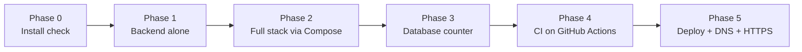
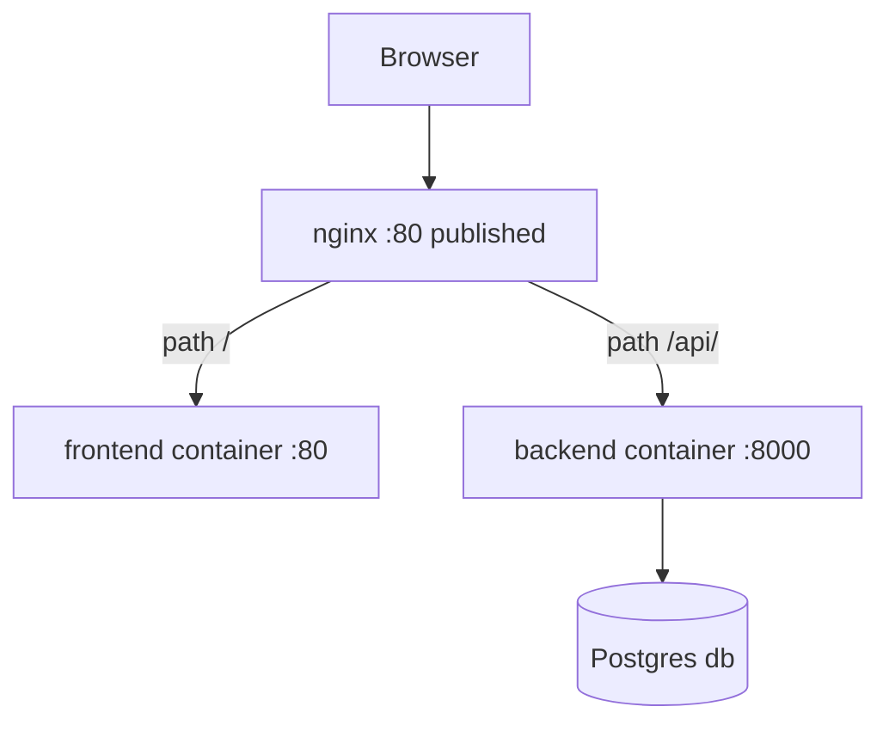
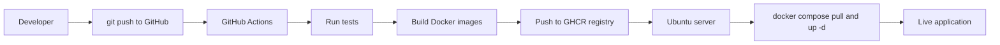
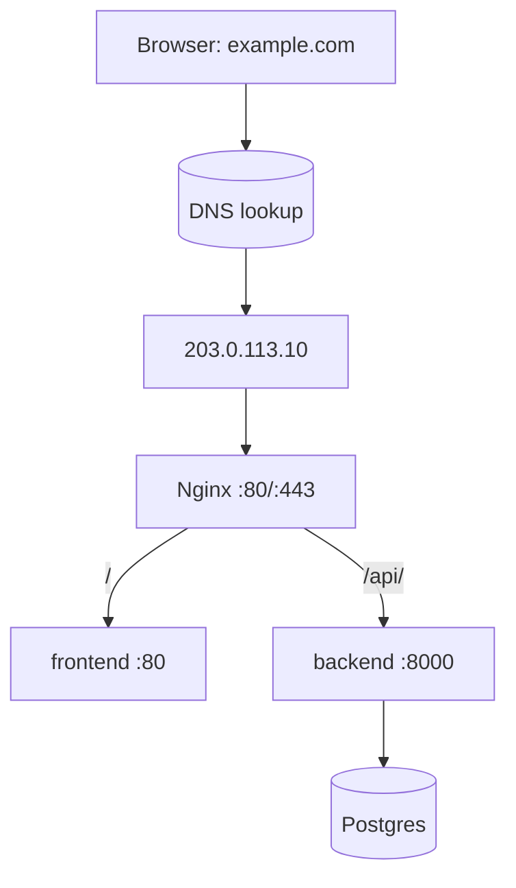
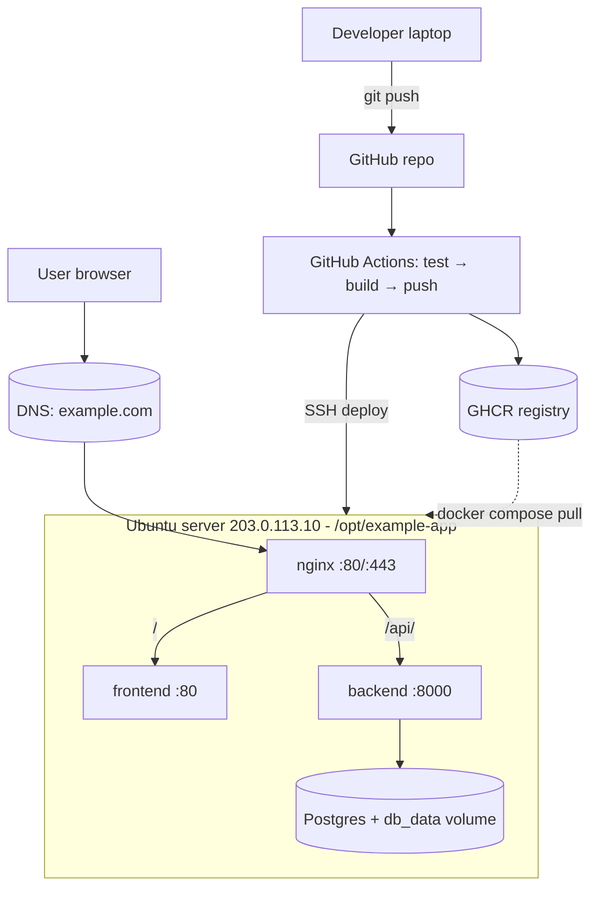

# Tutorial — Build & Ship the Example App End-to-End

> 💡 **Intuition:** The other chapters in this module each zoom in on one tool
> — [Docker](docker.md), [Compose](docker-compose.md),
> [GitHub Actions](github-actions.md), and so on. This chapter is different. It
> is the **"do this with me"** companion: a single, continuous walkthrough where
> you start with an empty folder and finish with a live, HTTPS-secured web app
> running on a real server. Every command is here. Every expected output is
> here. Follow along in your own terminal.

We will build and ship the **canonical example app** used throughout the whole
module: a small FastAPI backend, a static HTML frontend, an Nginx reverse proxy,
and a Postgres database. By the end you will understand how each piece is built
into a Docker **image** (think *recipe*), run as a **container** (the *cooked
meal*), wired together with Compose, tested and shipped by an automated factory
(GitHub Actions), and served from a restaurant kitchen (an Ubuntu server) behind
a receptionist (Nginx) that everyone reaches through the internet phone book
(DNS).

Here is the whole journey on one page. Don't worry if names are unfamiliar —
each phase below explains them.



Each phase ends with a ⚠️ **checkpoint**. If your output doesn't match, that's
normal — jump to [troubleshooting.md](troubleshooting.md) and come back.

---

## Phase 0 — Prerequisites & install check

Before cooking, we check the kitchen has working appliances. You need three
tools:

- **Docker** — the engine that builds images and runs containers.
- **git** — version control; we push code to GitHub later.
- **A text editor** — VS Code is fine, but anything works.

> 💡 **Intuition:** Docker is the appliance that turns a *recipe* (image) into a
> *cooked meal* (container). Before we cook anything, we make sure the appliance
> turns on.

### 0.1 Check Docker is installed and running

```bash
docker --version
```

Expected output (your version numbers may differ slightly — anything 24.x or
newer is fine):

```
Docker version 27.3.1, build ce12230
```

Now run the canonical smoke test. This pulls a tiny official image and runs it:

```bash
docker run hello-world
```

Expected output (abridged):

```
Unable to find image 'hello-world:latest' locally
latest: Pulling from library/hello-world
...
Hello from Docker!
This message shows that your installation appears to be working correctly.
...
```

> ⚠️ **Checkpoint:** If you see `Cannot connect to the Docker daemon`, the Docker
> engine isn't running. On Mac/Windows, open **Docker Desktop** and wait for the
> whale icon to go solid. On Linux, run `sudo systemctl start docker`. Still
> stuck? See [troubleshooting.md](troubleshooting.md).

### 0.2 Check Docker Compose v2

This module always uses **`docker compose`** (v2, a space) — never the old
`docker-compose` (v1, a hyphen). Confirm v2 is present:

```bash
docker compose version
```

Expected:

```
Docker Compose version v2.30.3
```

### 0.3 Check git

```bash
git --version
```

Expected:

```
git version 2.46.0
```

### 0.4 Get the example app on disk

The whole module ships the example app under
`14_cicd/example-app/`. If you cloned the course repo,
you already have it. Move into the backend so the commands below work as written:

```bash
cd 14_cicd/example-app
ls
```

Expected:

```
backend  docker-compose.yml  frontend  nginx
```

> ✅ **Best practice:** Always confirm your tools work with a trivial smoke test
> (`docker run hello-world`) *before* debugging your own app. It rules out "is
> the appliance even on?" in five seconds.

---

## Phase 1 — Run the backend alone

We'll start small: build **only** the FastAPI backend into an image, run it as a
container, and talk to it with `curl`. No frontend, no database yet — just the
API, so you can see Docker isolate and run a single service.

### 1.1 The recipe card — the backend Dockerfile

The backend is built from this `Dockerfile` (the *written recipe card*). This is
the exact file we ship — see [docker.md](docker.md) for the full line-by-line
teaching version.

```dockerfile
# syntax=docker/dockerfile:1

# ---- Base image: small, official Python ----
FROM python:3.12-slim

# Sensible Python defaults inside containers
ENV PYTHONUNBUFFERED=1 \
    PYTHONDONTWRITEBYTECODE=1

# All later paths are relative to /app
WORKDIR /app

# Copy ONLY requirements first so the pip layer is cached until deps change
COPY requirements.txt .
RUN pip install --no-cache-dir -r requirements.txt

# Now copy the application code
COPY app ./app

# Run as a non-root user (never run containers as root in production)
RUN useradd --create-home appuser && chown -R appuser /app
USER appuser

# Document the port the app listens on
EXPOSE 8000

# Container-level liveness check
HEALTHCHECK --interval=30s --timeout=3s --start-period=10s --retries=3 \
  CMD python -c "import urllib.request,sys; sys.exit(0 if urllib.request.urlopen('http://localhost:8000/api/health').status==200 else 1)"

# Start the ASGI server, bound to all interfaces so Docker can reach it
CMD ["uvicorn", "app.main:app", "--host", "0.0.0.0", "--port", "8000"]
```

The key idea: each line is a **layer** (a *step in the recipe*), cached and
reused. Copying `requirements.txt` *before* the app code means changing your
Python files doesn't force a slow re-install of dependencies.

### 1.2 Build the image

From inside the `backend/` folder:

```bash
cd backend
docker build -t example-app-backend:dev .
```

- `docker build` — turn a Dockerfile into an image.
- `-t example-app-backend:dev` — *tag* (name) the image so we can refer to it.
- `.` — the *build context*: the current folder, sent to the Docker engine.

Expected output (abridged — first build is slower as layers download):

```
[+] Building 38.4s (12/12) FINISHED
 => [internal] load build definition from Dockerfile
 => [1/6] FROM docker.io/library/python:3.12-slim
 => [2/6] WORKDIR /app
 => [3/6] COPY requirements.txt .
 => [4/6] RUN pip install --no-cache-dir -r requirements.txt
 => [5/6] COPY app ./app
 => [6/6] RUN useradd --create-home appuser && chown -R appuser /app
 => exporting to image
 => => naming to docker.io/library/example-app-backend:dev
```

Confirm the image exists:

```bash
docker images example-app-backend
```

Expected:

```
REPOSITORY            TAG   IMAGE ID       CREATED          SIZE
example-app-backend   dev   a1b2c3d4e5f6   10 seconds ago   210MB
```

### 1.3 Run the container

```bash
docker run --rm -p 8000:8000 example-app-backend:dev
```

- `--rm` — delete the container when it stops (keeps things tidy).
- `-p 8000:8000` — *publish* container port 8000 to your machine's port 8000
  (`host:container`). Without this, the API is unreachable from your browser.

Expected output (the server starts and stays running in this terminal):

```
INFO:     Started server process [1]
INFO:     Waiting for application startup.
[startup] DB init skipped: connection failed: ... (no DATABASE_URL set)
INFO:     Application startup complete.
INFO:     Uvicorn running on http://0.0.0.0:8000 (Press CTRL+C to quit)
```

The `DB init skipped` line is **expected and correct** — we haven't given the
backend a database yet, and the code is written to degrade gracefully (see
`app/main.py` §5.2). The API still serves `/health` and `/message`.

### 1.4 Talk to the API

Leave that terminal running. Open a **second** terminal and hit the endpoints:

```bash
curl http://localhost:8000/api/health
```

Expected:

```json
{"status":"ok"}
```

```bash
curl http://localhost:8000/api/message
```

Expected:

```json
{"message":"Hello from FastAPI"}
```

> ⚠️ **Checkpoint:** No response, or `Connection refused`? Make sure the `docker
> run` terminal still shows "Application startup complete" and that you used
> `-p 8000:8000`. A common slip is forgetting `-p`, which builds a perfectly good
> container you simply can't reach. See [troubleshooting.md](troubleshooting.md).

Stop the backend with **Ctrl+C** in the first terminal. The `--rm` flag removes
the container automatically.

---

## Phase 2 — Add the frontend and Nginx (the full stack)

Running one container by hand is fine for one service. But our app has four:
backend, frontend, db, and Nginx. Wiring them by hand — networks, env vars,
start order — is tedious and error-prone. **Docker Compose** describes the whole
stack in one YAML file and brings it up with one command.

> 💡 **Intuition:** If a single container is one cooked dish, Compose is the
> *head chef's plan* for the entire meal — who cooks what, in what order, and how
> the dishes are passed between stations.



### 2.1 The Compose file

This is the canonical `docker-compose.yml` (§5.12). It is used **both** for local
development and as the production template. Full teaching breakdown lives in
[docker-compose.md](docker-compose.md).

```yaml
# Compose file for local dev AND as the production template.
# Locally: `docker compose up --build`.
# In production we PULL prebuilt images (see deployment.md) — the `image:`
# tags below are what CI pushes and what the server pulls.

services:
  backend:
    build: ./backend
    image: ghcr.io/chrisw09/example-app-backend:latest
    environment:
      DATABASE_URL: postgresql://app:app@db:5432/app
    depends_on:
      db:
        condition: service_healthy
    restart: unless-stopped
    networks: [appnet]

  frontend:
    build: ./frontend
    image: ghcr.io/chrisw09/example-app-frontend:latest
    restart: unless-stopped
    networks: [appnet]

  db:
    image: postgres:16-alpine
    environment:
      POSTGRES_USER: app
      POSTGRES_PASSWORD: app
      POSTGRES_DB: app
    volumes:
      - db_data:/var/lib/postgresql/data
    healthcheck:
      test: ["CMD-SHELL", "pg_isready -U app"]
      interval: 10s
      timeout: 5s
      retries: 5
    restart: unless-stopped
    networks: [appnet]

  nginx:
    build: ./nginx
    image: ghcr.io/chrisw09/example-app-nginx:latest
    ports:
      - "80:80"
    depends_on:
      - backend
      - frontend
    restart: unless-stopped
    networks: [appnet]

volumes:
  db_data:

networks:
  appnet:
```

A few things to notice now (full detail in the Compose chapter):

- **`networks: [appnet]`** — all four services share one private network named
  `appnet`. On it, containers find each other by **service name**: the backend
  reaches Postgres at the hostname `db`, and Nginx reaches the API at `backend`.
- **`db_data`** named **volume** — the *pantry/fridge*. Postgres writes its data
  there so it survives container restarts.
- **`depends_on … condition: service_healthy`** — backend waits until the db's
  healthcheck passes, not merely until the db process starts.
- Only **nginx** publishes a port (`80:80`). Backend, frontend, and db are
  reachable *only* inside `appnet` — the browser never talks to them directly.
  That's the receptionist pattern: one front door.

### 2.2 Bring up the whole stack

From the `example-app/` folder (the one containing `docker-compose.yml`):

```bash
cd ..        # back up from backend/ to example-app/
docker compose up --build
```

- `up` — create and start every service.
- `--build` — build the images from the local Dockerfiles first (instead of
  pulling prebuilt ones).

Expected output (abridged — Compose builds backend/frontend/nginx, pulls
Postgres, then starts everything in dependency order):

```
[+] Building 2.1s (24/24) FINISHED
[+] Running 5/5
 ✔ Network example-app_appnet       Created
 ✔ Volume "example-app_db_data"     Created
 ✔ Container example-app-db-1        Healthy
 ✔ Container example-app-backend-1   Started
 ✔ Container example-app-frontend-1  Started
 ✔ Container example-app-nginx-1     Started
backend-1   | INFO:     Application startup complete.
db-1        | database system is ready to accept connections
nginx-1     | /docker-entrypoint.sh: Configuration complete; ready for start up
```

### 2.3 Open the app in your browser

Visit **http://localhost** (port 80, so no `:port` needed).

You should see the **Example App** page with the text **"Hello from FastAPI"**
under the heading. Click the **Refresh** button — the page re-fetches `/api/message`
through Nginx and updates the text.

What just happened: the browser asked Nginx (port 80) for `/`. Nginx proxied `/`
to the **frontend** container, which returned the HTML. The page's JavaScript
then called `/api/message`; Nginx matched the `/api/` rule and proxied it to the
**backend** container. Same origin, one front door — exactly the receptionist
analogy. The routing rules live in [reverse-proxies.md](reverse-proxies.md).

### 2.4 Inspect the running stack

Open a second terminal (leave Compose running). List the services:

```bash
docker compose ps
```

Expected:

```
NAME                     IMAGE                                          STATUS                   PORTS
example-app-backend-1    ghcr.io/chrisw09/example-app-backend:latest    Up 2 minutes (healthy)
example-app-db-1         postgres:16-alpine                             Up 2 minutes (healthy)
example-app-frontend-1   ghcr.io/chrisw09/example-app-frontend:latest   Up 2 minutes
example-app-nginx-1      ghcr.io/chrisw09/example-app-nginx:latest       Up 2 minutes            0.0.0.0:80->80/tcp
```

Tail the logs of all services (or one):

```bash
docker compose logs --tail=20
docker compose logs backend
```

> ⚠️ **Checkpoint:** If http://localhost shows **"Error contacting backend"**,
> the frontend loaded but the `/api/` proxy failed. Check `docker compose ps`
> (is backend `healthy`?) and `docker compose logs nginx backend`. If port 80 is
> already taken (e.g. by another web server), Compose will say "port is already
> allocated" — stop the conflicting service. See
> [troubleshooting.md](troubleshooting.md).

---

## Phase 3 — Exercise the database

The third endpoint, `/api/visits`, inserts a row into Postgres and returns the
total count. This proves the backend ↔ db connection and the persistent volume
work. Keep the stack from Phase 2 running.

### 3.1 Watch the counter increment

```bash
curl http://localhost/api/visits
```

Expected (your number depends on how many times you've called it):

```json
{"visits":1}
```

Call it again — the counter goes up because each call inserts a new row:

```bash
curl http://localhost/api/visits
curl http://localhost/api/visits
```

```json
{"visits":2}
{"visits":3}
```

> Note we're hitting `http://localhost/api/visits` (port 80, through **Nginx**),
> not the backend's port 8000 directly — in the full stack the backend isn't
> published. This is how a real user reaches it.

### 3.2 Look at the rows directly in Postgres

Use `docker compose exec` to open a `psql` shell *inside* the running `db`
container. The db credentials are `app` / `app` / database `app` (§6).

```bash
docker compose exec db psql -U app -d app -c "SELECT count(*) FROM visits;"
```

Expected:

```
 count
-------
     3
(1 row)
```

Inspect a few rows with their timestamps:

```bash
docker compose exec db psql -U app -d app -c "SELECT id, ts FROM visits ORDER BY id DESC LIMIT 3;"
```

Expected (timestamps will be yours):

```
 id |              ts
----+-------------------------------
  3 | 2026-06-16 09:41:22.118402+00
  2 | 2026-06-16 09:41:21.004217+00
  1 | 2026-06-16 09:41:19.882910+00
(3 rows)
```

### 3.3 Prove the volume persists data

This is the *pantry* in action. Restart just the db container and confirm the
rows survive:

```bash
docker compose restart db
docker compose exec db psql -U app -d app -c "SELECT count(*) FROM visits;"
```

Expected — the count is unchanged because data lives in the `db_data` volume,
not inside the container:

```
 count
-------
     3
(1 row)
```

> ⚠️ **Checkpoint:** If `/api/visits` returns `{"visits":null,"detail":"database
> unavailable: ..."}`, the backend can't reach Postgres. Confirm `db` is
> `healthy` in `docker compose ps` and that the backend's `DATABASE_URL` points
> at hostname `db`. See [troubleshooting.md](troubleshooting.md).

When you're done exploring, tear the stack down:

```bash
docker compose down            # stops & removes containers + network
# docker compose down -v       # ALSO deletes the db_data volume (wipes data!)
```

> ⚠️ The `-v` flag deletes the volume. Use it only when you genuinely want a
> clean slate — it erases your Postgres data.

---

## Phase 4 — Put it under CI (GitHub Actions)

So far you've built and run everything **by hand**. That doesn't scale and isn't
safe: a teammate could push code that breaks the tests, or ship an image that
never got tested. **CI/CD** automates this.

- **CI (Continuous Integration)** — the *quality-control line*. On every push it
  runs the tests automatically.
- **CD (Continuous Delivery/Deployment)** — the *delivery truck*. Once tests
  pass, it builds the images, pushes them to a registry, and (in Phase 5) ships
  them to the server.

> 💡 **Intuition:** GitHub Actions is the *automated factory*. You drop a YAML
> recipe into the repo; every `git push` puts your code on the assembly line.



### 4.1 The workflow file

This is the canonical `ci-cd.yml` (§5.13). Full teaching breakdown is in
[github-actions.md](github-actions.md).

```yaml
name: CI/CD

on:
  push:
    branches: [main]
  pull_request:
    branches: [main]

env:
  REGISTRY: ghcr.io
  IMAGE_PREFIX: ghcr.io/${{ github.repository_owner }}/example-app
  APP_DIR: 14_cicd/example-app

jobs:
  test:
    runs-on: ubuntu-latest
    steps:
      - uses: actions/checkout@v4
      - uses: actions/setup-python@v5
        with:
          python-version: "3.12"
      - name: Install dependencies
        working-directory: ${{ env.APP_DIR }}/backend
        run: |
          python -m pip install --upgrade pip
          pip install -r requirements.txt
      - name: Run tests
        working-directory: ${{ env.APP_DIR }}/backend
        run: pytest -q

  build-and-push:
    needs: test
    if: github.ref == 'refs/heads/main'
    runs-on: ubuntu-latest
    permissions:
      contents: read
      packages: write
    steps:
      - uses: actions/checkout@v4
      - uses: docker/setup-buildx-action@v3
      - name: Log in to GHCR
        uses: docker/login-action@v3
        with:
          registry: ghcr.io
          username: ${{ github.actor }}
          password: ${{ secrets.GITHUB_TOKEN }}
      - name: Build & push backend
        uses: docker/build-push-action@v6
        with:
          context: ${{ env.APP_DIR }}/backend
          push: true
          tags: |
            ${{ env.IMAGE_PREFIX }}-backend:latest
            ${{ env.IMAGE_PREFIX }}-backend:${{ github.sha }}
      - name: Build & push frontend
        uses: docker/build-push-action@v6
        with:
          context: ${{ env.APP_DIR }}/frontend
          push: true
          tags: |
            ${{ env.IMAGE_PREFIX }}-frontend:latest
            ${{ env.IMAGE_PREFIX }}-frontend:${{ github.sha }}
      - name: Build & push nginx
        uses: docker/build-push-action@v6
        with:
          context: ${{ env.APP_DIR }}/nginx
          push: true
          tags: |
            ${{ env.IMAGE_PREFIX }}-nginx:latest
            ${{ env.IMAGE_PREFIX }}-nginx:${{ github.sha }}

  deploy:
    needs: build-and-push
    if: github.ref == 'refs/heads/main'
    runs-on: ubuntu-latest
    steps:
      - name: Deploy over SSH
        uses: appleboy/ssh-action@v1
        with:
          host: ${{ secrets.SERVER_HOST }}
          username: ${{ secrets.SERVER_USER }}
          key: ${{ secrets.SERVER_SSH_KEY }}
          script: |
            cd /opt/example-app
            docker compose pull
            docker compose up -d
            docker image prune -f
```

The three jobs run in order: `test` → `build-and-push` → `deploy`. Each later
job has `needs:` the previous one, so a failed test stops the whole line — the
quality-control gate does its job.

### 4.2 ⚠️ The one gotcha: where the workflow file must live

> ⚠️ **Common mistake:** GitHub **only** runs workflows located at the
> **repository root** `.github/workflows/`. This module keeps the file at
> `14_cicd/example-app/.github/workflows/ci-cd.yml` for
> teaching co-location. **It will not run there.** To actually run it, copy it to
> the repo root:
>
> ```bash
> mkdir -p .github/workflows
> cp 14_cicd/example-app/.github/workflows/ci-cd.yml \
>    .github/workflows/ci-cd.yml
> ```
>
> The `APP_DIR` env var already points at the module path, so it works once
> relocated — no other edits needed.

### 4.3 Push and watch it run

```bash
git add .github/workflows/ci-cd.yml
git commit -m "Add CI/CD workflow"
git push origin main
```

Now open your repository on GitHub and click the **Actions** tab. You'll see a
run named **CI/CD** for your commit. Click into it:

- **test** job runs first — installs deps and runs `pytest -q`. Expected log
  tail: `2 passed in 0.42s`.
- **build-and-push** runs only after tests pass and only on `main`. It logs in to
  GHCR and builds/pushes all three images with two tags each: `:latest` and the
  commit SHA.
- **deploy** runs last (we set up its secrets in Phase 5).

A green check on the commit means the whole pipeline passed.

### 4.4 View the pushed images (packages)

GHCR (**GitHub Container Registry**) is the *warehouse* where your recipes are
stored. After `build-and-push` succeeds, find them on GitHub:

1. Go to your **profile/organization page** → **Packages** tab, **or** the repo's
   right sidebar → **Packages**.
2. You'll see three packages: `example-app-backend`, `example-app-frontend`,
   `example-app-nginx`, each with the `latest` and SHA tags.

You can also pull one locally to confirm it's really there:

```bash
docker pull ghcr.io/chrisw09/example-app-backend:latest
```

> ⚠️ **Checkpoint:** `build-and-push` failing with `denied: permission_denied`?
> The job needs `permissions: packages: write` (it's in the file above) and, for
> a brand-new package, you may need to make it visible/linked under repo
> settings. New packages default to **private** — that's fine; the server logs in
> to pull them. See [registries.md](registries.md) and
> [troubleshooting.md](troubleshooting.md).

---

## Phase 5 — Deploy to the Ubuntu server

Time to ship. Our target is a real **Ubuntu 24.04 LTS** server (the
*restaurant kitchen* — always on, runs the meals) at public IP **203.0.113.10**,
serving the domain **example.com**. This phase is the condensed happy path; each
step links to its deep-dive chapter.



### 5.1 Prepare the server (one-time)

SSH in and install Docker (full hardening checklist in
[deployment.md](deployment.md)):

```bash
ssh deploy@203.0.113.10
# On the server:
curl -fsSL https://get.docker.com | sudo sh
sudo usermod -aG docker $USER      # log out/in so this takes effect
docker compose version             # confirm v2 is present
```

Create the deploy directory (canonical path **`/opt/example-app`**, §6) and put
the Compose file there:

```bash
sudo mkdir -p /opt/example-app
sudo chown $USER /opt/example-app
# copy docker-compose.yml up to the server (run from your laptop):
# scp 14_cicd/example-app/docker-compose.yml deploy@203.0.113.10:/opt/example-app/
```

### 5.2 Log the server in to GHCR and pull images

Because the packages may be private, the server authenticates with a
**Personal Access Token** that has `read:packages`:

```bash
echo "$GHCR_TOKEN" | docker login ghcr.io -u chrisw09 --password-stdin
cd /opt/example-app
docker compose pull
```

Expected:

```
[+] Pulling 4/4
 ✔ backend   Pulled
 ✔ frontend  Pulled
 ✔ nginx     Pulled
 ✔ db        Pulled
```

### 5.3 Start the stack in the background

```bash
docker compose up -d
docker compose ps
```

- `-d` — *detached*: run in the background so it keeps going after you log out.

Expected: all four services `Up`, with nginx publishing `0.0.0.0:80->80/tcp`.
Test from your laptop against the raw IP:

```bash
curl http://203.0.113.10/api/health
```

```json
{"status":"ok"}
```

> ⚠️ **Checkpoint:** Connection times out? The server's firewall likely blocks
> port 80. Open it: `sudo ufw allow 80/tcp` (and `443/tcp` for HTTPS later). See
> [deployment.md](deployment.md).

### 5.4 Point DNS at the server

Right now you reach the app only by IP. To use **example.com**, add DNS records
at your domain registrar (the *internet phone book*). Full walkthrough in
[dns.md](dns.md):

| Type | Name | Value          |
|------|------|----------------|
| A    | `@`  | `203.0.113.10` |
| A    | `www`| `203.0.113.10` |

Wait for propagation, then verify:

```bash
dig +short example.com
# 203.0.113.10
curl http://example.com/api/health
# {"status":"ok"}
```

### 5.5 Add HTTPS with certbot

Plain HTTP is unencrypted. A **TLS certificate** (a *tamper-proof ID card* issued
by a trusted authority) upgrades you to HTTPS. The condensed path using
Certbot — full version, including auto-renewal and the Nginx 443 server block, in
[https.md](https.md):

```bash
# On the server:
sudo apt install -y certbot
sudo certbot certonly --standalone -d example.com -d www.example.com
# certbot writes certs to /etc/letsencrypt/live/example.com/
```

After wiring the certs into the Nginx config (see [https.md](https.md)) and
publishing port 443, verify the padlock:

```bash
curl -I https://example.com/api/health
# HTTP/2 200
```

> ⚠️ **Checkpoint:** Certbot failing with "challenge failed"? DNS must already
> resolve to your server (Phase 5.4) and port 80 must be open *before* you
> request a cert — Let's Encrypt connects back to prove you own the domain. See
> [https.md](https.md).

### 5.6 Automate deploys (close the loop)

The `deploy` job in the workflow (§4.1) does exactly Phase 5.2–5.3 over SSH. Add
these **repository secrets** (Settings → Secrets and variables → Actions):

- `SERVER_HOST` = `203.0.113.10`
- `SERVER_USER` = `deploy`
- `SERVER_SSH_KEY` = the private SSH key authorized on the server

Now every push to `main` runs tests → builds & pushes images → SSHes in and runs
`docker compose pull && docker compose up -d`. The factory ships to the kitchen
with no manual steps. Full operational detail in [deployment.md](deployment.md).

---

## What you built

You started with an empty terminal and ended with a tested, containerized,
multi-service web app deployed behind HTTPS on a real server — shipped
automatically on every push. Here is the complete system on one diagram:



You now understand, hands-on:

- **Images vs containers** — recipes vs cooked meals (Phase 1).
- **Multi-service orchestration** with Compose, private networks, healthchecks,
  and persistent volumes (Phases 2–3).
- **CI/CD** — automated testing, image builds, and registry pushes (Phase 4).
- **Deployment** — pulling images onto a server, DNS, and HTTPS (Phase 5).

## Where to go next

- Want the *why* behind each Dockerfile line? → [docker.md](docker.md)
- Curious how Compose wires the network and start order? →
  [docker-compose.md](docker-compose.md)
- Want to harden the pipeline (caching, matrix builds)? →
  [github-actions.md](github-actions.md)
- Operating the server day-to-day, backups, zero-downtime restarts? →
  [deployment.md](deployment.md)
- Add dashboards and alerts? → [monitoring.md](monitoring.md)
- Practice everything with graded tasks → [exercises.md](exercises.md)

---

## Next / Related

- [README.md](README.md) — module overview and learning path.
- [architecture.md](architecture.md) — the big-picture design this tutorial builds.
- [troubleshooting.md](troubleshooting.md) — fixes for every ⚠️ checkpoint above.
- [exercises.md](exercises.md) — the capstone exercise bank to cement the skills.
