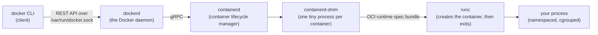

# Container internals — what actually happens on `docker run`

You type twelve characters — `docker run app` — and somewhere, a process starts that believes it is alone on a freshly installed machine: it is PID (process ID) 1, it sees an empty process table, its own hostname, its own network card, a filesystem that matches your image, and a memory cap it cannot exceed. None of that is virtualization. Every bit of it is the **host's Linux kernel doing bookkeeping**.

This chapter walks the whole chain: the tools that cooperate between your keystroke and the running process (§2), then the three kernel mechanisms that create the illusion — **namespaces** for *visibility* (§3), **cgroups** for *consumption* (§4), and **capabilities/seccomp** for *permission* (§5) — and closes with the consequences of the fact that everything shares one kernel (§6), including why your Mac secretly runs Linux. [`lab01_container_anatomy.ipynb`](lab01_container_anatomy.ipynb) has you model namespace isolation in pure Python; [images-and-layers.md](images-and-layers.md) already covered the filesystem half of the story, which §2 plugs in.

The commands shown are reference material — they assume a Linux machine (or a shell inside Docker Desktop's VM) and are safe to read without running.

---

## 1. The illusion, itemized

Start a container and look around inside it:

```bash
docker run -it --rm python:3.12-slim bash

ps aux            # 2 processes: bash (PID 1!) and this ps — the host runs hundreds
hostname          # a random 12-hex-char name, not your machine's
ls /              # the image's filesystem, not the host's
ip addr           # its own eth0 with a private IP like 172.17.0.2
whoami            # root — but a suspiciously powerless root, as §5 will show
uname -r          # ...the HOST's kernel version. The one crack in the illusion.
```

Five private views and one shared truth. Keep that `uname -r` in mind — it is the thesis of this chapter: *everything* is per-container except the kernel.

> 💡 **Intuition:** A container is a **theater set**. The actor (your process) sees walls, a door, furniture — a complete room. But the walls are flats, the door leads backstage, and the *building* (the kernel) is shared with every other stage in the theater. The set is real enough to act in; it is not a separate building. VMs, by contrast, build a separate building per play.

---

## 2. The chain of command: client → daemon → containerd → runc

`docker` the command does not run containers. It is a thin **client** at the top of a chain of increasingly small, increasingly boring programs:



- **`docker` (client).** Parses your flags, sends an HTTP request to the daemon's Unix socket, streams back output. That's all. (This is why `docker` can equally talk to a remote daemon — and why access to `docker.sock` equals root on the host: whoever holds the socket can ask the daemon, which *is* root, to do anything.)
- **`dockerd` (the daemon).** The long-running engine: manages images and the build system, volumes, networks, and the API. For actually *running* containers it delegates downward.
- **`containerd`.** The container **lifecycle manager**: pulls images, manages the content-addressed store and snapshots from [images-and-layers.md](images-and-layers.md), starts/stops/supervises containers. It was split out of Docker and donated to the CNCF (Cloud Native Computing Foundation) — Kubernetes typically uses containerd *directly, with no Docker installed at all* ([ecosystem.md](ecosystem.md)).
- **`containerd-shim`.** A featherweight per-container babysitter. It holds the container's stdio and exit status so that containerd — and even dockerd — can restart or upgrade *without killing your containers*.
- **`runc`.** The endpoint of the chain and the reference implementation of the **OCI runtime specification**. Given a **bundle** — a root filesystem directory (the OverlayFS `merged` mount from [images-and-layers.md §5](images-and-layers.md)) plus a `config.json` describing namespaces, cgroups, capabilities, mounts, env, and the command — runc makes the kernel syscalls that create the isolated process, then **exits**. Nothing called "a container" keeps running in the background: after runc leaves, there is only *your process*, wearing kernel-enforced constraints, supervised by a shim.

So the full story of `docker run app` is: client asks daemon; daemon has containerd ensure the image and prepare the overlay mount and config; a shim launches runc; runc clones your process into fresh namespaces, applies cgroup limits, pivots its root into the merged filesystem, drops privileges, and execs your `CMD`. Ten milliseconds later the theater set is lit.

> 💡 **Intuition:** The chain is a **restaurant order**: you (client) tell the waiter (dockerd), who logs it with the kitchen manager (containerd), who assigns a line cook (shim) who follows the standard recipe format (runc + OCI bundle). The recipe format being standardized is the important part — any kitchen manager can employ any OCI-speaking cook: swap runc for gVisor or Kata (sandboxed/micro-VM runtimes) and Docker doesn't notice.

---

## 3. Namespaces: private views of a shared machine

A **namespace** wraps one global resource of the machine — the process table, the network stack, the mount table… — and gives a group of processes their own private instance of it. Processes inside see *their* copy; they cannot even *name* things outside it. Isolation by invisibility, not by walls: the kernel simply never shows you what you're not in the namespace of. There are several namespace kinds; the six classic ones that Docker sets up for every container:

| Namespace | Isolates | Inside the container that means |
|---|---|---|
| **pid** | Process IDs | Your process is PID 1; only its descendants are visible; host PIDs unmappable |
| **net** | Network stack | Own interfaces, own IP, own ports, own routing table — two containers can both bind `:8000` |
| **mnt** | Mount table | Own filesystem tree — the overlay `merged` dir becomes `/`; host mounts invisible |
| **uts** | Host & domain name | Own `hostname` (UTS = "Unix Time-Sharing system", a fossilized name) |
| **ipc** | Inter-process communication | Own System V IPC / POSIX shared-memory segments (matters for PyTorch DataLoader workers — see below) |
| **user** | User & group IDs | UID (user ID) 0 *inside* can map to an unprivileged UID *outside* — root in the set, nobody in the building |

Worth pausing on three of them:

**pid.** Being PID 1 is a job, not just a number: PID 1 is expected to reap zombie children and gets special signal treatment (unhandled SIGTERM does *not* kill PID 1 by default — one reason a container sometimes ignores `docker stop` for ten seconds until the SIGKILL follow-up lands; `docker run --init` inserts a tiny real init process to do the job properly). The mapping is one-way glass: the host sees your container's python as some ordinary PID 48213 (`docker top <container>` shows the mapping); the container sees nothing of the host.

**net.** Each container's private network stack is connected to the world by a **veth pair** — a virtual cable with one end as the container's `eth0` and the other plugged into the Docker **bridge** on the host. Port publishing (`-p 8000:8000`) is the host forwarding its own port over that cable. The full wiring — bridges, DNS, port publishing — is [volumes-and-networking.md](volumes-and-networking.md).

**ipc & user.** Two namespaces data scientists actually meet: PyTorch's `DataLoader` passes tensors between worker processes through **shared memory**, which lives in the ipc namespace and is capped small (64 MB) by Docker's default `/dev/shm` — the classic `DataLoader worker … bus error` crash, fixed with `--shm-size=2g` ([dockerfiles-for-data-science.md](dockerfiles-for-data-science.md)). And the **user** namespace is what lets rootless container runtimes (Podman's headline feature, [ecosystem.md](ecosystem.md)) offer "root inside, unprivileged user outside."

You can build namespaces without Docker — they're plain kernel features:

```bash
# a shell in fresh pid+mount namespaces; --fork so the shell is PID 1
sudo unshare --pid --fork --mount-proc bash
ps aux                     # 2 processes. You just made 1/6 of a container.

# see any process's namespaces (each is just a numbered kernel object):
ls -l /proc/self/ns/       # pid, net, mnt, uts, ipc, user, ...
```

That `ls` demystifies the whole thing: a namespace is a kernel object with an ID; "being in a container" simply means your `/proc/<pid>/ns/` entries point at different objects than the host's. `docker exec` is precisely the act of starting a new process and *joining* it to an existing container's namespaces (the `setns` syscall) — nothing more.

---

## 4. cgroups v2: metering and capping consumption

Namespaces control what a process can *see*; **cgroups** ("control groups") control what it can *use*. A cgroup is a node in a kernel-managed tree (mounted at `/sys/fs/cgroup`); every process belongs to exactly one node; **controllers** (cpu, memory, io, pids) meter and limit each node's consumption. **cgroups v2** — the current, unified hierarchy used by modern distros and Docker — is what we describe; you'll still meet v1's messier per-controller trees on older servers.

Docker exposes the important knobs as `docker run` flags, which become plain values in cgroup files:

```bash
docker run -d --name train --memory=4g --cpus=2.0 my-training-image

# what the kernel actually recorded (paths abbreviated):
cat /sys/fs/cgroup/system.slice/docker-<id>.scope/memory.max   # 4294967296
cat /sys/fs/cgroup/.../cpu.max                                 # "200000 100000"
```

| Flag | cgroup file | Semantics |
|---|---|---|
| `--memory=4g` | `memory.max` | Hard ceiling. Exceed it and the **OOM killer** (out-of-memory killer) kills the offending process — container exits with code **137** |
| `--memory-reservation` | `memory.low` | Soft target the kernel tries to honor under pressure |
| `--cpus=2.0` | `cpu.max` (`quota period`) | May consume 200 000 µs of CPU per 100 000 µs wall-clock — i.e. two cores' worth, enforced by **throttling**, not killing |
| `--cpu-shares` | `cpu.weight` | *Relative* priority — only matters when the CPU is contended |
| `--pids-limit` | `pids.max` | Caps process/thread count (fork-bomb insurance) |

Two behaviors to internalize, because you *will* meet both:

- **Memory limits kill; CPU limits throttle.** A training job that creeps past `--memory=4g` dies instantly with exit code 137 and, often, no Python traceback — the kernel killed it mid-instruction. `docker inspect --format '{{.State.OOMKilled}}' train` confirms it. A job past its CPU quota merely runs slower.
- **Unlimited is the default.** With no flags, a container may use all host memory and CPU — on shared machines (the team GPU box), setting limits is basic courtesy and self-defense.

> ⚠️ **Common mistake (data-science edition):** Your container has `--memory=8g`, but your code asks *the machine* how much memory it has — `psutil.virtual_memory()`, or a JVM/BLAS library auto-sizing its pools — and gets the **host's** 256 GB, because `/proc/meminfo` is not namespaced. The library then happily allocates 32 GB and gets OOM-killed. Well-behaved runtimes (modern Python allocators, recent JVMs) check the cgroup files; when tuning thread pools yourself, read `len(os.sched_getaffinity(0))` and `/sys/fs/cgroup/memory.max` rather than the machine-wide numbers.

> 💡 **Intuition:** Namespaces are the walls of the apartment; cgroups are the **utility meters and breakers** — each apartment has its own electricity budget, and the breaker trips (OOM kill) or the flow narrows (CPU throttle) per-apartment, so one tenant's space heater can't brown-out the building.

---

## 5. Capabilities and seccomp, briefly

Two more kernel mechanisms round out the default sandbox; one paragraph each is genuinely enough at this level. **Capabilities** split root's monolithic power into ~40 named privileges (`CAP_NET_ADMIN` to configure networking, `CAP_SYS_ADMIN` for mount-and-much-else, `CAP_NET_BIND_SERVICE` to bind ports below 1024, …). Docker starts containers with a *small default set* — which is why `whoami` says root inside, yet that "root" cannot change the clock, load kernel modules, or reconfigure interfaces. `--cap-drop ALL` (then `--cap-add` back the one or two you need) tightens further; `--privileged` hands *everything* back plus all host devices — treat it as "no container boundary at all," and be suspicious of any tutorial reaching for it. **seccomp** ("secure computing mode") filters at the next level down: which of the ~450 Linux **syscalls** the process may invoke at all. Docker's default profile blocks ~44 obscure or dangerous ones (`reboot`, `kexec_load`, `mount`, …) that near-zero applications need — a free cut of kernel attack surface, complementing capabilities (which gate *privileged operations*) by gating the *entry points themselves*. Together with the non-root-user practice from [Module 14's Dockerfile](../14_cicd/docker.md) and user namespaces (§3), these are the "defense-in-depth" layers behind the honest security assessment in [why-containers.md §3](why-containers.md).

---

## 6. One kernel to rule them all — and its consequences

Everything above is bookkeeping *inside a single running kernel*. That single fact explains a cluster of things practitioners otherwise memorize as folklore:

**Consequence 1 — Linux containers require a Linux kernel. Anywhere.** Namespaces, cgroups, OverlayFS, seccomp — none of these exist in the macOS (XNU) or Windows (NT) kernels. So **Docker Desktop on macOS/Windows runs a hidden, lightweight Linux VM** (via each OS's hypervisor framework; WSL 2 — Windows Subsystem for Linux — on Windows) and every one of "your" containers runs inside it. Daily consequences:

- `uname -r` in any container shows that VM's kernel — not macOS, whatever your laptop says.
- The VM has a **fixed RAM/CPU allocation** (Docker Desktop settings); containers can starve *inside* it while your Mac shows plenty free — the opposite of Linux, where containers share host memory natively.
- **Bind mounts cross the VM boundary** (macOS filesystem ↔ Linux VM), which is why mounting a source tree with 100 000 files is dramatically slower than on native Linux ([volumes-and-networking.md](volumes-and-networking.md)).
- `/var/lib/docker` "doesn't exist" on your Mac — it exists *inside the VM's* disk image.
- On Linux servers, none of this applies: containers are host processes, full stop. Your laptop and your server genuinely run containers differently — remembering *which differences are Desktop artifacts* saves real debugging time.

**Consequence 2 — kernel version and architecture are shared, not chosen.** An image built `FROM ubuntu:24.04` running on a Debian host uses *Ubuntu's userland* atop *Debian's kernel* — the "OS" in a base image is just files ([images-and-layers.md](images-and-layers.md)); the kernel is whoever's hosting. Likewise CPU **architecture** is the host's: an `linux/amd64` image on an ARM Mac either fails or runs under slow emulation — hence multi-platform manifest lists ([images-and-layers.md §6](images-and-layers.md)) and the occasional need for `docker run --platform linux/amd64`.

**Consequence 3 — kernel-level observation and tuning are host-side.** You cannot `mount`, load modules, tweak most `sysctl`s, or see other containers from inside (good); equally, host tools can see straight *into* containers — the host's `ps`, `top`, and profilers show container processes as ordinary PIDs (useful for debugging: `docker top`, or perf-profiling from the host).

**Consequence 4 — GPUs pierce the boundary deliberately.** A GPU is a kernel-managed device, so containers don't get one by namespacing; the **NVIDIA Container Toolkit** mounts the host's GPU device files and driver libraries into the container at start (`docker run --gpus all`). Corollary: the *driver* lives on the host, the *CUDA toolkit* lives in the image, and their versions must be compatible — the full recipe is in [dockerfiles-for-data-science.md](dockerfiles-for-data-science.md).

---

## 7. Exercises

Try each before opening the answer.

**Exercise 1.** Inside a container, `ps aux` shows 2 processes and `whoami` says `root`. On the host, the same python process appears as PID 48213 owned by… whom, and visible how? Name the mechanism behind each half of the answer.

<details>
<summary>Answer</summary>

The container's **pid namespace** gives it a private process table where its main process is PID 1; the host, outside that namespace, sees the same process under an ordinary host PID (48213) — `docker top <container>` prints the mapping. The owner depends on user configuration: by default plain `root` (same UID 0 as host root — but with the reduced **capability** set of §5 and the default **seccomp** filter), or an unprivileged host UID if **user namespaces** / rootless mode remap it. One process, two descriptions — namespaces change visibility, not reality.
</details>

**Exercise 2.** Your overnight training container vanished. `docker ps -a` shows exit code **137** and `docker inspect` shows `"OOMKilled": true`. Reconstruct what happened at the kernel level, and name two distinct fixes.

<details>
<summary>Answer</summary>

The container's cgroup hit its `memory.max` ceiling; the kernel's OOM killer selected the memory-hog (your training process) and killed it with SIGKILL (128 + 9 = 137). No Python traceback is possible — the process was terminated mid-flight. Fixes: raise the limit (`--memory=16g`) if the host has headroom; reduce actual usage (smaller batch size, streaming datasets instead of loading in full, `del`/garbage-collecting checkpoints); on Docker Desktop, also raise the *VM's* memory allocation, which silently caps every container regardless of `--memory`.
</details>

**Exercise 3.** Explain to a teammate why `docker exec -it train bash` is fundamentally different from `ssh` into a machine, even though it feels identical. What does the kernel actually do?

<details>
<summary>Answer</summary>

There is no server listening and no machine to log into. `docker exec` asks the daemon to spawn a *new process* (bash) and **join it into the existing container's namespaces** (the `setns` syscall: its pid, net, mnt, uts, ipc — hence it sees the same process table, files, and hostname as the containerized app) and its cgroup (so it shares the container's resource budget). It's adding an actor to the same theater set, not connecting to a different building — and when the container dies, the exec'd shell dies with it.
</details>

**Exercise 4.** On your Linux server, a bind-mounted data directory is fast and containers can use all 256 GB of RAM. On your macOS laptop, the identical `docker run` command reads the same directory slowly and gets OOM-killed at 8 GB. Explain both differences with one underlying fact.

<details>
<summary>Answer</summary>

The fact: macOS has no Linux kernel, so Docker Desktop runs containers inside a **Linux VM**. Bind mounts therefore cross the macOS↔VM boundary through a file-sharing layer (slow for many small files), and every container competes for the *VM's* fixed memory allocation (default a few GB) rather than the laptop's full RAM — the OOM killer fires at the VM's ceiling, ignoring how much memory macOS has free. On the Linux server there is no VM: mounts are native and memory is the host's.
</details>

**Exercise 5.** A tutorial tells you to fix a permissions problem with `docker run --privileged`. What does that flag actually grant, and what would a more surgical fix look like?

<details>
<summary>Answer</summary>

`--privileged` grants **all capabilities**, disables the seccomp filter, and exposes **all host devices** — effectively deleting the container/host security boundary (root in the container ≈ root on the host). Surgical alternatives: identify the one missing privilege and `--cap-add` exactly it (e.g. `CAP_NET_ADMIN` for network tooling); for device access, pass the specific device (`--device /dev/ttyUSB0` or `--gpus all`); for volume-permission issues, fix ownership/UID mapping instead ([volumes-and-networking.md](volumes-and-networking.md)). Reach for `--privileged` only for tooling whose *job* is host administration.
</details>

---

## Next / Related

- **Next:** [Dockerfiles for data science](dockerfiles-for-data-science.md) — put the mechanics to work on the images this course actually cares about: Python, CUDA, Jupyter, and models.
- [Images & layers](images-and-layers.md) — the filesystem half that runc mounts in step one.
- [`lab01_container_anatomy.ipynb`](lab01_container_anatomy.ipynb) — includes a toy pid-namespace simulation: isolated process tables as Python objects.
- [Ecosystem](ecosystem.md) — where containerd, runc alternatives, and rootless Podman fit in the wider landscape.
