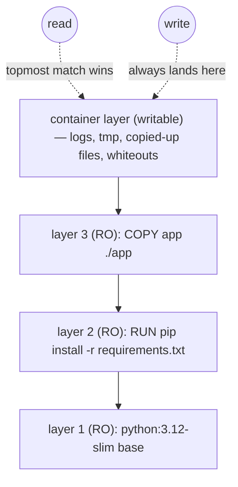

# Images & layers — the OCI image format from the inside

[Module 14's Docker chapter](../14_cicd/docker.md) teaches you to *write* a Dockerfile and gives you the working rule for layers: each instruction makes one, order them for caching. That's the driver's view. This chapter opens the format itself: what an image literally is on disk, why a "layer" is a tarball, how **content addressing** makes images verifiable and shareable, how the **overlay filesystem** stacks layers into the single filesystem your process sees, and what the build cache is *really* keying on. When you finish, `docker image inspect` output will read like prose, and image-size mysteries ("I deleted the files, why is it still huge?") will stop being mysteries.

Everything here is standardized by the **OCI (Open Container Initiative) image specification** — so it applies identically to images built by Docker, Podman, `buildah`, or Kubernetes tooling. The hands-on lab for this chapter is [`lab01_container_anatomy.ipynb`](lab01_container_anatomy.ipynb), where you build all of this machinery yourself in ~100 lines of Python.

---

## 1. An image is not a disk image

The word "image" misleads. A VM (virtual machine) disk image is one giant opaque blob of bytes — a simulated hard drive. An **OCI image is nothing like that.** It is a small bundle of JSON (JavaScript Object Notation) documents plus a stack of ordinary compressed tarballs:

```
an OCI image
├── manifest  (JSON)   "this image = this config + these layers, in this order"
├── config    (JSON)   env vars, default command, working dir, layer ordering, history
└── layers    (tar.gz) each one a filesystem *diff*: "files added/changed/removed at this step"
```

That's the entire format. No magic, no proprietary container — you could unpack an image with `tar` and a JSON reader (and in the lab notebook, you effectively do).

> 💡 **Intuition:** An image is not a photograph of a finished room — it's a **stack of transparent sheets** on an overhead projector. The bottom sheet is the base OS's files; each following sheet adds or covers a few things ("add `/app/requirements.txt`", "add the installed packages"). What the audience sees — the *composed* picture — is the container's filesystem. Crucially, the sheets are **immutable and reusable**: fifty images built `FROM python:3.12-slim` all project the *same physical bottom sheets*, stored once.

Three properties fall out of this design, and the rest of the chapter unpacks each:

1. **Layers are shared and deduplicated** — because they're separate, immutable artifacts (§2, §3).
2. **Everything is verifiable by hash** — because each artifact is addressed by its content digest (§4).
3. **Composition happens at runtime** via a union filesystem — layers are never physically merged (§5).

---

## 2. Layers: filesystem diffs, stacked in order

A **layer** is a tar archive describing a *change set* against the layers below it:

- files **added** at this step (the file's full content is in the tar),
- files **modified** at this step (again, the full new content — diffs are per-*file*, not per-byte),
- files **removed** at this step — recorded as a **whiteout**: a special marker entry named `.wh.<filename>` that means "pretend the file below doesn't exist."

Whiteouts are the detail with the biggest practical consequence in this whole chapter:

> ⚠️ **Common mistake:** "I added `RUN rm -rf /root/.cache` at the end of my Dockerfile, but the image didn't get smaller." Correct — it got slightly **bigger**. Layers are immutable and additive: the cache files still fully exist in the earlier layer's tarball; your `rm` produced a *new* layer containing whiteout markers that hide them. Registry, disk, and download all still pay for the hidden bytes. To actually avoid the weight you must either not create the files in that layer at all (`RUN pip install ... && rm -rf ...` in **one** instruction, so the deletion happens before the layer is snapshotted) or use a multi-stage build ([dockerfiles-for-data-science.md](dockerfiles-for-data-science.md)).

You can watch the layer stack of any image with `docker history`, which shows one row per layer, its creating instruction, and its size:

```bash
docker history python:3.12-slim
# IMAGE          CREATED BY                                      SIZE
# <missing>      CMD ["python3"]                                 0B
# <missing>      RUN ... apt-get install ... python3.12 ...      ~45MB
# <missing>      ADD rootfs.tar.xz /                             ~75MB   <- the Debian base
# ...
```

Rows with `0B` are **metadata-only layers** — instructions like `ENV`, `WORKDIR`, `CMD`, `EXPOSE`, `USER` change the image's *config* (§6), not its filesystem, so they add no tarball. Only `FROM`'s base, `COPY`/`ADD`, and filesystem-touching `RUN`s carry weight.

### Why diff-stacking is worth the complexity

The payoff is **massive deduplication at every stage of the lifecycle**:

- **On disk:** your twelve project images built `FROM python:3.12-slim` store the ~120 MB of base layers *once*.
- **On the network:** `docker pull` downloads only layers you don't already have — that's what the per-layer `Already exists` / `Pull complete` lines mean. Pushing after a code-only change uploads kilobytes, not the multi-gigabyte PyTorch layer.
- **In the build:** unchanged layers are cache hits (§7) — the entire build-cache mechanism *is* layer reuse.

For data-science images, where a single dependency layer can be 5 GB, this is not an optimization — it's the difference between workable and not.

---

## 3. Copy-on-write: how containers write on read-only layers

Image layers are **read-only forever**. So how does a running container — which writes logs, temp files, `.pyc` files — function? When a container starts, the runtime adds one final, *writable* layer on top of the image's stack: the **container layer**. All writes land there; the image below is never touched. This strategy is **copy-on-write (CoW)**:

- **Read** a file → the runtime looks down the stack, top layer first, and returns the *topmost* version found (respecting whiteouts).
- **Write** a *new* file → created directly in the writable layer.
- **Modify** an *existing* file from a lower layer → the file is first **copied up**, in full, into the writable layer, and the copy is modified. The lower layer's original is now shadowed, permanently, for this container.
- **Delete** a file from a lower layer → a whiteout is placed in the writable layer.



Consequences worth engraving:

- Start **100 containers from one image** and they share every read-only byte; each costs only its (initially empty) writable layer. This is why containers are cheap.
- The writable layer **dies with the container** (`docker rm` deletes it). Anything that must survive belongs on a volume — the whole subject of [volumes-and-networking.md](volumes-and-networking.md).
- **Copy-up is per-file and pays the full file size.** Appending one line to a 2 GB file that lives in a lower layer copies 2 GB into the writable layer first. Databases, model checkpoints being rewritten, and other write-heavy data don't belong on the overlay at all — mount a volume, which bypasses CoW entirely.

> 💡 **Intuition:** Copy-on-write is a **library book with sticky notes**. The book (image) is shared by every reader and nobody may write in it. Your notes (writable layer) sit on top of the pages; reading, you see page-plus-note; "editing" a page means photocopying it, marking the copy, and clipping it over the original. Return the book (remove the container) and your notes are gone — the book is pristine for the next reader.

---

## 4. Content addressing: digests, and tags vs digests

Now the idea that makes the whole system trustworthy. Every artifact in an image — each layer tarball, the config JSON, the manifest JSON — is identified by its **digest**: the SHA-256 (Secure Hash Algorithm, 256-bit) hash of its exact bytes, written like

```
sha256:0d97070ff315528ae9f0b46bd11f0eda1a2a2160f18b808eab8d1b1e5f024995
```

Storage keyed by content hash is called **content-addressable storage**, and you already use it daily: **Git commits work exactly this way**. The properties transfer one-for-one:

- **Identity = content.** Same digest ⟹ byte-identical content, mathematically. There is nothing to trust and no one to ask.
- **Verification is free.** After pulling a layer, the client hashes it; any corruption or tampering changes the hash and the pull fails.
- **Deduplication is trivial.** Two images referencing layer `sha256:0d97…` reference the *same stored object* — that's the §2 sharing, implemented.
- **Cascading fingerprints.** The manifest *contains* the layer digests, so the manifest's own digest fingerprints the entire image transitively — exactly as a Git commit hash pins the whole tree and history. Change one byte anywhere and every digest above it changes.

### Tags are mutable pointers; digests are immutable identities

A **tag** (`python:3.12-slim`, `myapp:latest`, `myapp:v2.1`) is just a human-friendly, *re-pointable* label in a registry — Git branch semantics, not Git commit semantics. Whoever controls the repository can re-point any tag at a different manifest at any time, and routinely does (`python:3.12-slim` is re-pointed at every Debian security patch; that's a feature). A **digest reference** pins the exact bytes forever:

```bash
# by tag — whatever the registry currently says "3.12-slim" means
docker pull python:3.12-slim

# by digest — this exact image, verifiable, forever
docker pull python@sha256:6f78dc45283a3b1c1d0e5e0d3d0e2f9c...

# belt and braces — human-readable AND pinned (tag is ignored for resolution, kept for readability)
FROM python:3.12-slim@sha256:6f78dc45283a3b1c1d0e5e0d3d0e2f9c...
```

Find any local image's digest with `docker images --digests`, or in the `RepoDigests` field of `docker image inspect`.

| | Tag | Digest |
|---|---|---|
| Nature | Mutable name → manifest pointer | SHA-256 of the manifest bytes |
| Git analogy | Branch | Commit hash |
| Can two pulls differ? | Yes — hours apart, silently | Never |
| Use for | Humans, dev convenience, "give me current" | Reproducibility, science, audited production |

> ✅ **Best practice:** For any build you may need to *reproduce* — a paper's analysis, a trained model's environment, a regulated deployment — pin base images **by digest**. Module 14's pipeline reaches the same destination differently: its CI (Continuous Integration) tags every build with the Git commit SHA (see [registries.md](../14_cicd/registries.md)), which is a tag *used as* an immutable identifier by team convention. Digests give you the same guarantee cryptographically, with no convention required.

---

## 5. OverlayFS: the union filesystem that does the stacking

§3 said reads search "down the stack." Something concrete must implement that, and on Linux it's **OverlayFS**, a **union filesystem** built into the kernel (Docker's default storage driver, `overlay2`, drives it). A union filesystem presents several directories as if merged into one. OverlayFS takes:

- **`lowerdir`** — one or more read-only directories: the unpacked image layers, listed top-to-bottom;
- **`upperdir`** — one writable directory: the container layer;
- **`workdir`** — kernel scratch space for atomic operations (you never look inside);
- **`merged`** — the mount point where the union appears: this is the `/` your container sees.

You can build one by hand in two commands — genuinely worth doing once on any Linux box, it turns this whole chapter concrete:

```bash
mkdir lower upper work merged
echo "from the image"  > lower/base.txt
echo "old version"     > lower/config.txt

sudo mount -t overlay overlay \
  -o lowerdir=lower,upperdir=upper,workdir=work merged

cat merged/base.txt              # "from the image"      (served from lower)
echo "new version" > merged/config.txt   # copy-up: config.txt now fully in upper/
rm merged/base.txt               # upper/ gains a whiteout: a char device named base.txt
ls merged/                       # only config.txt — base.txt is hidden, not gone
ls upper/                        # config.txt (the copied-up file) + the whiteout entry
ls lower/                        # untouched: base.txt, config.txt — read-only survives it all
```

The lookup rule is exactly the §3 rule, now with its real implementation: **upper wins over lower; among lowers, higher wins; whiteouts terminate the search** (OverlayFS represents a whiteout on disk as a character device with device number 0:0 — the tar-level `.wh.` prefix from §2 is how the same idea is *serialized* into layer archives). When Docker starts a container, it unpacks any not-yet-unpacked layers under `/var/lib/docker/overlay2/`, constructs precisely this mount, and hands `merged` to the container as its root. "Starting from an image" is a **mount**, not a copy — which is the other half of why containers start in milliseconds.

In [`lab01_container_anatomy.ipynb`](lab01_container_anatomy.ipynb) you implement this lookup — upper/lower search order, copy-up, whiteouts — in about twenty lines of Python, and it behaves byte-for-byte like the rules above.

---

## 6. Reading a real image: manifest, config, `docker image inspect`

Time to look at actual anatomy. Three commands, three documents.

### The manifest — the image's table of contents

```bash
docker buildx imagetools inspect python:3.12-slim --raw
```

```json
{
  "schemaVersion": 2,
  "mediaType": "application/vnd.oci.image.manifest.v1+json",
  "config":   { "mediaType": "application/vnd.oci.image.config.v1+json",
                "digest": "sha256:19334b…", "size": 3221 },
  "layers": [
    { "mediaType": "application/vnd.oci.image.layer.v1.tar+gzip",
      "digest": "sha256:0d9707…", "size": 29125413 },
    { "mediaType": "application/vnd.oci.image.layer.v1.tar+gzip",
      "digest": "sha256:6f28b1…", "size": 3512 }
  ]
}
```

The manifest is tiny: it just names the config blob and the layer blobs **by digest**, in order. Pulling an image means: fetch manifest → fetch every blob it names that you don't already have → verify each against its digest. (For popular images this command actually returns a **manifest list** — an "index" mapping platforms like `linux/amd64` and `linux/arm64` each to their own manifest; that's how one tag serves both your Intel server and your M-series Mac. Same format, one level up.)

### The config — the runtime metadata

The config blob is where all those `0B` metadata layers went. It carries the environment (`Env`), default command (`Cmd`, `Entrypoint`), `WorkingDir`, `ExposedPorts`, `User`, plus two structural fields: `history` (one entry per Dockerfile instruction — what `docker history` prints) and `rootfs.diff_ids` (the ordered list of layer digests, this time of the *uncompressed* tars). `docker image inspect` shows you the config, locally:

```bash
docker image inspect python:3.12-slim
```

The fields worth knowing cold:

| Field | Meaning |
|---|---|
| `Id` | Digest of the config blob — the image's local identity |
| `RepoTags` / `RepoDigests` | The tags, and the pinnable manifest digests, this image is known by |
| `Config.Env`, `Config.Cmd`, `Config.Entrypoint`, `Config.WorkingDir`, `Config.User` | The `ENV`/`CMD`/`ENTRYPOINT`/`WORKDIR`/`USER` your Dockerfile set — this is where they *live* |
| `RootFS.Layers` | The ordered diff-ID stack — §2 made literal |
| `GraphDriver` | The actual `overlay2` `LowerDir`/`UpperDir`/`MergedDir` paths from §5 |

Trace one setting end-to-end and the format clicks: `ENV PYTHONUNBUFFERED=1` in a Dockerfile → a line in `Config.Env` in the config blob → an environment variable in every container's process at `docker run`. The Dockerfile is *source code*; the config is the *compiled artifact*; `docker run` is the *loader*.

### The blobs on disk

Locally, Docker stores every blob under `/var/lib/docker/image/.../blobs/sha256/<digest>` and unpacked layers under `/var/lib/docker/overlay2/` — a plain content-addressed store you now know how to read. (On macOS/Windows these paths live inside Docker Desktop's Linux VM — see [container-internals.md §7](container-internals.md).)

---

## 7. Build-cache mechanics: what the cache actually keys on

You know Module 14's rule — *stable instructions high, volatile instructions low*. Here is the machine that rule is exploiting. During `docker build`, for each instruction the builder computes a **cache key** and reuses the cached layer on a hit. The key covers:

1. **the parent layer's identity** — a hit requires the whole chain above to have hit; the first miss invalidates everything after it, unconditionally;
2. **the instruction text**, verbatim — change `RUN pip install -r requirements.txt` to add a single flag and that layer misses;
3. **for `COPY`/`ADD`: the *content checksum* of every copied file** — not names, not timestamps. Docker hashes the files; `touch requirements.txt` does **not** bust the cache, editing one byte in it does. (This is also why a broad `COPY . .` is cache-poison: *any* file changing anywhere in the context misses that layer — and everything below it.)

Two subtleties the simple rule hides:

- **`RUN` commands are assumed deterministic.** The key is the instruction *text* — Docker does not know that `RUN pip install requests` (unpinned) or `RUN apt-get update` produces different results on different days. A cached stale layer is served happily forever. That's an argument for pinning (reproducibility), and the reason "why is my image not picking up the new package version" is a FAQ. Force a full re-run with `docker build --no-cache`, or bust from a chosen point down by editing that instruction.
- **BuildKit** (the modern build engine, default since Docker 23) extends this model: it builds the instruction *graph* rather than a straight line (independent multi-stage branches build in parallel and cache independently), can **export/import the cache** to a registry so CI runners share it (`--cache-to` / `--cache-from` — this is what makes Module 14-style pipelines fast), and adds **cache mounts** (`RUN --mount=type=cache,target=/root/.cache/pip …`) — a persistent scratch directory that survives across builds *without* entering any layer. Cache mounts are the single biggest lever for Python dependency layers, and [dockerfiles-for-data-science.md](dockerfiles-for-data-science.md) builds on them heavily.

The lab notebook's centerpiece is a working model of exactly this: you hash instructions + file content into layer keys, chain them through parents, and replay code-edit vs dependency-edit builds to watch the invalidation cascade — the same simulation style as [Module 14's lab01](../14_cicd/lab01_docker_and_compose.ipynb), one level deeper.

---

## 8. Exercises

Try each before opening the answer.

**Exercise 1.** `docker history` on your image shows a 1.2 GB layer for `RUN pip install -r requirements.txt` and, three lines later, a layer for `RUN rm -rf /root/.cache/pip`. Roughly how much does that `rm` layer reduce the image's download size, and what are correct ways to actually get the saving?

<details>
<summary>Answer</summary>

It reduces it by approximately **zero** (it adds a few bytes of whiteout entries). The cache files remain, in full, inside the earlier immutable layer; the later layer only hides them. Correct fixes: (1) delete within the *same* instruction so the files never enter the snapshot — `RUN pip install -r requirements.txt && rm -rf /root/.cache/pip` — or equivalently `pip install --no-cache-dir`; (2) a BuildKit **cache mount** (`RUN --mount=type=cache,target=/root/.cache/pip pip install -r requirements.txt`), which keeps the cache out of every layer *and* speeds up rebuilds; (3) a multi-stage build that copies only the installed packages forward. 
</details>

**Exercise 2.** Your production deploy pulls `myapp:latest` on two servers, twenty minutes apart, and they end up running different code. Explain precisely why this is possible, and give the two mechanisms (one cryptographic, one conventional) that prevent it.

<details>
<summary>Answer</summary>

A **tag** is a mutable pointer: CI pushed a new image and re-pointed `latest` between the two pulls, so each server resolved the same name to a different manifest. Prevention: (1) **digest pinning** — deploy `myapp@sha256:…`; identical digest guarantees identical bytes cryptographically; (2) **immutable-by-convention tags** — Module 14's approach of tagging every build with the Git commit SHA and deploying that tag ([registries.md](../14_cicd/registries.md)). Same idea Git users already trust: deploy commits, not branches.
</details>

**Exercise 3.** An OverlayFS mount has `lowerdir=l2:l1` (l2 on top of l1) and `upperdir=u`. Files: `l1/a.txt`, `l1/b.txt`, `l2/b.txt`, `l2/c.txt`, `u/c.txt`, and a whiteout for `a.txt` in `u`. What does `ls merged/` show, and which physical file serves each name?

<details>
<summary>Answer</summary>

`merged/` shows **`b.txt` and `c.txt`**. Lookup is top-down (`u`, then `l2`, then `l1`): `a.txt` — the whiteout in `u` hides it (search terminates; l1's copy is invisible). `b.txt` — served from **`l2/b.txt`** (higher lower layer shadows `l1/b.txt`). `c.txt` — served from **`u/c.txt`** (upper wins over `l2/c.txt`). Exactly the rule the lab notebook has you implement.
</details>

**Exercise 4.** During a rebuild after editing only `app/main.py`, which of these instructions hit the cache and why: (1) `FROM python:3.12-slim`, (2) `COPY requirements.txt .`, (3) `RUN pip install -r requirements.txt`, (4) `COPY app ./app`, (5) `CMD ["python","app/main.py"]`? Then: does running `touch requirements.txt` first change anything?

<details>
<summary>Answer</summary>

(1)–(3) **hit**: parents unchanged, instruction text unchanged, and for (2) the *content hash* of `requirements.txt` is unchanged. (4) **misses** — the copied content changed. (5) **rebuilds despite being unchanged** — its parent (4) missed, and a cache hit requires an unbroken chain of hits above; it's a cheap metadata-only layer, so this costs nothing. `touch` changes nothing at all: `COPY`'s cache key hashes file *content*, not timestamps.
</details>

**Exercise 5.** Why does pulling an image you've never seen sometimes print `Already exists` for several layers?

<details>
<summary>Answer</summary>

Layers are stored and transferred by **content digest**, independently of which image references them. If the new image shares layers with anything you've pulled before — most commonly a base like `python:3.12-slim` or `nvidia/cuda` — your local content-addressed store already holds those digests, so only the genuinely novel layers are downloaded. Deduplication isn't an optimization bolted on; it's a direct corollary of content addressing.
</details>

---

## Next / Related

- **Next:** [Container internals](container-internals.md) — the other half: what the kernel does when this stack of layers actually *runs*.
- [Dockerfiles for data science](dockerfiles-for-data-science.md) — every pattern there (multi-stage, cache mounts, layer ordering for 5 GB dependencies) is this chapter's mechanics, applied.
- [`lab01_container_anatomy.ipynb`](lab01_container_anatomy.ipynb) — build the digest store, the overlay lookup, and the build cache yourself, offline.
- [Module 14 — Docker](../14_cicd/docker.md) and [Registries](../14_cicd/registries.md) — the Dockerfile tutorial and the push/pull workflow that this chapter's format underpins.
