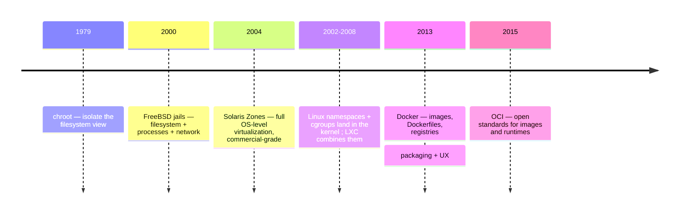
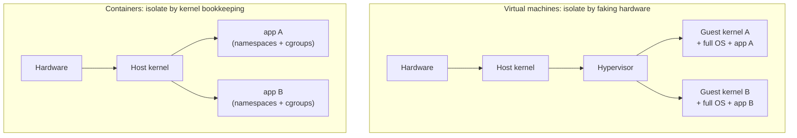

# Why containers

Every tool in this course exists because some specific pain became unbearable. Pandas exists because spreadsheets don't scale; Git exists because emailing `final_v3_REALLY_final.zip` around a team ends in tears. Containers exist because of two pains that every software team — and every data scientist — eventually hits: **environments drift** and **processes interfere**. This chapter builds the container idea from those two pains, walks through forty years of history in ten minutes, puts containers and virtual machines side by side properly, and — because honest engineering means knowing a tool's limits — ends with the cases where a container is the *wrong* answer.

If you have read [Module 14's Docker chapter](../14_cicd/docker.md), its §1–2 are the compressed version of this chapter. Here we take our time.

---

## 1. The two problems

### Problem one: reproducibility — "it works on my machine"

Software does not run in a vacuum. A Python script that "just works" is really standing on a tower of implicit context:

- a **Python interpreter** of one specific version,
- dozens of **libraries**, each at one specific version, each with *its own* dependencies,
- **native system libraries** underneath those (NumPy leans on a BLAS — a Basic Linear Algebra Subprograms library; `psycopg` leans on `libpq`; Pillow leans on `libjpeg`),
- an **operating system** with particular conventions (paths, line endings, a package manager),
- **environment variables**, config files, locale settings, timezone settings,
- and, for AI work, often a **GPU driver** and a **CUDA (Compute Unified Device Architecture) toolkit** whose versions must agree with your framework's expectations.

Your laptop happens to have one consistent snapshot of that whole tower. Your colleague's laptop has a slightly different snapshot. The production server has a third. The result is the oldest joke in software: *"but it works on my machine."*

Data science makes this worse, not better. A web app that breaks fails loudly with a stack trace. A numerical pipeline on a subtly different BLAS or floating-point environment can *succeed* — and quietly produce different numbers. A model trained under NumPy 1.x and scored under 2.x might not crash; it might just be wrong. For scientists, the reproducibility problem isn't an inconvenience — it undermines the product itself, which is a *claim that a computation gives a particular result*.

The classic fixes each solve a slice:

| Fix | What it pins | What it misses |
|---|---|---|
| `requirements.txt` | Python package versions | Python itself, native libraries, OS, env vars |
| Virtual environments (`venv`, `conda`) | Package *isolation* per project | Everything below the interpreter; conda reaches lower but still shares the OS |
| A long `README` ("install these 14 things…") | Nothing, really — it *describes* the tower | Humans skip steps; READMEs rot |
| A virtual machine image | Everything — the whole OS | Gigabytes per project, minutes to boot, painful to share and diff |

What we want is the *coverage* of the VM with the *weight* of the venv. Hold that thought.

### Problem two: isolation — processes stepping on each other

The second pain has nothing to do with shipping. Run two apps on the same machine and they fight:

- Both want port 8000.
- One needs system-wide `libssl 1.1`, the other needs `3.0`.
- One process goes berserk and eats all the RAM (Random Access Memory), taking the other down with it.
- One writes temp files where the other expects to find its own.
- A bug (or an attacker) in one can read the other's files.

Operating systems always had *partial* answers — user accounts, file permissions, `nice` levels — but nothing that made two apps on one machine behave as if each had the machine to itself.

> 💡 **Intuition:** Think of an open-plan office with no walls. Everyone shares the same air, the same noise, the same whiteboard. One loud phone call (a runaway process) degrades everyone. What you want is not a separate *building* per person (a VM — expensive) but decent *walls and doors* inside the building you already have. Containers are those walls: cheap, quick to put up, good enough for coworkers — though, as we'll see, not bank-vault walls.

A **container** is the single mechanism that solves both problems at once: it is a process (or process tree) that runs from a **packaged, frozen filesystem** (solving reproducibility) inside a **private view of the machine** — its own process list, network stack, hostname, and filesystem root, with capped CPU and memory (solving isolation). The packaging half is the subject of [images-and-layers.md](images-and-layers.md); the private-view half is [container-internals.md](container-internals.md). This chapter stays at the level of *why*.

---

## 2. A short history: forty years in five steps

Containers were not invented in 2013. Docker's genius was packaging, not invention. The load-bearing ideas arrived one at a time over decades, each step isolating one more aspect of the machine.



### 1979 — `chroot`: lying about the root directory

Unix version 7 introduced `chroot` ("change root"): a system call that makes a process believe some subdirectory is the root of the filesystem (`/`). Everything outside it becomes invisible — the process's world *is* that directory.

```bash
# Classic use: give a process a private, minimal filesystem
sudo chroot /srv/minimal-debian /bin/bash
# inside: "/" is now /srv/minimal-debian; the real / is unreachable*
```

This is one-sixth of a container: the *filesystem* is isolated, but the process still sees every other process on the machine, shares the network, and can hog all the CPU it likes. (*And the isolation is famously escapable by root — `chroot` was built for convenience, not security.) Still, the core trick — *isolation by lying to a process about the machine* — is the trick everything since has generalized.

### 2000 — FreeBSD jails: the first real containers

FreeBSD's **jails** extended the lie: a jailed process got its own filesystem *and* its own process list *and* its own IP (Internet Protocol) address, with root-inside-the-jail unable to escape to root-outside. Hosting providers used jails to pack many customers safely onto one server. Sun's **Solaris Zones** (2004) polished the same idea to commercial grade. Both were genuine OS-level virtualization — years before Linux caught up — but tied to operating systems most developers didn't run.

### 2002–2008 — Linux grows the primitives: namespaces, cgroups, LXC

Linux acquired the same powers piecemeal: **namespaces** (starting with the mount namespace in 2002, expanding through the 2000s) let the kernel give a process a private view of one machine aspect at a time — mounts, process IDs, the network stack, hostname. **cgroups** ("control groups", contributed by Google engineers in 2007, who were running everything in containers internally years before the rest of the industry) let the kernel *meter and cap* a process group's CPU, memory, and I/O (input/output). In 2008, **LXC** ("Linux Containers") glued namespaces + cgroups into a usable tool: full Linux containers on a stock kernel. The machinery was all there. Almost nobody used it — because it was operations-team tooling with no story for *developers*: no standard way to package an environment, version it, or share it.

### 2013 — Docker: the packaging breakthrough

Docker (originally a side project inside a PaaS — Platform as a Service — company called dotCloud) initially wrapped LXC and added the three things that made containers explode:

1. **The image** — a layered, shareable, immutable snapshot of a filesystem. Suddenly an environment was an *artifact* you could version and pass around, not a pile of setup steps.
2. **The `Dockerfile`** — a short text file that *builds* that artifact reproducibly. Environments became code you could review and diff.
3. **The registry** (Docker Hub) — `docker push` / `docker pull`, a package manager for entire environments. `docker run postgres` replaced an afternoon of database installation.

> 💡 **Intuition:** LXC was the shipping container with no crane, no standard corner fittings, and no port infrastructure. Docker built the cranes, the fittings, and the ports. The metal box barely changed; the *logistics system around it* is what changed the world — exactly like physical shipping containers, whose corner-casting standard (ISO 668) mattered more than the box.

### 2015 — the OCI: containers become a standard, not a product

Docker's dominance worried the industry (one company controlling the format everyone ships in), so in 2015 Docker, Google, Red Hat, and others founded the **OCI (Open Container Initiative)** and Docker donated the core formats. The OCI maintains three specifications:

- the **image spec** — what an image is on disk (layers + manifest + config; see [images-and-layers.md](images-and-layers.md)),
- the **runtime spec** — what "run this bundle as a container" means (implemented by `runc`; see [container-internals.md](container-internals.md)),
- the **distribution spec** — how registries serve images over HTTP.

The consequence you should carry with you: **"Docker" is now one brand of client for an open standard.** An image built by Docker runs under Podman, containerd, Kubernetes, or any other OCI-compliant runtime, pulled from any OCI registry. You are learning a format, not a vendor. (The alternatives get their due in [ecosystem.md](ecosystem.md).)

---

## 3. Containers vs virtual machines, properly

[Module 14](../14_cicd/docker.md) gives the one-paragraph version (house vs apartment). Since this module is the deep-dive, let's do the real comparison — architecture, then performance, then security — because "containers are lightweight VMs" is the single most common *wrong* mental model in this field.

### The structural difference

A **virtual machine** runs on a **hypervisor** — software (like KVM, Hyper-V, or VMware) that simulates hardware: virtual CPUs, virtual disks, virtual network cards. On that fake hardware, the VM boots a complete **guest operating system** with **its own kernel**. The guest kernel genuinely believes it owns a machine.

A **container** boots nothing. It is an ordinary process (tree) started by the **host's** kernel — the same kernel every other process uses — but launched inside namespaces (private views of the filesystem, process table, network…) and cgroups (resource caps). There is no guest kernel, no virtual hardware, no boot sequence. "Starting a container" is starting a process with extra kernel bookkeeping, which is why it takes milliseconds.



Everything else in the comparison falls out of that one difference:

| | Virtual machine | Container |
|---|---|---|
| Isolation mechanism | Simulated hardware; separate kernel per guest | Host-kernel features (namespaces, cgroups) |
| What "starting" means | Boot an operating system | Start a process |
| Start time | Seconds to minutes | Milliseconds |
| Size on disk | Gigabytes (whole OS) | Megabytes to a few GB (just userland + app) |
| Memory overhead | Whole guest OS resident per VM | Essentially just the app; shared kernel, shared page cache |
| Density (how many per host) | Tens | Hundreds to thousands |
| Can run a different OS? | Yes — Windows guest on Linux host, any kernel version | No — Linux containers need a Linux kernel, and it's the host's |
| Isolation strength | Very strong (hardware-enforced boundary) | Good, but one shared kernel = one shared attack surface |
| Performance | Small but real virtualization overhead | Native — it *is* a normal process |

### Performance: containers are not "fast VMs" — they're processes

There is no meaningful runtime penalty for CPU-bound work in a container: your NumPy code executes as ordinary instructions on the real CPU, scheduled by the real kernel. Disk and network I/O cross a little extra plumbing (overlay filesystem, virtual network bridge) with usually-small costs — and [volumes-and-networking.md](volumes-and-networking.md) shows how to bypass exactly those layers when they matter (volumes for write-heavy data, host networking where appropriate). A VM, by contrast, pays for every privileged operation crossing the hypervisor boundary, and holds a whole OS in RAM before your app allocates its first byte.

One honest asterisk for this course's audience: on **macOS and Windows there is no Linux kernel**, so Docker Desktop runs your containers inside a hidden Linux VM — meaning you pay VM costs (fixed RAM reservation, slower file sharing across the VM boundary) *on your laptop*, even though the production Linux server pays none of them. That asymmetry surprises people; [container-internals.md §7](container-internals.md) explains the machinery.

### Security: the shared kernel cuts both ways

Because every container calls into the same host kernel, a kernel vulnerability is a potential **container-escape** vulnerability — a hostile process breaking out of its namespace jail into the host. Such bugs are rare and quickly patched, but they exist in a way that hardware-enforced VM boundaries mostly don't. The practical rules:

- Containers isolate **your own workloads from each other** excellently — crashes, resource hogging, dependency conflicts, port clashes.
- For running **untrusted third-party code** (a public "run any code" service, a multi-tenant platform), serious operators put containers *inside* VMs or use micro-VM runtimes (Firecracker, gVisor, Kata) — VM-grade walls with near-container ergonomics.
- Defense-in-depth inside a container — dropped capabilities, seccomp filters, non-root users — narrows the kernel attack surface substantially; [container-internals.md](container-internals.md) covers each.

> 💡 **Intuition:** Namespaces are the apartment walls; the kernel is the building's shared foundation and plumbing. Walls stop noise and nosy neighbors fine. But a flaw in the shared plumbing touches every apartment at once — and if a neighbor is actively hostile and skilled, you'd rather they were in a different *building* (a VM).

### And the reproducibility comparison

For the *reproducibility* problem, the container's win over the VM is not isolation but **logistics**: images are layered (shared base layers stored once — see [images-and-layers.md](images-and-layers.md)), diffable, buildable from a five-line text file, and pullable in seconds. A VM image solves reproducibility too — it just costs gigabytes per project and doesn't compose. That's why the scientific-computing world (Binder, `repo2docker`, nextflow pipelines) standardized on containers; [ecosystem.md](ecosystem.md) picks that thread up.

---

## 4. When a container is the wrong tool

A course that only sells you the tool is an advertisement. Here is the honest list — brief, because the pattern is easy to internalize: containers virtualize *userland on a shared Linux kernel*, so anything that needs a **different kernel**, a **stronger wall**, or **no wall at all** is a bad fit.

- **You need a different OS or kernel.** Testing your library against Windows, running a macOS build, needing a specific kernel version or a custom kernel module — that's a VM's job by definition. (Linux containers on Mac/Windows already *are* running in a VM, courtesy of Docker Desktop.)
- **You're running hostile or untrusted code.** As above: the shared kernel makes plain containers the wrong *sole* boundary for adversarial multi-tenancy. Use VMs or micro-VMs.
- **A virtual environment already suffices.** For a solo analysis on your own machine with pure-Python dependencies, `venv` + a lockfile is simpler, faster, and native. Reach for a container when *native libraries, system tools, services, or other people's machines* enter the picture — not before. Don't containerize a script out of fashion.
- **Desktop GUI (graphical user interface) apps.** Possible (X11 forwarding, VNC hacks), never pleasant. Containers are built for services and jobs, not windows. (Browser-based UIs like Jupyter are the happy exception — the UI is just HTTP; see [dockerfiles-for-data-science.md](dockerfiles-for-data-science.md).)
- **Heavy stateful pets with deep host integration.** You *can* run your primary production database in a container (many do, carefully, with volumes), but a system whose whole value is tuned, long-lived, host-entangled state gains the least from a disposable-process model — and loses the most when someone forgets a volume ([volumes-and-networking.md](volumes-and-networking.md) shows the guardrails).
- **Hard real-time or exotic hardware.** Sub-millisecond latency guarantees and unusual device stacks want the host, not another layer of indirection. (Standard GPUs are fine — that path is well-paved; see the GPU section of [dockerfiles-for-data-science.md](dockerfiles-for-data-science.md).)

> ⚠️ **Common mistake:** Treating "we containerized it" as an end in itself. A container is a *packaging and isolation* mechanism, not an architecture, not a security strategy, and not a substitute for pinning your dependencies (an unpinned `pip install` inside a Dockerfile is exactly as irreproducible as one outside it — see [dockerfiles-for-data-science.md](dockerfiles-for-data-science.md)).

---

## 5. Exercises

Try each before opening the answer.

**Exercise 1.** Your colleague says: "A container is just a lightweight VM." Give the one-sentence correction, then name two *practical* consequences of the difference.

<details>
<summary>Answer</summary>

Correction: a VM boots its own kernel on simulated hardware, while a container is an ordinary process on the **host's** kernel, isolated by namespaces and cgroups — nothing is virtualized. Consequences (any two): (1) containers start in milliseconds and pack hundreds per host, because "start" means "start a process"; (2) a Linux container cannot run on a non-Linux kernel — hence Docker Desktop's hidden VM on macOS/Windows; (3) the shared kernel means container isolation is weaker than VM isolation, which matters for untrusted code; (4) container CPU performance is native, since no hypervisor sits in the path.
</details>

**Exercise 2.** Map each historical step to the modern feature it pioneered: `chroot` (1979), FreeBSD jails (2000), cgroups (2007), Docker (2013), OCI (2015).

<details>
<summary>Answer</summary>

`chroot` → isolating a process's **filesystem view** (ancestor of the mount namespace / image root). Jails → combining filesystem + **process + network isolation** into one unit, the first true containers. cgroups → **resource limits** (CPU/memory caps per container). Docker → the **image, Dockerfile, and registry** — packaging and distribution, the developer experience. OCI → the **open standards** (image, runtime, distribution specs) that make images portable across Docker, Podman, Kubernetes, and every other compliant tool.
</details>

**Exercise 3.** For each scenario, pick the *most appropriate* tool — venv, container, or VM — and justify in one sentence: (a) a solo exploratory analysis in pure pandas on your own laptop; (b) a FastAPI + Postgres app that three teammates must run identically; (c) a service that executes arbitrary Python submitted by anonymous internet users; (d) testing your package on Windows from a Linux machine.

<details>
<summary>Answer</summary>

(a) **venv** — no native deps, no other machines, no services: a container adds ceremony without benefit. (b) **containers** — multiple services plus multiple machines is exactly the reproducibility-and-isolation sweet spot (this is Module 14's example app). (c) **VM / micro-VM** (possibly wrapping containers) — arbitrary hostile code must not share a kernel with your host. (d) **VM** — a different operating system means a different kernel, which containers cannot provide.
</details>

**Exercise 4.** Why did LXC (2008) — which had essentially the same kernel machinery Docker uses — not trigger the container revolution, while Docker (2013) did?

<details>
<summary>Answer</summary>

The kernel machinery (namespaces + cgroups) solves *isolation*, but LXC shipped no answer to *packaging and distribution*: no standard image artifact, no reproducible build file, no push/pull ecosystem. Docker added the image (a versionable, layered artifact), the Dockerfile (environments as reviewable code), and the registry (sharing environments like packages) — turning an ops capability into a developer workflow. The lesson generalizes: adoption follows logistics and developer experience, not raw capability.
</details>

---

## Next / Related

- **Next:** [Images & layers](images-and-layers.md) — the packaging half of the story: what that "frozen filesystem" actually is on disk.
- [Container internals](container-internals.md) — the isolation half: namespaces, cgroups, and what `docker run` really does.
- [Module 14 — Docker](../14_cicd/docker.md) — the hands-on command tour and Dockerfile tutorial, if you want to *drive* before opening the hood further.
