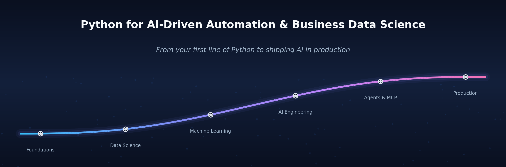

<p align="center">
  
</p>

<p align="center">
  From your first line of Python to shipping a real AI-driven automation —<br>
  a hands-on curriculum (self-paced <em>or</em> instructor-led) across Python fluency, business data science,<br>
  machine learning, deep learning, AI engineering, and production.
</p>

<p align="center">
  
  
  
  <a href="#-open-any-notebook-in-colab"></a>
  
  
  <a href="https://github.com/ChrisW09/Python-for-AI-Driven-Automation/actions/workflows/checkpoints.yml"></a>
</p>

<p align="center">
  <b>111 runnable notebooks · 17 modules · 300+ end-of-lesson exercises · 317 in-lesson checkpoints · 100% offline</b>
</p>

<p align="center">
  <a href="#-quick-start">🚀 Quick start</a> &nbsp;·&nbsp;
  <a href="#-curriculum">📚 Curriculum</a> &nbsp;·&nbsp;
  <a href="#-how-each-notebook-works">📓 How it works</a> &nbsp;·&nbsp;
  <a href="#-open-any-notebook-in-colab">▶️ Open in Colab</a> &nbsp;·&nbsp;
  <a href="#-contributing--licence">🤝 Contributing</a>
</p>

---

## Contents

- [Why this course](#-why-this-course)
- [What's new](#-whats-new)
- [Quick start](#-quick-start)
- [Choose your path](#-choose-your-path)
- [Curriculum](#-curriculum)
- [Repository layout](#-repository-layout)
- [Datasets](#-datasets)
- [How each notebook works](#-how-each-notebook-works)
- [LLM providers](#-llm-providers)
- [Open any notebook in Colab](#-open-any-notebook-in-colab) — one-click links to all 111 notebooks
- [About](#-about)
- [Contributing &amp; licence](#-contributing--licence)

---

## ⚡ Why this course

- **End to end.** From `print("hello")` to a deployed, scheduled AI automation — no gaps assumed, no steps skipped.
- **Runs anywhere.** One click into Google Colab, or `pip install` locally. Every notebook runs **100% offline** — no API key, no paid service required.
- **Learn by doing.** **300+ exercises** — including a deliberate 🐞 debug-me in each lesson — every one shipping with a worked solution and the *reasoning* behind it.
- **Built for live teaching.** Every lesson is punctuated with short ✋ **Quick exercise** checkpoints (~2 min each) at natural section breaks, so a class can alternate ~20 minutes of instruction with a quick hands-on pause. **317 across the course**, each with a scaffolded starter and a collapsible solution — and every solution has been **executed in a fresh kernel to confirm it runs**.
- **Modern, minimal code.** Charts in 1–3 lines (pandas `.plot()`, seaborn, sklearn's built-in plot helpers), pipelines over boilerplate — you learn the way practitioners actually write Python today.
- **Visual where it counts.** Key ideas — train/test splits, k-fold cross-validation, grid search, RAG pipelines, MCP topology — come with clean diagrams embedded right in the notebooks.
- **Real business problems.** Churn &amp; CLV, fraud detection, demand forecasting, customer segmentation, RAG assistants, and AI governance — not toy datasets.

---

## ✨ What's new

- **🔥 A new PyTorch module — deep learning as full lessons.** Tensors → autograd → the five-step training loop (NB 20); the training craft — the two-curve overfitting diagnostic, dropout & weight decay, early stopping, LR schedules, save/load, a live four-bug clinic (NB 21); then embeddings for categorical data, an honest bake-off vs gradient boosting, a sklearn-style wrapper and TorchScript serving (NB 22) — all on the course's own churn data, 100% offline (Colab ships PyTorch preinstalled). The Module 5 appendix mini-track (A1–A3) stays as the condensed reference tour. → [Module 6](./06_pytorch/)
- **🕸️ A new Web Scraping module.** BeautifulSoup fundamentals (`robots.txt`, politeness, pagination), managed scraping with **Firecrawl**, and the **OpenAlex** open scholarly API — the "check for an open API before you scrape" discipline, all runnable 100% offline. → [Module 4](./04_webscraping/)
- **🛠️ Hands-on labs for shipping.** [CI/CD & Deployment](./14_cicd/) (Docker, GitHub Actions, DNS/HTTPS — *simulated in pure Python*, no Docker required) and [Django](./17_django/) (a real ORM/views/forms/auth app booted inside a notebook) now ship runnable lab notebooks alongside their mini-books.
- **🏎️ The fast track now spans the whole course.** 22 trimmed notebooks (~26 h): the 14 core essentials plus **8 breadth extensions** mirroring the applied modules — forecasting, model evaluation, industry applications, NLP, deployment, a capstone, and web scraping. → [`fast_track/`](./fast_track/)
- **🧪 Module quizzes.** Fifteen short multiple-choice quizzes — one per content module — to check what actually stuck. → [`quizzes/`](./quizzes/)
- **✋ Interactive in-lesson checkpoints, built for live teaching.** Every lesson embeds short ~2-minute *Quick exercise* checkpoints at natural section breaks — **317 across the course** — each with a scaffolded starter and a collapsible solution, **executed in a fresh kernel to confirm it runs**. The lecture → try → reveal rhythm turns any lesson into an interactive class with zero prep. → [How each notebook works](#-how-each-notebook-works)
- **🔌 100% offline, end to end.** Every notebook — including the LLM, RAG, agent, and scraping lessons — runs with no API key via a built-in `MockLLM` and offline stand-ins for the heavy libraries.

---

## 🚀 Quick start

A taste of the style you'll be writing by Module 5 — a full, leakage-free model in a handful of lines (pipelines over boilerplate, just like real practitioners):

```python
from sklearn.pipeline import make_pipeline
from sklearn.preprocessing import StandardScaler
from sklearn.linear_model import LogisticRegression
from sklearn.model_selection import cross_val_score

# X, y: a feature matrix and churn labels you've already loaded (see Module 5)
churn_model = make_pipeline(StandardScaler(), LogisticRegression())
auc = cross_val_score(churn_model, X, y, cv=5, scoring="roc_auc").mean()
print(f"5-fold ROC-AUC: {auc:.3f}")
```

No setup yet — just open a notebook and press **Run**:

### ▶︎ Google Colab — zero setup *(recommended)*

Click a badge to open a notebook in your browser; nothing to install.

> 🔑 **You need a free Google account to *run* the notebooks.** Colab gives each signed-in user a free cloud runtime, so the first time you press **Run** it will ask you to sign in (any Gmail account works). Without signing in you can read a notebook but not execute its cells. No Google account? Use the **Local Jupyter** option below instead.

- **Start the full course** — `00_master_onboarding.ipynb` &nbsp; [](https://colab.research.google.com/github/ChrisW09/Python-for-AI-Driven-Automation/blob/main/00_onboarding/00_master_onboarding.ipynb)
- **Start the fast track** — `00_fast_track_onboarding.ipynb` &nbsp; [](https://colab.research.google.com/github/ChrisW09/Python-for-AI-Driven-Automation/blob/main/fast_track/00_fast_track_onboarding.ipynb)
- **See it work first (5 min)** — `00c_see_it_work.ipynb` &nbsp; [](https://colab.research.google.com/github/ChrisW09/Python-for-AI-Driven-Automation/blob/main/00_onboarding/00c_see_it_work.ipynb)

Every notebook is listed with its own Colab link in [Open any notebook in Colab](#-open-any-notebook-in-colab).

### ⌥ Local Jupyter

```bash
python -m venv .venv
source .venv/bin/activate         # Windows: .venv\Scripts\activate
pip install -r requirements.txt
jupyter lab
```

Tested with **Python 3.10+**. Module 0 includes an environment-check cell. The heavier optional libraries (PyTorch for Module 6 and the ML appendices, Prophet, FAISS, LangChain, …) stay commented-out at the bottom of `requirements.txt` — every notebook that uses one still runs offline via a built-in stand-in or a graceful skip, so install them only to see the real library at work. (Colab ships PyTorch preinstalled, so Module 6 needs no install there at all.)

---

## 🧭 Choose your path

| | 🎓 **Complete course** | 🏎️ **Fast track** |
|---|---|---|
| **Scope** | All 17 modules + 13 optional appendices | The essentials, condensed |
| **Notebooks** | 52 lessons + 5 labs (+ 13 appendices) | 23 (onboarding + 22 lessons) |
| **Time** | ~125 hours | ~26 hours |
| **Best for** | Depth — every exercise, stretch problem &amp; capstone | A credible end-to-end pass in a few evenings |
| **Start here** | [`00_master_onboarding.ipynb`](./00_onboarding/00_master_onboarding.ipynb) | [`fast_track/`](./fast_track/) |

New here? [`00c_see_it_work.ipynb`](./00_onboarding/00c_see_it_work.ipynb) is a 5-minute offline demo of what you'll build, and [`00b_course_overview.ipynb`](./00_onboarding/00b_course_overview.ipynb) has the full module map and an interactive time estimator.

---

## 📚 Curriculum

| Module | Lessons | Focus |
|---|:---:|---|
| [**0 · Onboarding**](./00_onboarding/) | — | Setup, orientation, 5-minute demo |
| [**1 · Foundations**](./01_foundations/) | 1–6 | Variables, control flow, lists, dicts, functions, classes |
| [**2 · Data Science**](./02_data_science/) | 7–11 | pandas, NumPy, seaborn/matplotlib, statistics, time series |
| [**3 · Real-world I/O**](./03_real_world_io/) | 12–13 | HTTP/APIs, SQL, data validation |
| [**4 · Web Scraping**](./04_webscraping/) | 14–16 | Scraping fundamentals (BeautifulSoup, `robots.txt`, politeness), Firecrawl managed scraping, and the OpenAlex open scholarly API — all 100% offline |
| [**5 · Machine Learning**](./05_machine_learning/) | 17–19 | scikit-learn, cross-validation &amp; hyperparameter tuning, model evaluation, feature engineering |
| [**6 · Deep Learning with PyTorch**](./06_pytorch/) | 20–22 | Tensors, autograd &amp; the training loop; overfitting, regularization &amp; schedules; embeddings, an honest bake-off vs gradient boosting, a sklearn-style wrapper &amp; serving |
| [**7 · Industry Applications**](./07_industry_applications/) | 23–26 | Churn/CLV, fraud, segmentation + recommenders, demand &amp; maintenance |
| [**8 · AI Engineering**](./08_ai_engineering/) | 27–32 | LLM fundamentals, prompts, RAG, agents, document processing, eval &amp; observability |
| [**9 · Building AI POCs**](./09_building_ai_pocs/) | 33–36 | Copilot setup, three POCs, RAG deep dive, vector DBs + agentic AI |
| [**10 · Agents, Tools &amp; MCP**](./10_agents_tools_mcp/) | 37–40 | Agent architectures, robust tools, the Model Context Protocol, multi-agent systems |
| [**11 · NLP (Text Analytics)**](./11_nlp/) | 41–43 | Topic modeling (BERTopic, STREAM) &amp; sentiment analysis (VADER → classical → transformers) |
| [**12 · Optional: DeepTab**](./12_deeptab/) | 44 | Deep learning for tabular data — Mamba/FT-Transformer/SAINT… behind a scikit-learn API |
| [**13 · Production**](./13_production/) | 45–46 | Packaging notebooks into projects, scheduling |
| [**14 · CI/CD &amp; Deployment**](./14_cicd/) | 3 labs | Docker, Compose, GitHub Actions, registries, DNS, reverse proxies, HTTPS, Ubuntu deployment — a self-contained mini-book + 3 hands-on lab notebooks + runnable example app |
| [**15 · Capstones**](./15_capstones/) | 47–48 | Two end-to-end projects (analytics + AI assistant) |
| [**16 · Business AI**](./16_business_ai/) | 49–52 | Digital transformation, architecture, AI-assisted dev, governance |
| [**17 · Optional: Django**](./17_django/) | 2 labs | Wrap a model in a real web app — ORM, admin, forms, a JSON API — a self-contained mini-book + 2 hands-on lab notebooks + runnable example app |

> **13 optional appendices** (classical → deep-learning → foundation-model forecasting, PyTorch, vector stores, RAG/agent frameworks) live beside their modules — all runnable offline. **Modules 11–12 are optional, reference-style tracks** (text analytics + deep tabular), and **Module 17 (Django)** is an optional mini-book — all fully offline. **Module 6 (PyTorch)** is the full-lesson treatment of the Module 5 appendix mini-track (A1–A3). Every content module also ships a short **[5-question quiz](./quizzes/)** to check what stuck; short on time? The **[fast track](./fast_track/)** condenses the whole course into 22 notebooks (~26 h).

---

## 🗂️ Repository layout

| Path | Contents |
|---|---|
| `00_onboarding/` … `17_django/` | The complete course — modules 0–17 in learning order, lessons 1–52 + 13 appendices |
| `11_nlp/`, `12_deeptab/` | Optional reference tracks — text analytics (NB 41–43) &amp; deep tabular learning (NB 44) |
| `14_cicd/` | CI/CD, Docker &amp; deployment mini-book — 14 chapters + 3 hands-on lab notebooks + a runnable example app |
| `17_django/` | Optional: Django for AI web apps — mini-book (7 chapters) + 2 hands-on lab notebooks + a runnable example app, ChurnScope |
| `04_webscraping/` | Web scraping — fundamentals (BeautifulSoup, `robots.txt`), Firecrawl, and the OpenAlex open API (lessons 14–16, all offline) |
| `06_pytorch/` | Deep Learning with PyTorch — tensors → autograd → the training loop, training craft, embeddings + bake-off + serving (lessons 20–22, all offline) |
| `fast_track/` | The fast track — 22 trimmed notebooks (~26 h): 14 core essentials + 8 breadth extensions |
| `quizzes/` | 15 short multiple-choice quizzes — one per content module |
| `data/` | Sample CSVs (support_ops, api_log, customer_feedback) — disk copies of inline data for `read_csv` practice; see [Datasets](#-datasets) |
| `slides/` | Course-overview deck + lecture decks (PDF + LaTeX source) |
| `scripts/` | Helpers — validate/execute every checkpoint (`test_checkpoints.py`), run every notebook end-to-end, regenerate the hero banner, check NB-number references |
| `docs/` | Course-design notes (pedagogical review, module-descriptor coverage) |
| `llm_providers.py` | Unified interface to OpenAI / Anthropic / Google / Ollama (+ offline `MockLLM`) |
| `previous_versions/` | The legacy flat 19-notebook layout, archived |

---

## 📊 Datasets

The course is **offline-first and reproducible**: almost every dataset is **synthetic and generated inline** from a fixed random seed, so each run produces identical data with **zero downloads**. One fictional world ties them together — a SaaS company running an **AI customer-support operation** — and its tables (customers, support tickets, API-cost logs, feedback, payments) recur from module to module, so you re-meet familiar data as the techniques get harder. Three of those synthetic tables are also dumped to `data/*.csv` so you can practise `pd.read_csv` against real files; two small **real** datasets (Palmer Penguins, UCI Bike Sharing) are bundled there too, so the optional *📊 try it on real data* sections run offline as well; and a few lessons deliberately reach for live public APIs where that *is* the point.

> **Output convention.** The quantitative teaching notebooks ship **with their figures rendered**, so every chart is viewable directly on GitHub and in Colab before you run a single cell. Deterministic seeds mean re-running a notebook reproduces the same figures; if you re-run and commit, keep the rendered outputs in place.

### Bundled sample files

Small enough to fit on one screen and travel with the repo (see [`data/README.md`](./data/README.md)). The first four are disk copies of data the notebooks build inline; the last two are small **real** datasets bundled for the optional *try it on real data* sections.

| File | Rows | What it is | Used by |
|---|---|---|---|
| `data/api_log.csv` | 50 | LLM API request log — `model`, `segment`, `quarter`, `tokens_in/out`, `latency_ms` | NB 7 — Pandas fundamentals |
| `data/support_ops.csv` | 60 | Support-ops metrics by channel & month — tickets, automation rate, latency, satisfaction, cost | disk copy of the data NB 47 (Capstone A) builds inline |
| `data/customer_feedback.csv` | 15 | Labelled feedback — `text`, `sentiment`, `topic` | sample mirroring the inline data in NB 17 & 22 |
| `forecast.csv` | 28 | 7-day weather forecast for 4 cities, saved from the Open-Meteo API (lives at the repo root) | written by NB 12 — APIs & HTTP |
| `data/penguins.csv` | 344 | **Real** — Palmer Penguins: 3 species' bill/flipper/mass measurements, with real missing values · CC0 | NB 9 — Visualization |
| `data/bike_sharing_daily.csv` | 731 | **Real** — UCI Bike Sharing: daily rentals 2011–12 with weather & calendar features · CC BY 4.0 | NB 26 — Demand forecasting |

### Synthetic datasets, by theme

All generated inline (no downloads), grouped by the business problem they illustrate:

| Theme | What's in it | Notebooks |
|---|---|---|
| **SaaS customer churn** | The course backbone — tenure, charges, support tickets, usage, contract, region, churn label (+ a revenue target) | NB 17–23, 44 |
| **LLM cost & latency logs** | Support calls tagged by model & channel with tokens, cost, latency, satisfaction | NB 7–9 |
| **Support operations** | Tickets across five channels (Email/Chat/Phone/Web/Social), queried in an in-memory SQLite DB | NB 13, 30, 47 |
| **Fraud / payments** | One row per transaction, with planted fraud patterns (night spend, new-device takeover) | NB 24 |
| **Customer segmentation** | Customers drawn from hidden archetypes for clustering + recommendations | NB 25 |
| **Demand & maintenance** | Short demand series (lag & rolling features) plus predictive-maintenance signals | NB 26 |
| **Time-series forecasting** | Daily product-search series with trend & seasonality (classical → Prophet → DL → foundation models) | NB 11, DS A1–A4 |
| **Customer feedback & reviews** | Piles of short product reviews, support tickets and survey notes for topic models + sentiment | NB 41–43, 48 |
| **RAG document corpora** | Small knowledge bases / product catalogues chunked, embedded and retrieved | NB 29, 35, 36 |
| **Invoices & documents** | Synthetic messy invoices for an extraction pipeline | NB 31 |
| **Golden eval sets** | Tiny labelled sets for evaluating and triaging an AI feature | NB 32 |
| **Agent / copilot data** | A support copilot's lookup numbers + docs, exposed as tools / MCP resources | NB 37–40 |
| **POC & app demo data** | ~500 synthetic customer rows, a product catalogue, and random embedding vectors that seed the POC apps | NB 33, 34, 36 |
| **Vision & sequences (PyTorch)** | Toy 8×8 "digit" images, a synthetic sequence task, and tiny text-intent/support-note sets | ML A2, A3, NB 22 (stretch) |
| **Business case studies** | *Meridian*, a fictional 400-person B2B SaaS, for transformation & governance scenarios | NB 49–52 |

### Real data & live services — the few exceptions

- **scikit-learn toy sets** — Iris & Wine (NB 17) and Breast Cancer (NB 18), used briefly to anchor the classic ML examples before switching to the synthetic SaaS data.
- **Live public APIs** *(no key required)* — Open-Meteo (weather — the running example) and JSONPlaceholder (a fake REST API) in NB 12; **Firecrawl** web scraping into a RAG-ready dataset in the I/O appendix.
- **Pretrained models** *(models, not datasets — fetched on first use when online, each with an offline fallback)* — sentence-transformers embeddings and small Hugging Face transformers in the embeddings/NLP lessons.
- **`MockLLM`** — not a dataset, but the deterministic offline model that *produces* the text/JSON for 16 of the AI notebooks; swap one line in [`llm_providers.py`](./llm_providers.py) to call OpenAI / Anthropic / Google / Ollama instead.

### Going further — real datasets to drop in

If you want to take a lesson onto real data, these fit the course's themes and mostly load in one line (cached after the first fetch):

| Dataset | Load / source | Pairs with | Licence |
|---|---|---|---|
| **California Housing** | `sklearn.datasets.fetch_california_housing()` | M5 regression (17–18) | public |
| **20 Newsgroups** | `sklearn.datasets.fetch_20newsgroups()` | M11 topic modeling (41–42) | public |
| **statsmodels series** (CO₂, sunspots, Nile) | `statsmodels.datasets.co2.load_pandas()` | M2 stats & forecasting (10–11, A1–A4) | public |
| **Telco Customer Churn** | [Kaggle `blastchar/telco-customer-churn`](https://www.kaggle.com/datasets/blastchar/telco-customer-churn) · 7,043 rows | M5–M7 churn (17–23), M12 (44) | IBM sample |
| **RAG Mini-Wikipedia** | `load_dataset("rag-datasets/rag-mini-wikipedia")` · corpus + Q/A | M8–M9 RAG (29, 35, 36) | CC BY 3.0 |
| **Twitter Financial News Sentiment** | `load_dataset("zeroshot/twitter-financial-news-sentiment")` | M11 sentiment (43) | MIT |
| **Adult / Census Income** | `sklearn.datasets.fetch_openml("adult", version=2)` | M16 governance & fairness (52), M12 (44) | public |
| **Online Retail II** | [UCI #352](https://archive.ics.uci.edu/dataset/352/online+retail) · ~1M rows | M2 pandas-at-scale, M3 SQL (13), M7 RFM/CLV (25) | CC BY 4.0 |
| **Credit Card Fraud** (ULB) | [Kaggle `mlg-ulb/creditcardfraud`](https://www.kaggle.com/datasets/mlg-ulb/creditcardfraud) · 0.17% fraud | M7 fraud (24) | DbCL v1.0 |

> **Key-free public APIs** for Module 3 (NB 12), beyond Open-Meteo: **REST Countries**, **Frankfurter** (FX rates), **USGS earthquakes** (GeoJSON), and **Hacker News** — each returns a different JSON shape to practise on.

---

## 📓 How each notebook works

A consistent six-part template:

> 🎯 **Objectives** + ✅ **prerequisites** → numbered **concept sections** (prose + runnable code), interleaved with ✋ **quick-exercise checkpoints** → 🧪 **practice exercises** (incl. a 🐞 debug-me) → 🧠 **stretch exercises** A–D → 🎁 **bonus mini-project** → ✅ **self-assessment** + 🚀 **next step**

Every exercise — **300+ across the course** — ships with a worked solution and the *reasoning* behind it.

### ✋ In-lesson checkpoints — designed for interactive teaching

Beyond the end-of-lesson exercise bank, each lesson embeds short **✋ Quick exercise** checkpoints at natural section breaks — roughly one every ~20 minutes of material. They turn a lecture into a rhythm: **teach ~20 min → pause for a ~2-minute hands-on exercise → teach again.**

Each checkpoint is a self-contained three-cell block:

1. **Prompt** — a focused, business/AI-flavoured task, solvable with *only* what the lesson has covered up to that point.
2. **`# ✍️ Your turn`** — a scaffolded starter cell to fill in.
3. **✅ Solution** — a collapsible answer with a one-line explanation.

There are **317 of these across the course** (3–4 per core lesson, 3 per fast-track lesson, 4 per CI/CD &amp; Django lab and per web-scraping and PyTorch lesson), and every code solution has been **executed in a fresh Jupyter kernel to verify it actually runs** (the few file-content solutions — `__init__.py`, pytest, `pyproject.toml` — are validated by inspection). A [CI workflow](./.github/workflows/checkpoints.yml) re-checks the structure and syntax of all 317 on every push; run the full kernel test yourself with `python scripts/test_checkpoints.py --exec`. They run 100% offline like everything else — no API key or network needed. Self-paced learners solve each one as they reach it; instructors use them as the built-in "pause and try" beats of a class. In the conceptual Business-AI lessons (43–46) the middle cell is a short written reflection/decision task instead of code.

> 🧑‍🏫 **Teaching live?** Lecture for ~20 minutes, then jump to the next ✋ checkpoint and give the room ~2 minutes to try it before you reveal the solution. With 3–4 per lesson, a 90-minute class gets several natural interactive breaks — no prep required.

Two more conventions you'll see throughout:

- **Charts take a few lines, not a page.** Plots are drawn with pandas `.plot()`, seaborn one-liners (`hue=` instead of loops, `sns.heatmap(cm, annot=True)` for matrices), and scikit-learn's `*Display` helpers — raw matplotlib appears only for final tweaks and multi-panel layouts.
- **Diagrams travel with the notebook.** Explanatory figures (the train/test split, 5-fold cross-validation, the GridSearchCV flow, RAG pipelines, MCP host/client/server topology, walk-forward backtesting, …) are embedded as attachments inside the `.ipynb` files, so they render on GitHub, in Colab, and locally with no extra image files.

---

## 🔌 LLM providers

Notebooks 27–32 and 42 run **entirely offline** with the built-in `MockLLM`. For real intelligence, swap one line — the unified interface in [`llm_providers.py`](./llm_providers.py) supports four providers:

| Provider | Class | When to use |
|---|---|---|
| 🟢 OpenAI | `OpenAILLM(model="gpt-5.4-mini")` | Reliable default |
| 🟠 Anthropic | `AnthropicLLM(model="claude-haiku-4-5")` | Long context, careful tone |
| 🔵 Google | `GoogleLLM(model="gemini-2.5-flash")` | Cheap at scale |
| 🟣 Ollama | `OllamaLLM(model="llama3.2:3b")` | Local — no internet, key, or cost |

Set the matching `*_API_KEY` env var for hosted providers (never inline). See [`08_ai_engineering/A1_llm_providers_guide.ipynb`](./08_ai_engineering/A1_llm_providers_guide.ipynb) for setup and cost notes. **Never commit API keys.**

---

## ▶️ Open any notebook in Colab

Every notebook below runs in [Google Colab](https://colab.research.google.com/) with one click — no install, no download. Click a badge to open it. **Sign in with a free Google account** the first time you run a cell — Colab needs it to give you a cloud runtime.

### 0 · Onboarding

| Notebook | Open |
|---|---|
| `00_master_onboarding.ipynb` | [](https://colab.research.google.com/github/ChrisW09/Python-for-AI-Driven-Automation/blob/main/00_onboarding/00_master_onboarding.ipynb) |
| `00b_course_overview.ipynb` | [](https://colab.research.google.com/github/ChrisW09/Python-for-AI-Driven-Automation/blob/main/00_onboarding/00b_course_overview.ipynb) |
| `00c_see_it_work.ipynb` | [](https://colab.research.google.com/github/ChrisW09/Python-for-AI-Driven-Automation/blob/main/00_onboarding/00c_see_it_work.ipynb) |

### 1 · Foundations

| Notebook | Open |
|---|---|
| `01_python_basics.ipynb` | [](https://colab.research.google.com/github/ChrisW09/Python-for-AI-Driven-Automation/blob/main/01_foundations/01_python_basics.ipynb) |
| `02_control_structures.ipynb` | [](https://colab.research.google.com/github/ChrisW09/Python-for-AI-Driven-Automation/blob/main/01_foundations/02_control_structures.ipynb) |
| `03_lists_data_structures.ipynb` | [](https://colab.research.google.com/github/ChrisW09/Python-for-AI-Driven-Automation/blob/main/01_foundations/03_lists_data_structures.ipynb) |
| `04_dictionaries_advanced.ipynb` | [](https://colab.research.google.com/github/ChrisW09/Python-for-AI-Driven-Automation/blob/main/01_foundations/04_dictionaries_advanced.ipynb) |
| `05_functions_modules.ipynb` | [](https://colab.research.google.com/github/ChrisW09/Python-for-AI-Driven-Automation/blob/main/01_foundations/05_functions_modules.ipynb) |
| `06_classes_and_oop.ipynb` | [](https://colab.research.google.com/github/ChrisW09/Python-for-AI-Driven-Automation/blob/main/01_foundations/06_classes_and_oop.ipynb) |

### 2 · Data Science

| Notebook | Open |
|---|---|
| `07_pandas_fundamentals.ipynb` | [](https://colab.research.google.com/github/ChrisW09/Python-for-AI-Driven-Automation/blob/main/02_data_science/07_pandas_fundamentals.ipynb) |
| `08_numpy_fundamentals.ipynb` | [](https://colab.research.google.com/github/ChrisW09/Python-for-AI-Driven-Automation/blob/main/02_data_science/08_numpy_fundamentals.ipynb) |
| `09_matplotlib_basics.ipynb` | [](https://colab.research.google.com/github/ChrisW09/Python-for-AI-Driven-Automation/blob/main/02_data_science/09_matplotlib_basics.ipynb) |
| `10_statistics_basics.ipynb` | [](https://colab.research.google.com/github/ChrisW09/Python-for-AI-Driven-Automation/blob/main/02_data_science/10_statistics_basics.ipynb) |
| `11_time_series_forecasting.ipynb` | [](https://colab.research.google.com/github/ChrisW09/Python-for-AI-Driven-Automation/blob/main/02_data_science/11_time_series_forecasting.ipynb) |
| `A1_forecasting_classical.ipynb` | [](https://colab.research.google.com/github/ChrisW09/Python-for-AI-Driven-Automation/blob/main/02_data_science/A1_forecasting_classical.ipynb) |
| `A2_forecasting_prophet_libraries.ipynb` | [](https://colab.research.google.com/github/ChrisW09/Python-for-AI-Driven-Automation/blob/main/02_data_science/A2_forecasting_prophet_libraries.ipynb) |
| `A3_forecasting_deep_learning.ipynb` | [](https://colab.research.google.com/github/ChrisW09/Python-for-AI-Driven-Automation/blob/main/02_data_science/A3_forecasting_deep_learning.ipynb) |
| `A4_forecasting_foundation_models.ipynb` | [](https://colab.research.google.com/github/ChrisW09/Python-for-AI-Driven-Automation/blob/main/02_data_science/A4_forecasting_foundation_models.ipynb) |

### 3 · Real-world I/O

| Notebook | Open |
|---|---|
| `12_apis_and_http.ipynb` | [](https://colab.research.google.com/github/ChrisW09/Python-for-AI-Driven-Automation/blob/main/03_real_world_io/12_apis_and_http.ipynb) |
| `13_sql_fundamentals.ipynb` | [](https://colab.research.google.com/github/ChrisW09/Python-for-AI-Driven-Automation/blob/main/03_real_world_io/13_sql_fundamentals.ipynb) |
| `A1_web_scraping_firecrawl.ipynb` | [](https://colab.research.google.com/github/ChrisW09/Python-for-AI-Driven-Automation/blob/main/03_real_world_io/A1_web_scraping_firecrawl.ipynb) |

### 4 · Web Scraping

| Notebook | Open |
|---|---|
| `14_web_scraping_fundamentals.ipynb` | [](https://colab.research.google.com/github/ChrisW09/Python-for-AI-Driven-Automation/blob/main/04_webscraping/14_web_scraping_fundamentals.ipynb) |
| `15_scraping_with_firecrawl.ipynb` | [](https://colab.research.google.com/github/ChrisW09/Python-for-AI-Driven-Automation/blob/main/04_webscraping/15_scraping_with_firecrawl.ipynb) |
| `16_openalex_scholarly_data.ipynb` | [](https://colab.research.google.com/github/ChrisW09/Python-for-AI-Driven-Automation/blob/main/04_webscraping/16_openalex_scholarly_data.ipynb) |

### 5 · Machine Learning

| Notebook | Open |
|---|---|
| `17_sklearn_basics.ipynb` | [](https://colab.research.google.com/github/ChrisW09/Python-for-AI-Driven-Automation/blob/main/05_machine_learning/17_sklearn_basics.ipynb) |
| `18_model_evaluation.ipynb` | [](https://colab.research.google.com/github/ChrisW09/Python-for-AI-Driven-Automation/blob/main/05_machine_learning/18_model_evaluation.ipynb) |
| `19_feature_engineering.ipynb` | [](https://colab.research.google.com/github/ChrisW09/Python-for-AI-Driven-Automation/blob/main/05_machine_learning/19_feature_engineering.ipynb) |
| `A1_pytorch_foundations.ipynb` | [](https://colab.research.google.com/github/ChrisW09/Python-for-AI-Driven-Automation/blob/main/05_machine_learning/A1_pytorch_foundations.ipynb) |
| `A2_pytorch_vision_and_sequences.ipynb` | [](https://colab.research.google.com/github/ChrisW09/Python-for-AI-Driven-Automation/blob/main/05_machine_learning/A2_pytorch_vision_and_sequences.ipynb) |
| `A3_pytorch_fine_tuning.ipynb` | [](https://colab.research.google.com/github/ChrisW09/Python-for-AI-Driven-Automation/blob/main/05_machine_learning/A3_pytorch_fine_tuning.ipynb) |
| `A4_tabpfn_priorlab.ipynb` | [](https://colab.research.google.com/github/ChrisW09/Python-for-AI-Driven-Automation/blob/main/05_machine_learning/A4_tabpfn_priorlab.ipynb) |
| `A5_conformal_prediction.ipynb` | [](https://colab.research.google.com/github/ChrisW09/Python-for-AI-Driven-Automation/blob/main/05_machine_learning/A5_conformal_prediction.ipynb) |

### 6 · Deep Learning with PyTorch

| Notebook | Open |
|---|---|
| `20_pytorch_fundamentals.ipynb` | [](https://colab.research.google.com/github/ChrisW09/Python-for-AI-Driven-Automation/blob/main/06_pytorch/20_pytorch_fundamentals.ipynb) |
| `21_training_neural_networks.ipynb` | [](https://colab.research.google.com/github/ChrisW09/Python-for-AI-Driven-Automation/blob/main/06_pytorch/21_training_neural_networks.ipynb) |
| `22_pytorch_in_practice.ipynb` | [](https://colab.research.google.com/github/ChrisW09/Python-for-AI-Driven-Automation/blob/main/06_pytorch/22_pytorch_in_practice.ipynb) |

### 7 · Industry Applications

| Notebook | Open |
|---|---|
| `23_churn_clv_retention.ipynb` | [](https://colab.research.google.com/github/ChrisW09/Python-for-AI-Driven-Automation/blob/main/07_industry_applications/23_churn_clv_retention.ipynb) |
| `24_fraud_anomaly_detection.ipynb` | [](https://colab.research.google.com/github/ChrisW09/Python-for-AI-Driven-Automation/blob/main/07_industry_applications/24_fraud_anomaly_detection.ipynb) |
| `25_segmentation_recommenders.ipynb` | [](https://colab.research.google.com/github/ChrisW09/Python-for-AI-Driven-Automation/blob/main/07_industry_applications/25_segmentation_recommenders.ipynb) |
| `26_demand_maintenance.ipynb` | [](https://colab.research.google.com/github/ChrisW09/Python-for-AI-Driven-Automation/blob/main/07_industry_applications/26_demand_maintenance.ipynb) |

### 8 · AI Engineering

| Notebook | Open |
|---|---|
| `27_llm_fundamentals.ipynb` | [](https://colab.research.google.com/github/ChrisW09/Python-for-AI-Driven-Automation/blob/main/08_ai_engineering/27_llm_fundamentals.ipynb) |
| `28_ai_workflows.ipynb` | [](https://colab.research.google.com/github/ChrisW09/Python-for-AI-Driven-Automation/blob/main/08_ai_engineering/28_ai_workflows.ipynb) |
| `29_embeddings_retrieval.ipynb` | [](https://colab.research.google.com/github/ChrisW09/Python-for-AI-Driven-Automation/blob/main/08_ai_engineering/29_embeddings_retrieval.ipynb) |
| `30_tools_and_agents.ipynb` | [](https://colab.research.google.com/github/ChrisW09/Python-for-AI-Driven-Automation/blob/main/08_ai_engineering/30_tools_and_agents.ipynb) |
| `31_document_processing.ipynb` | [](https://colab.research.google.com/github/ChrisW09/Python-for-AI-Driven-Automation/blob/main/08_ai_engineering/31_document_processing.ipynb) |
| `32_ai_evaluation_observability.ipynb` | [](https://colab.research.google.com/github/ChrisW09/Python-for-AI-Driven-Automation/blob/main/08_ai_engineering/32_ai_evaluation_observability.ipynb) |
| `A1_llm_providers_guide.ipynb` | [](https://colab.research.google.com/github/ChrisW09/Python-for-AI-Driven-Automation/blob/main/08_ai_engineering/A1_llm_providers_guide.ipynb) |
| `A2_vector_stores_survey.ipynb` | [](https://colab.research.google.com/github/ChrisW09/Python-for-AI-Driven-Automation/blob/main/08_ai_engineering/A2_vector_stores_survey.ipynb) |
| `A3_rag_and_agent_frameworks.ipynb` | [](https://colab.research.google.com/github/ChrisW09/Python-for-AI-Driven-Automation/blob/main/08_ai_engineering/A3_rag_and_agent_frameworks.ipynb) |

### 9 · Building AI POCs

| Notebook | Open |
|---|---|
| `33_from_setup_to_first_poc.ipynb` | [](https://colab.research.google.com/github/ChrisW09/Python-for-AI-Driven-Automation/blob/main/09_building_ai_pocs/33_from_setup_to_first_poc.ipynb) |
| `34_three_pocs_growing_complexity.ipynb` | [](https://colab.research.google.com/github/ChrisW09/Python-for-AI-Driven-Automation/blob/main/09_building_ai_pocs/34_three_pocs_growing_complexity.ipynb) |
| `35_rag_pipeline_deep_dive.ipynb` | [](https://colab.research.google.com/github/ChrisW09/Python-for-AI-Driven-Automation/blob/main/09_building_ai_pocs/35_rag_pipeline_deep_dive.ipynb) |
| `36_vector_db_and_agentic_ai.ipynb` | [](https://colab.research.google.com/github/ChrisW09/Python-for-AI-Driven-Automation/blob/main/09_building_ai_pocs/36_vector_db_and_agentic_ai.ipynb) |

### 10 · Agents, Tools & MCP

| Notebook | Open |
|---|---|
| `37_agent_architectures.ipynb` | [](https://colab.research.google.com/github/ChrisW09/Python-for-AI-Driven-Automation/blob/main/10_agents_tools_mcp/37_agent_architectures.ipynb) |
| `38_designing_robust_tools.ipynb` | [](https://colab.research.google.com/github/ChrisW09/Python-for-AI-Driven-Automation/blob/main/10_agents_tools_mcp/38_designing_robust_tools.ipynb) |
| `39_model_context_protocol.ipynb` | [](https://colab.research.google.com/github/ChrisW09/Python-for-AI-Driven-Automation/blob/main/10_agents_tools_mcp/39_model_context_protocol.ipynb) |
| `40_multi_agent_systems.ipynb` | [](https://colab.research.google.com/github/ChrisW09/Python-for-AI-Driven-Automation/blob/main/10_agents_tools_mcp/40_multi_agent_systems.ipynb) |

### 11 · NLP (Text Analytics)

| Notebook | Open |
|---|---|
| `41_topic_modeling_bertopic.ipynb` | [](https://colab.research.google.com/github/ChrisW09/Python-for-AI-Driven-Automation/blob/main/11_nlp/41_topic_modeling_bertopic.ipynb) |
| `42_topic_modeling_stream.ipynb` | [](https://colab.research.google.com/github/ChrisW09/Python-for-AI-Driven-Automation/blob/main/11_nlp/42_topic_modeling_stream.ipynb) |
| `43_sentiment_analysis.ipynb` | [](https://colab.research.google.com/github/ChrisW09/Python-for-AI-Driven-Automation/blob/main/11_nlp/43_sentiment_analysis.ipynb) |

### 12 · Optional: DeepTab

| Notebook | Open |
|---|---|
| `44_deeptab_tabular_deep_learning.ipynb` | [](https://colab.research.google.com/github/ChrisW09/Python-for-AI-Driven-Automation/blob/main/12_deeptab/44_deeptab_tabular_deep_learning.ipynb) |

### 13 · Production

| Notebook | Open |
|---|---|
| `45_from_notebook_to_project.ipynb` | [](https://colab.research.google.com/github/ChrisW09/Python-for-AI-Driven-Automation/blob/main/13_production/45_from_notebook_to_project.ipynb) |
| `46_scheduling_orchestration.ipynb` | [](https://colab.research.google.com/github/ChrisW09/Python-for-AI-Driven-Automation/blob/main/13_production/46_scheduling_orchestration.ipynb) |

### 14 · CI/CD &amp; Deployment *(labs — mini-book module)*

| Notebook | Open |
|---|---|
| `lab01_docker_and_compose.ipynb` | [](https://colab.research.google.com/github/ChrisW09/Python-for-AI-Driven-Automation/blob/main/14_cicd/lab01_docker_and_compose.ipynb) |
| `lab02_ci_pipeline_github_actions.ipynb` | [](https://colab.research.google.com/github/ChrisW09/Python-for-AI-Driven-Automation/blob/main/14_cicd/lab02_ci_pipeline_github_actions.ipynb) |
| `lab03_deploy_dns_https_monitoring.ipynb` | [](https://colab.research.google.com/github/ChrisW09/Python-for-AI-Driven-Automation/blob/main/14_cicd/lab03_deploy_dns_https_monitoring.ipynb) |

### 15 · Capstones

| Notebook | Open |
|---|---|
| `47_capstone_analytics.ipynb` | [](https://colab.research.google.com/github/ChrisW09/Python-for-AI-Driven-Automation/blob/main/15_capstones/47_capstone_analytics.ipynb) |
| `48_capstone_ai_assistant.ipynb` | [](https://colab.research.google.com/github/ChrisW09/Python-for-AI-Driven-Automation/blob/main/15_capstones/48_capstone_ai_assistant.ipynb) |

### 16 · Business AI

| Notebook | Open |
|---|---|
| `49_digital_transformation.ipynb` | [](https://colab.research.google.com/github/ChrisW09/Python-for-AI-Driven-Automation/blob/main/16_business_ai/49_digital_transformation.ipynb) |
| `50_architecture_patterns.ipynb` | [](https://colab.research.google.com/github/ChrisW09/Python-for-AI-Driven-Automation/blob/main/16_business_ai/50_architecture_patterns.ipynb) |
| `51_ai_assisted_software_development.ipynb` | [](https://colab.research.google.com/github/ChrisW09/Python-for-AI-Driven-Automation/blob/main/16_business_ai/51_ai_assisted_software_development.ipynb) |
| `52_bpm_governance_poc_mvp.ipynb` | [](https://colab.research.google.com/github/ChrisW09/Python-for-AI-Driven-Automation/blob/main/16_business_ai/52_bpm_governance_poc_mvp.ipynb) |

### 17 · Optional: Django *(labs — mini-book module)*

| Notebook | Open |
|---|---|
| `lab01_django_in_a_notebook.ipynb` | [](https://colab.research.google.com/github/ChrisW09/Python-for-AI-Driven-Automation/blob/main/17_django/lab01_django_in_a_notebook.ipynb) |
| `lab02_serving_a_model_with_auth.ipynb` | [](https://colab.research.google.com/github/ChrisW09/Python-for-AI-Driven-Automation/blob/main/17_django/lab02_serving_a_model_with_auth.ipynb) |

### 🏎️ Fast track

| Notebook | Open |
|---|---|
| `00_fast_track_onboarding.ipynb` | [](https://colab.research.google.com/github/ChrisW09/Python-for-AI-Driven-Automation/blob/main/fast_track/00_fast_track_onboarding.ipynb) |
| `01_python_basics.ipynb` | [](https://colab.research.google.com/github/ChrisW09/Python-for-AI-Driven-Automation/blob/main/fast_track/01_python_basics.ipynb) |
| `02_control_structures.ipynb` | [](https://colab.research.google.com/github/ChrisW09/Python-for-AI-Driven-Automation/blob/main/fast_track/02_control_structures.ipynb) |
| `03_lists_and_dicts.ipynb` | [](https://colab.research.google.com/github/ChrisW09/Python-for-AI-Driven-Automation/blob/main/fast_track/03_lists_and_dicts.ipynb) |
| `04_functions.ipynb` | [](https://colab.research.google.com/github/ChrisW09/Python-for-AI-Driven-Automation/blob/main/fast_track/04_functions.ipynb) |
| `05_classes_basics.ipynb` | [](https://colab.research.google.com/github/ChrisW09/Python-for-AI-Driven-Automation/blob/main/fast_track/05_classes_basics.ipynb) |
| `06_pandas_fundamentals.ipynb` | [](https://colab.research.google.com/github/ChrisW09/Python-for-AI-Driven-Automation/blob/main/fast_track/06_pandas_fundamentals.ipynb) |
| `07_visualization_and_stats.ipynb` | [](https://colab.research.google.com/github/ChrisW09/Python-for-AI-Driven-Automation/blob/main/fast_track/07_visualization_and_stats.ipynb) |
| `08_sklearn_basics.ipynb` | [](https://colab.research.google.com/github/ChrisW09/Python-for-AI-Driven-Automation/blob/main/fast_track/08_sklearn_basics.ipynb) |
| `09_apis_and_sql.ipynb` | [](https://colab.research.google.com/github/ChrisW09/Python-for-AI-Driven-Automation/blob/main/fast_track/09_apis_and_sql.ipynb) |
| `10_ai_workflows.ipynb` | [](https://colab.research.google.com/github/ChrisW09/Python-for-AI-Driven-Automation/blob/main/fast_track/10_ai_workflows.ipynb) |
| `11_embeddings_and_rag.ipynb` | [](https://colab.research.google.com/github/ChrisW09/Python-for-AI-Driven-Automation/blob/main/fast_track/11_embeddings_and_rag.ipynb) |
| `12_tools_and_agents.ipynb` | [](https://colab.research.google.com/github/ChrisW09/Python-for-AI-Driven-Automation/blob/main/fast_track/12_tools_and_agents.ipynb) |
| `13_notebook_to_project.ipynb` | [](https://colab.research.google.com/github/ChrisW09/Python-for-AI-Driven-Automation/blob/main/fast_track/13_notebook_to_project.ipynb) |
| `14_agents_and_mcp.ipynb` | [](https://colab.research.google.com/github/ChrisW09/Python-for-AI-Driven-Automation/blob/main/fast_track/14_agents_and_mcp.ipynb) |
| `15_time_series_and_forecasting.ipynb` | [](https://colab.research.google.com/github/ChrisW09/Python-for-AI-Driven-Automation/blob/main/fast_track/15_time_series_and_forecasting.ipynb) |
| `16_model_evaluation_and_feature_engineering.ipynb` | [](https://colab.research.google.com/github/ChrisW09/Python-for-AI-Driven-Automation/blob/main/fast_track/16_model_evaluation_and_feature_engineering.ipynb) |
| `17_industry_applications.ipynb` | [](https://colab.research.google.com/github/ChrisW09/Python-for-AI-Driven-Automation/blob/main/fast_track/17_industry_applications.ipynb) |
| `18_document_ai_and_observability.ipynb` | [](https://colab.research.google.com/github/ChrisW09/Python-for-AI-Driven-Automation/blob/main/fast_track/18_document_ai_and_observability.ipynb) |
| `19_nlp_topic_modeling_and_sentiment.ipynb` | [](https://colab.research.google.com/github/ChrisW09/Python-for-AI-Driven-Automation/blob/main/fast_track/19_nlp_topic_modeling_and_sentiment.ipynb) |
| `20_shipping_scheduling_and_deployment.ipynb` | [](https://colab.research.google.com/github/ChrisW09/Python-for-AI-Driven-Automation/blob/main/fast_track/20_shipping_scheduling_and_deployment.ipynb) |
| `21_capstone_fast_track.ipynb` | [](https://colab.research.google.com/github/ChrisW09/Python-for-AI-Driven-Automation/blob/main/fast_track/21_capstone_fast_track.ipynb) |
| `22_web_scraping.ipynb` | [](https://colab.research.google.com/github/ChrisW09/Python-for-AI-Driven-Automation/blob/main/fast_track/22_web_scraping.ipynb) |

### 🧠 Quizzes

| Notebook | Open |
|---|---|
| `quiz_01_foundations.ipynb` | [](https://colab.research.google.com/github/ChrisW09/Python-for-AI-Driven-Automation/blob/main/quizzes/quiz_01_foundations.ipynb) |
| `quiz_02_data_science.ipynb` | [](https://colab.research.google.com/github/ChrisW09/Python-for-AI-Driven-Automation/blob/main/quizzes/quiz_02_data_science.ipynb) |
| `quiz_03_real_world_io.ipynb` | [](https://colab.research.google.com/github/ChrisW09/Python-for-AI-Driven-Automation/blob/main/quizzes/quiz_03_real_world_io.ipynb) |
| `quiz_04_webscraping.ipynb` | [](https://colab.research.google.com/github/ChrisW09/Python-for-AI-Driven-Automation/blob/main/quizzes/quiz_04_webscraping.ipynb) |
| `quiz_05_machine_learning.ipynb` | [](https://colab.research.google.com/github/ChrisW09/Python-for-AI-Driven-Automation/blob/main/quizzes/quiz_05_machine_learning.ipynb) |
| `quiz_06_pytorch.ipynb` | [](https://colab.research.google.com/github/ChrisW09/Python-for-AI-Driven-Automation/blob/main/quizzes/quiz_06_pytorch.ipynb) |
| `quiz_07_industry_applications.ipynb` | [](https://colab.research.google.com/github/ChrisW09/Python-for-AI-Driven-Automation/blob/main/quizzes/quiz_07_industry_applications.ipynb) |
| `quiz_08_ai_engineering.ipynb` | [](https://colab.research.google.com/github/ChrisW09/Python-for-AI-Driven-Automation/blob/main/quizzes/quiz_08_ai_engineering.ipynb) |
| `quiz_09_building_ai_pocs.ipynb` | [](https://colab.research.google.com/github/ChrisW09/Python-for-AI-Driven-Automation/blob/main/quizzes/quiz_09_building_ai_pocs.ipynb) |
| `quiz_10_agents_tools_mcp.ipynb` | [](https://colab.research.google.com/github/ChrisW09/Python-for-AI-Driven-Automation/blob/main/quizzes/quiz_10_agents_tools_mcp.ipynb) |
| `quiz_11_nlp.ipynb` | [](https://colab.research.google.com/github/ChrisW09/Python-for-AI-Driven-Automation/blob/main/quizzes/quiz_11_nlp.ipynb) |
| `quiz_13_production.ipynb` | [](https://colab.research.google.com/github/ChrisW09/Python-for-AI-Driven-Automation/blob/main/quizzes/quiz_13_production.ipynb) |
| `quiz_14_cicd.ipynb` | [](https://colab.research.google.com/github/ChrisW09/Python-for-AI-Driven-Automation/blob/main/quizzes/quiz_14_cicd.ipynb) |
| `quiz_16_business_ai.ipynb` | [](https://colab.research.google.com/github/ChrisW09/Python-for-AI-Driven-Automation/blob/main/quizzes/quiz_16_business_ai.ipynb) |
| `quiz_17_django.ipynb` | [](https://colab.research.google.com/github/ChrisW09/Python-for-AI-Driven-Automation/blob/main/quizzes/quiz_17_django.ipynb) |

---

## 👤 About

I am Prof. Dr. Christoph Weisser, Professor of Mathematics, specializing in Business Data Science at Hochschule Bielefeld (HSBI), and former Technical Lead Analytics & Artificial Intelligence at BASF. My work focuses on Artificial Intelligence, Generative AI, Business Data Science, and agentic AI systems that bridge research with real-world industrial applications.

Before joining academia, I led international AI initiatives at BASF from strategy through production deployment. Today, I combine research, teaching, open-source software development, and selected industry collaborations to advance the practical application of AI.

I completed the PhD Program in Applied Statistics & Empirical Methods (summa cum laude) at Georg-August-Universität Göttingen and studied at the University of Oxford and the University of St Andrews as a scholar of the Studienstiftung des deutschen Volkes. I regularly publish research in leading journals and international conferences and contribute to open-source AI software.

---

## 🤝 Contributing & licence

Spotted a bug or an unclear explanation? **Open an issue or PR** — contributions are welcome.

Licensed under the **MIT License** (see [`LICENSE`](./LICENSE)) — use freely for learning, teaching, or anything else.

<p align="center"><sub>Happy coding 🚀</sub></p>
